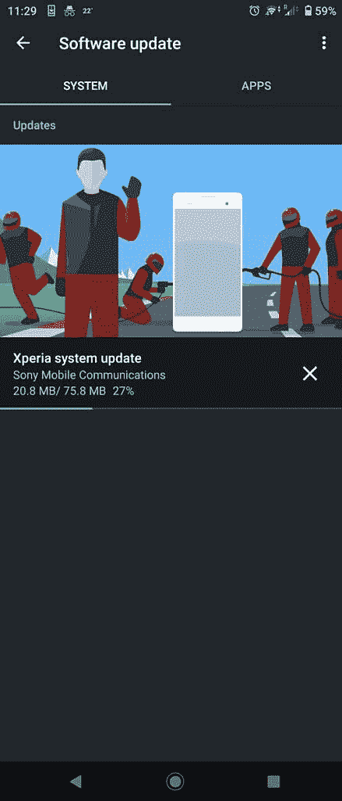
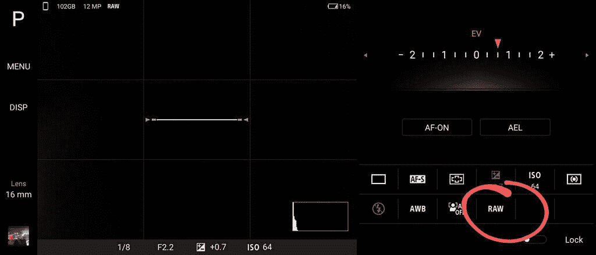

# 索尼 Xperia 1 II 更新在 Photo Pro 模式下为所有三款相机添加了 RAW 捕捉支持

> 原文：<https://www.xda-developers.com/sony-xperia-1-ii-update-raw-capture-support-photo-pro-mode/>

当索尼 Xperia 1 II 推出时，它的目的非常明确:提供市场上最好的手机相机体验。随着新的 7 月安全更新(58.0.A.3.88)的推出，体验变得更好了。

XDA 开发者论坛[的用户声称这次更新引入了 Photo Pro 模式下的 RAW 支持。对于喜欢摆弄照片的用户来说，这是个好消息。](https://forum.xda-developers.com/sony-xperia-1-II/help/58-0-3-88-update-t4136681)

 <picture></picture> 

Image credits: Redditor /u/[h-nucleus](https://www.reddit.com/user/h-nucleus)

对于普通用户来说，用 RAW 拍摄照片可能并不重要，但对于后期处理来说，这是非常棒的。与 JPEG 格式相比，您有更多的空间来编辑 RAW 图像的深度。结合 Xperia 1 II 的 Photo Pro 模式，用户可以获得市场上最强大的移动相机体验之一。

 <picture></picture> 

Image credits: Redditor /u/[Kapil300](https://www.reddit.com/user/Kapil300)

需要注意的一点是 RAW(。DNG)图像比 JPEG 大得多，所以你手机上的存储空间会很快用完。这可能就是为什么该设备的连拍模式不支持原始图像，正如那些收到最新更新的人所指出的那样。原始照片也总是以 4:3 的宽高比保存在内部存储器中，但可以在拍摄后手动移动到外部存储介质中。

索尼 Xperia 1 II 有三个镜头:广角、超广角和长焦，这三个镜头都有 1200 万像素的传感器。该设备还支持闪电般快速的双像素相位检测自动对焦和光学图像稳定。最值得注意的是，相机系统还支持聚焦于人和动物眼睛的能力，因此拍摄人像应该会产生清晰、令人满意的结果。

**[索尼 Xperia 1 II XDA 论坛](https://forum.xda-developers.com/sony-xperia-1-II)**

这个更新现在似乎正在向 Xperia 1 II 用户推出，所以请保持警惕，并为 RAW 的好处做好准备。

* * *

**Via: [Reddit 1](https://www.reddit.com/r/SonyXperia/comments/hyp4f8/large_update_incoming_o2_uk/) ， [2](https://www.reddit.com/r/SonyXperia/comments/hyox43/raw_is_here/) ， [3](https://www.reddit.com/r/SonyXperia/comments/hypm23/raw_support_on_580a388/) ，[4](https://forum.xda-developers.com/sony-xperia-1-II/help/58-0-3-88-update-t4136681)**