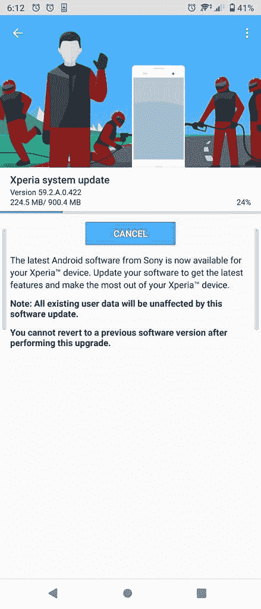

# 索尼的中端 Xperia 10 II 正在进行稳定的 Android 12 更新

> 原文：<https://www.xda-developers.com/sony-xperia-10-ii-getting-android-12-update/>

上月底，索尼为 Xperia 10 III 和 Xperia Pro-I 推出了稳定的 Android 12 [更新。此次更新为设备带来了所有新的 Android 12 功能，以及 2022 年 2 月的 Android 安全补丁。索尼现在正在为旧的 Xperia 10 II 推出类似的更新，但它打包了更新的安全补丁。](https://www.xda-developers.com/android-12-update-sony-xperia-10-iii-xperia-pro-i/)

索尼 Xperia 10 II 的 Android 12 更新已经开始向东南亚用户推出。它的大小约为 900MB，版本号为 59.2.A.0.422。如前所述，此次更新为该设备带来了所有新的 [Android 12](https://www.xda-developers.com/android-12/) 功能，但它没有采用 2022 年 2 月的旧安全补丁。相反，索尼将在 2022 年 3 月发布更新补丁。

 <picture></picture> 

Credit: u/Fantasytky

在 Reddit 上分享的更新截图进一步揭示了更新不会影响用户数据。此外，它还揭示了用户在安装更新后将无法回滚到之前的 Android 11 版本。索尼目前还没有公布其他地区的发布时间表，但我们预计该公司将在未来几周内在其他地区发布更新。如果您尚未收到更新，您可以转至设备设置中的“软件更新”部分来手动检查更新。

或者，你可以使用 XDA 资深会员 IgorEisberg 的 [XperiFirm](https://forum.xda-developers.com/t/2834142/) 工具下载完整的固件包。下载固件包后，您可以使用 Flashtool (GUI)或 Newflasher (CUI)将其安装在手机上。

对于不知道的人来说，Android 12 是一个巨大的更新，带来了大量的功能和改进。安装更新后，您可以在 Xperia 10 II 上看到新的附加功能，如您设计的更新材料、改进的快速设置面板、隐私仪表盘、新的主屏幕小部件、摄像头和麦克风隐私指示器等。

* * *

**来源:** [Reddit](https://www.reddit.com/r/SonyXperia/comments/u9bh6k/xperia_10_ii_android_12_wish_me_luck/)