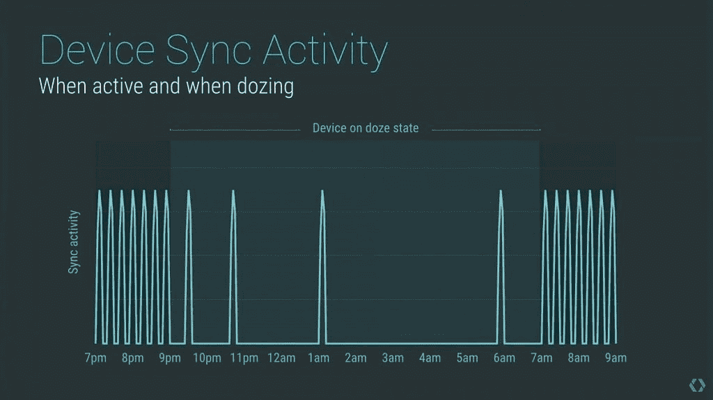
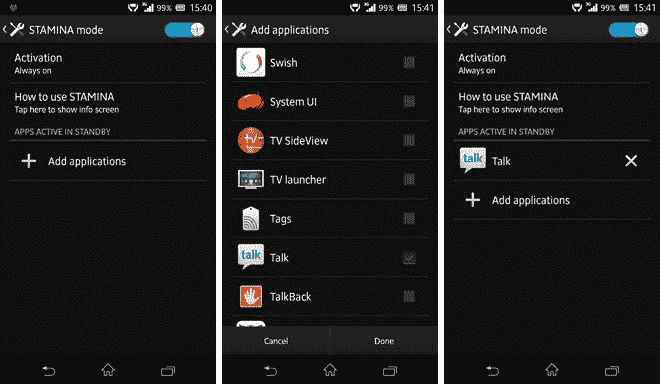

# 对于索尼来说，Android 6.0 的 Doze 模式标志着电池寿命的回归

> 原文：<https://www.xda-developers.com/sonys-stamina-mode-did-it-first/>

最近有很多关于定制皮肤、安卓系统以及二者之间关系的争论。 Stock Android 已经成为我们读者中[最喜欢的 Android 版本](http://www.xda-developers.com/battle-royale-stock-android-vs-oems-which-side-are-you-on/)有一段时间了。

在 Android 发烧友圈子里，谷歌试图整合各种 Android 设备的用户体验对最终用户是有益的，这几乎是一个既定事实。当社区在 Android 中实现一个已经存在于 OEM 皮肤中的特性时，他们通常会偏向 Google。

以多窗口为例，三星已经在其 Galaxy 设备的几个迭代中将其功能嵌入到 rom 中。我个人没有任何三星实现多窗口的旗舰 Galaxy 设备，但我肯定对 Android N 在即将到来的未来提供的东西感到非常兴奋。但是谷歌的实现会优于三星吗？[我们对这两个](http://www.xda-developers.com/praise-and-criticism-of-ns-multi-window-freeform-from-a-multi-window-fan/)的初步比较显示，Android N 的多窗口需要更多的润色，才能宣称它是最终的多窗口实现。不过，公平地说，我们距离 Android N 的公开发布还有几个月的时间，所以我们不能说 Android N 中的多窗口最终不会成为更好的实现。

但是如果谷歌官方的多窗口没有三星的多窗口叠加起来呢？如果没有，那么三星用户会对这个看似降级的功能感到失望。我也不是在没有任何正当理由的情况下陈述这些担忧，因为这正是索尼的耐力模式刚刚发生的事情。

* * *

**体力模式耗尽**

今年早些时候，当 Android Marshmallow 开始在某些索尼 Xperia 设备上推出时，一些用户注意到了耐力模式的缺失。参与索尼测试计划的用户收到了这条消息，解释了该公司为何在他们的设备中取消了耐力模式:

> 棉花糖版本的 Android 有自己的智能解决方案来管理功耗(瞌睡和应用待机)。这些功能直接集成到 Android 6.0 中，使得耐力模式变得多余。换句话说，m 去掉了耐力模式。

在这里不难看出索尼为什么在安卓棉花糖中去掉了耐力模式。随着瞌睡模式的引入，很容易向消费者解释为什么索尼要删除其最受吹捧的软件功能之一——因为谷歌自己制作了耐力模式，没有必要存在。不过，索尼在这件事上似乎没有任何选择，因为根据 [Android 兼容性定义](https://static.googleusercontent.com/media/source.android.com/en//compatibility/android-cdd.pdf)，包含瞌睡模式是设备通过谷歌 CTS 的**要求**。不满足这一要求，设备就不能预装谷歌的应用程序，这实际上是对任何不在中国销售的设备的致命一击。

> 8.3.省电模式
> 
> 所有免除应用待机和/或休眠模式的应用必须对最终用户可见。此外，这些省电模式的触发、维护、唤醒算法和全局系统设置的使用不得偏离 Android 开源项目。

但是让我们回到索尼声明放弃耐力模式的原因。他们表示，Android 6.0 中的瞌睡模式和应用待机使耐力模式变得多余，这是一个相当奇怪的说法，因为 T2 显然是错误的。索尼的耐力模式并没有因为 Android 6.0 的省电功能而变得多余。相反，Android 棉花糖的瞌睡模式标志着索尼设备电池寿命的**回归**。其实索尼的耐力模式，从 Android Lollipop 就有了，更和 Android N 的 Doze 模式实现不相上下。

* * *

**电池续航大战**

那么索尼的耐力模式到底有什么了不起的呢？据索尼称，该功能将通过限制不必要的后台服务来节省大量待机电池寿命。他们向我们展示了一些简洁的图表，显示了可以节省多少电池寿命。

眼熟吗？哦，等等...

 <picture></picture> 

Android M Doze Mode

我不是这些向你展示打盹模式和耐力模式有多棒的普通公关图片的主要粉丝。虽然这两种功能带来的电池续航时间提升可能相当可观，但这两种功能实现方式的差异是该功能对您真正有效的主要因素。所以让我们深入一点，比较一下 Android 6.0 的瞌睡模式和索尼的耐力模式。

***耐力模式***

[耐力模式](http://developer.sonymobile.com/2013/04/03/how-sonys-battery-stamina-mode-works/)工作原理是这样的:在你关闭屏幕一分钟后，系统会屏蔽所有数据流量，防止所有后台活动唤醒系统。但是，当您打开屏幕时，所有活动都将恢复。不过，该系统不会禁用网络访问，所以当你打开手机屏幕时，你会很快收到任何未决通知。电话、短信、日历通知或闹钟等关键活动仍将照常进行(只要它们使用 Android 的标准 AlarmManager 类来安排闹钟服务)。

但是，如果你有重要的应用程序，你总是想收到通知，无论如何？对于这些情况，你可以在耐力模式下将应用列入白名单，这样他们就不会受到系统的限制。否则，如果你对耐力模式不感兴趣，你可以选择不启用该功能。

 <picture></picture> 

White-Listing Apps in Stamina Mode

但是，这与瞌睡模式相比如何呢？我将[重温我以前的一篇文章](http://www.xda-developers.com/how-android-n-will-improve-battery-and-memory-management/)，这篇文章深入探讨了瞌睡模式，并提供一个简短的解释:

> 在屏幕关闭后，设备将耗尽其电池，并且设备已经**静止**一段时间，设备将进入休眠模式。当设备进入 doze 模式时，所有在电池优化设置中没有被用户列入白名单的**的应用程序都将有以下**延迟**:网络访问、唤醒锁、标准[警报管理器](https://developer.android.com/reference/android/app/AlarmManager.html)警报(不要与用于唤醒你的*实际*警报混淆)、WiFi 扫描或同步适配器。这些动作被推迟到下一个**维护窗口**，由此系统唤醒设备并允许所有这些动作同时运行一小段时间(即将它们聚结)。**

听起来很像索尼的耐力模式，不是吗？然而，这里需要考虑几个主要的区别。

1.  瞌睡模式要求你的手机在地理位置上保持静止。坐在桌子上，不在口袋里)。
2.  瞌睡模式只能被 **[高优先级 GCM](https://developers.google.com/cloud-messaging/concept-options#setting-the-priority-of-a-message) 消息**中断。你最喜欢的应用程序的开发人员没有将通知设置为高优先级？太糟糕了，你必须等到下一个维护窗口才会得到通知。
3.  Doze mode 的白名单[并没有真正免除一个应用程序的所有限制。](https://developer.android.com/training/monitoring-device-state/doze-standby.html#support_for_other_use_cases)
4.  打盹模式**不能被禁用**。[安卓 6.0 上的通知](http://www.xda-developers.com/what-do-you-think-of-marshmallows-doze/)有问题？太糟糕了。

耐力模式在当时是一个非常出色的功能，甚至有一次将它移植到所有设备上的成功尝试。耐力模式可以根据你列入白名单的应用程序进行调整，变得或多或少保守一些，而瞌睡模式是如此的反复无常，以至于当它触发时[的修改者不得不求助于编辑它的基本工作方式](http://forum.xda-developers.com/apps/greenify/aggressive-doze-experimental-feature-t3223731)，只是为了让瞌睡模式真正完成它的工作。

* * *

**体力模式回归...是吗？**

大约一个月前，用户报告说耐力模式正在某些手机的测试版棉花糖更新中回归。几个博客很快注意到了这个消息，并为这个功能最终回归而欢欣鼓舞。然而，一些精明的用户立即注意到耐力模式的回归相当严重。

这是通过 Reddit 拍摄的几张截图，显示了新的耐力模式的运行。本质上，它只是从 Android Lollipop 开始就存在的[电池节电模式](https://support.google.com/nexus/answer/6187458?hl=en)的一个稍微加强的版本，而不是 Xperia 粉丝们喜欢的 Doze 模式的竞争对手。通过迫使原始设备制造商在他们的棉花糖更新中实现未经修改的 Doze 模式，谷歌实质上迫使索尼从根本上改变了耐力模式的工作方式。通过这样做，他们削减了一个相当大的电池节省功能，而支持一个相当平庸的功能。拥有索尼 Xperia 设备的用户将不得不等到 Android N [实现改进的 Doze 模式](http://www.xda-developers.com/how-android-n-will-improve-battery-and-memory-management/)才能重新获得 Stamina 模式提供的出色电池寿命。在我看来，Android N 的 Doze 模式优于索尼的 Stamina 模式，然而，Android M 的 Doze 模式对于索尼来说是**一步落后**。

不幸的是，Android N 来到索尼 Xperia 设备的等待可能会相当漫长。毕竟，Android N 本身仍处于谷歌 Nexus 用户的 beta 测试阶段。直到第三季度的某个时候，我们才会看到 Android N 的最终版本(以及完整的源代码)。

从 Android Marshmallow 到索尼旗舰 Xperia Z5 设备花了多长时间(4 个月)来看，我们应该期待 2017 年 3 月的 Android N 吗？也许是，也许不是，因为当索尼开始在其设备上测试 Android N 时，它似乎走在了前面。但是那些不再更新过安卓棉花糖的索尼设备怎么办？你们真倒霉。在谷歌寻求统一曾经是相互竞争的 OEM 皮肤的碎片化景观的过程中，你们中的一些人倒在了剑的错误一边。