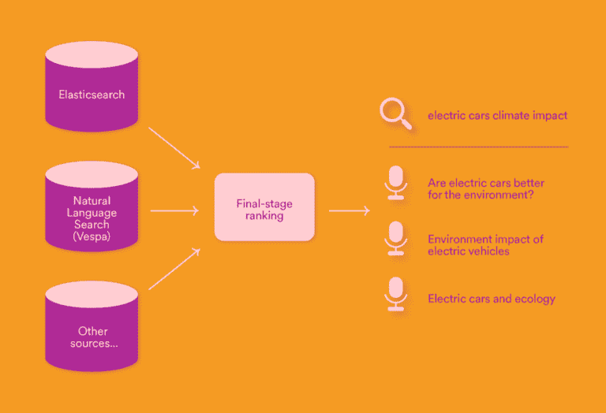

# Spotify 正在改善深度学习播客的搜索结果

> 原文：<https://www.xda-developers.com/spotify-deep-learning-search/>

过去一年，Spotify 一直在迅速增强其播客能力，不仅收购了节目和播客工作室，还推出了软件功能来改善收听和搜索体验。现在，另一项改进已经向大多数人推出:由深度学习人工智能驱动的更新搜索。

Spotify 在其工程博客中写道，“为了让用户能够用更少的努力找到更多相关的内容，我们开始研究一种叫做自然语言搜索的技术，在文献中也被称为语义搜索。简而言之，自然语言搜索匹配语义相关的查询和文本文档，而不需要精确的单词匹配。它匹配同义词、释义等。以及表达相同意思的自然语言的任何变体

 <picture></picture> 

Multi-source retrieval and ranking (Source: Spotify)

最终结果是，搜索“电动汽车对气候的影响”这个词，会出现标题为“电动汽车对环境更好吗？”的播客和“电动汽车和生态”，尽管与最初的搜索没有完全匹配。深度学习模型的结果也与传统搜索结果相结合，显然是因为深度学习模型在精确术语匹配方面不如更传统的搜索方法。

这一变化可能会使 Spotify 成为比许多其他播客播放器更好的播客搜索引擎，但它并不是唯一一个使用人工智能改善搜索的公司。自 2019 年以来，谷歌播客(Google Podcasts)一直在[生成播客剧集](https://9to5google.com/2019/03/27/google-podcasts-transcribing-episodes/)的副本，以改善搜索结果， [Spotify 也于去年开始试验这一功能](https://www.xda-developers.com/spotify-automatic-podcast-transcriptions-more/)。

Spotify 在播客推广上投入了大量资金。该公司在 2 月份收购了播客广告和分析平台 Podsights 和 Chartable。Spotify 还于 2019 年[支付 3.4 亿美元](https://techcrunch.com/2019/02/14/spotify-gimlet-anchor-340-million/)收购 Gimlet Media(一家播客网络)和 Anchor(一家播客发布平台)，播客科技公司 Whooshkaa 于 2021 年底被[收购。](https://techcrunch.com/2021/12/16/spotify-acquires-podcast-tech-company-whooshkaa-which-turns-radio-broadcasts-into-on-demand-audio/)

**来源:** [Spotify](https://engineering.atspotify.com/2022/03/introducing-natural-language-search-for-podcast-episodes/)