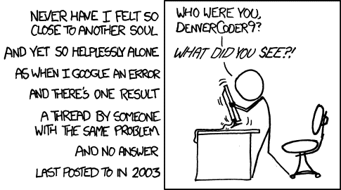

# Stack Overflow 收到一个 Android 和 iOS 的官方应用

> 原文：<https://www.xda-developers.com/stack-overflow-receives-an-official-app-for-android-and-ios/>

如果你对编程有任何经验或兴趣，你可能至少听说过 StackOverflow.com。对于希望学习如何编码的新手开发者和希望调试现有工作的老手来说，该网站都是最好的资源之一。甚至你的普通用户也可能通过精心措辞的谷歌搜索遇到过这个网站，试图解决他们在使用一些软件时遇到的一些模糊的错误。或者有时，你遇到一个 StackOverflow 线程，有着完全相同的问题，却发现这个线程已经被原始发帖者放弃了，他们发现了问题的答案，但从未费心分享他们做了什么来解决它。

 <picture></picture> 

Credits: [XKCD](https://xkcd.com/979/)

该网站的名称来自一个常见的编程错误，即程序试图使用比已经分配给调用堆栈的空间更多的空间，通常会导致程序崩溃。该网站于 2008 年推出，作为一个平台，用户可以就围绕计算机编程的主题提出问题并获得答案。Stack Overflow 是 Stack Exchange 旗下问答网站网络中的一个网站，Stack Exchange 已经有了自己的应用程序 T1。

现在，一个专门解决堆栈溢出的官方应用程序已经在 Android 和 iOS 上推出。尽管堆栈交换和堆栈溢出应用程序具有许多相同的功能(尽管堆栈交换应用程序显然允许您访问的不仅仅是堆栈溢出)，但设计显然是不同的。我是新外观的粉丝，但这里有一些截图，你可以形成自己的看法:

有了新的应用程序，你可以阅读、提问、评论、标记和投票。您可以为帖子回复设置推送通知。您可以搜索帖子，并根据相关性、活动、投票数或日期进行过滤。您还可以在离线时起草问题，并阅读您之前浏览过的问题历史记录。

* * *

[**在 Play Store 上下载 app**](https://play.google.com/store/apps/details?id=com.stackexchange.stackoverflow)

[**来源:栈溢出博客**](https://stackoverflow.blog/2017/05/16/stack-overflow-official-app-launches-ios-android/)