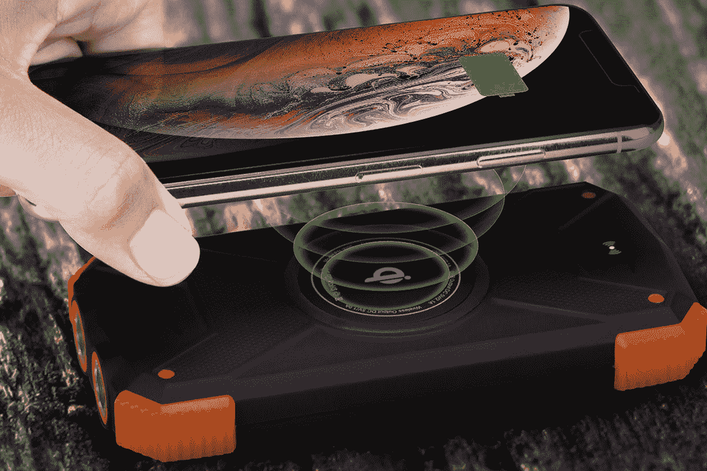
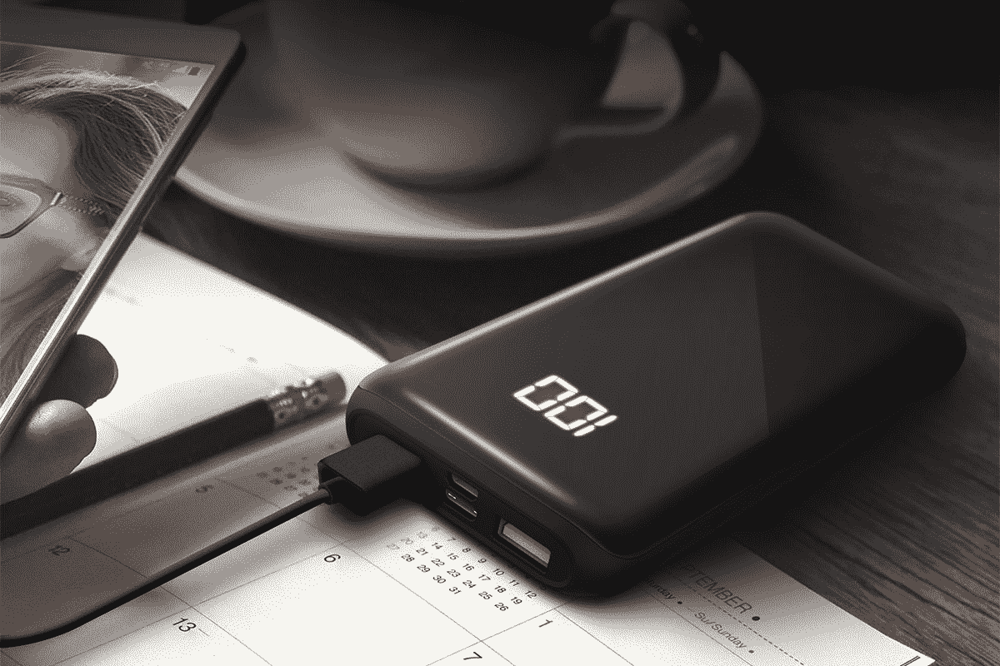
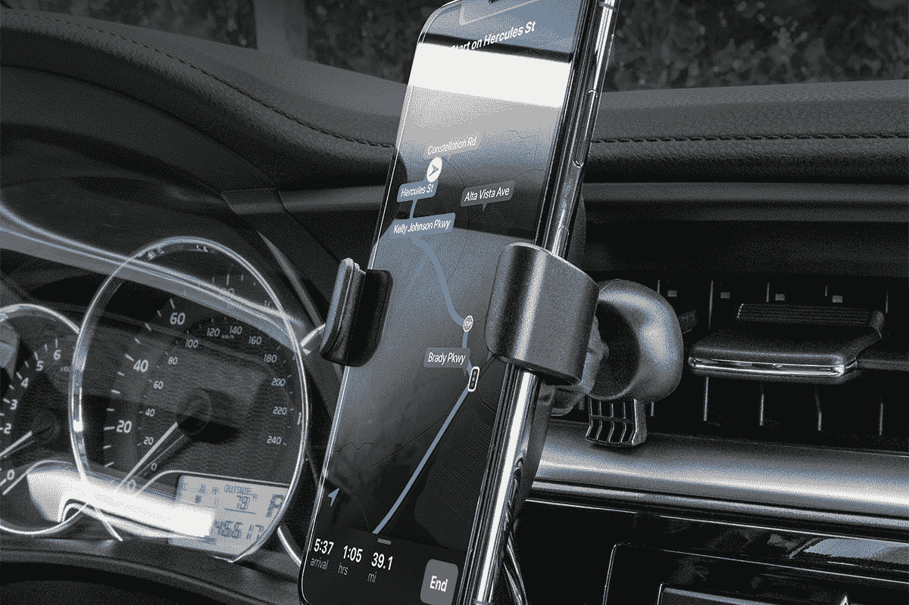
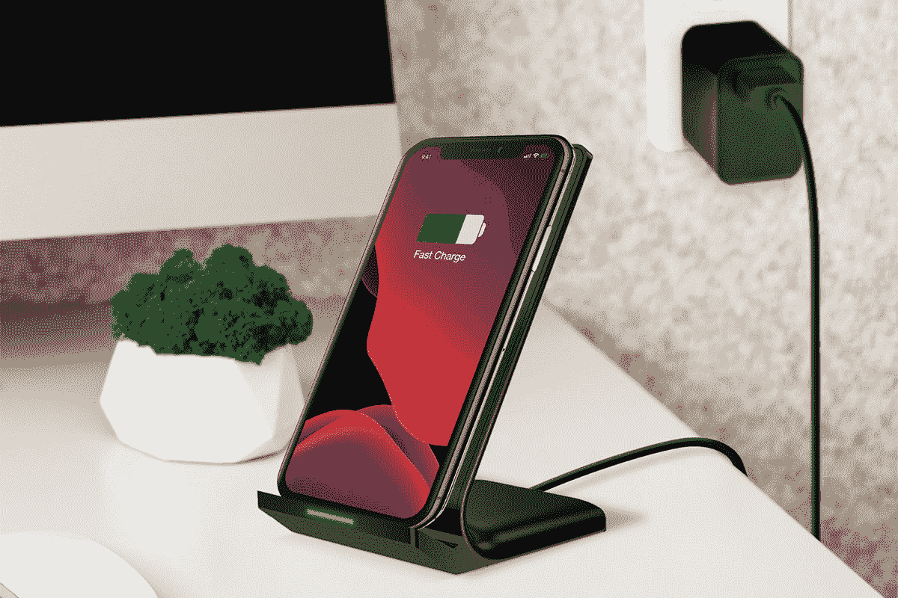

# 使用高达 25%折扣的 HyperGear 充电器和便携式银行保持联系

> 原文：<https://www.xda-developers.com/stay-connected-with-up-to-25-off-hypergear-chargers-and-portable-banks/>

从没完没了的视频通话到查看最新消息，我们现在比以往任何时候都更频繁地使用手机。如果你想保持更长时间的连接，请查看 HyperGear 充电器和便携式电源组的这些交易。现在，您可以在 XDA Developers Depot 节省高达 25%的建议零售价。

## **超耳太阳能 10,000mAh 电源组**

****

这款防水、 [跌落测试的电源组](https://depot.xda-developers.com/sales/hypergear-solar-10000mah-power-bank-black?utm_source=xda-developers.com&utm_medium=referral&utm_campaign=hypergear-solar-10000mah-power-bank-black&utm_term=scsf-420239&utm_content=a0x1P000004sqBMQAY&scsonar=1) 内置太阳能电池板，用于捕捉能量。它有两个输出，可以同时为两个设备充电，还有一个指南针和应急手电筒。正常情况下 39 美元，现在只要 34.99 美元[。](https://depot.xda-developers.com/sales/hypergear-solar-10000mah-power-bank-black?utm_source=xda-developers.com&utm_medium=referral&utm_campaign=hypergear-solar-10000mah-power-bank-black&utm_term=scsf-420239&utm_content=a0x1P000004sqBMQAY&scsonar=1)

## **HyperGear 双 USB + USB-C 数字电源组**

****

带三个端口包括一个 USB-C 插座， [这款电源库](https://depot.xda-developers.com/sales/hypergear-10000mah-dual-usb-usb-c-digital-power-bank-black?utm_source=xda-developers.com&utm_medium=referral&utm_campaign=hypergear-10000mah-dual-usb-usb-c-digital-power-bank-black&utm_term=scsf-420240&utm_content=a0x1P000004sqBMQAY&scsonar=1) 可以给各种设备充电。你有 15W 可以玩，而显示屏会显示你还剩多少电量。10,000mAh 版本目前[MSRP 低 14%，29.99 美元](https://depot.xda-developers.com/sales/hypergear-10000mah-dual-usb-usb-c-digital-power-bank-black?utm_source=xda-developers.com&utm_medium=referral&utm_campaign=hypergear-10000mah-dual-usb-usb-c-digital-power-bank-black&utm_term=scsf-420240&utm_content=a0x1P000004sqBMQAY&scsonar=1) 。

## **HyperGear 10W 快充无线安装套件**

****

平均来说，我们每周都要花八个小时开车。凭借高达 10W 的输出功率， [这款 Qi 无线充电器](https://depot.xda-developers.com/sales/hypergear-10w-fast-charge-wireless-mount-kit-black?utm_source=xda-developers.com&utm_medium=referral&utm_campaign=hypergear-10w-fast-charge-wireless-mount-kit-black&utm_term=scsf-420241&utm_content=a0x1P000004sqBMQAY&scsonar=1) 将在旅途中为您的手机恢复 100%电量。它还可以让您的手机通过 GPS 和免提通话。正常情况下 39 美元，现在只要 29.99 美元[。](https://depot.xda-developers.com/sales/hypergear-10w-fast-charge-wireless-mount-kit-black?utm_source=xda-developers.com&utm_medium=referral&utm_campaign=hypergear-10w-fast-charge-wireless-mount-kit-black&utm_term=scsf-420241&utm_content=a0x1P000004sqBMQAY&scsonar=1)

## **超耳无线快速充电座**

****

采用同样的技术， [这款优雅的支架](https://depot.xda-developers.com/sales/hypergear-wireless-fast-charging-stand-black?utm_source=xda-developers.com&utm_medium=referral&utm_campaign=hypergear-wireless-fast-charging-stand-black&utm_term=scsf-420242&utm_content=a0x1P000004sqBMQAY&scsonar=1) 提供在家无线充电。它的速度是标准充电器的两倍，具有广阔的充电区域，以确保良好的连接。该支架零售价为 39 美元，但你现在可以以 29.99 美元 买到。

*价格随时变化*