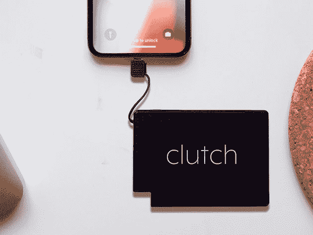
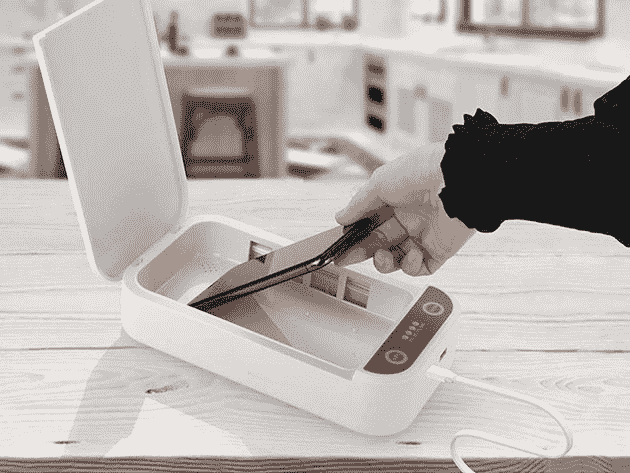
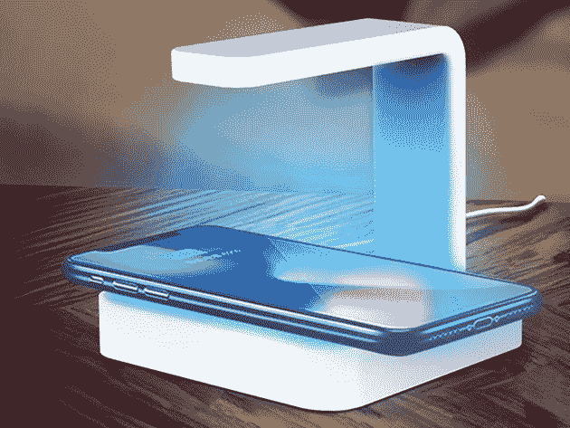
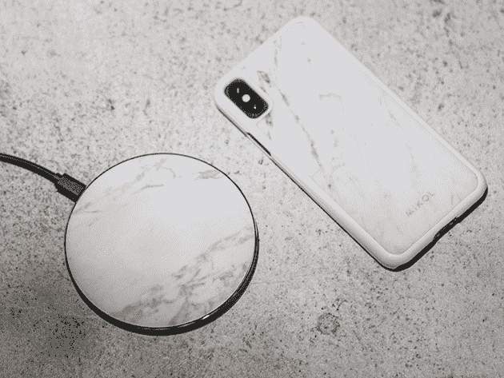
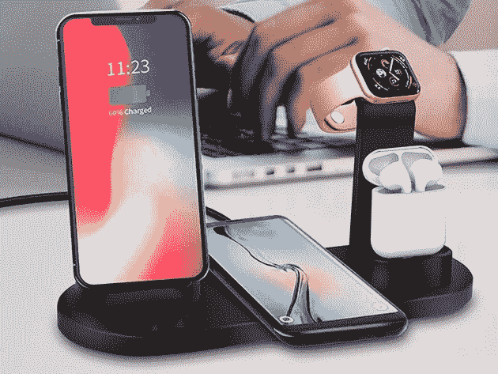
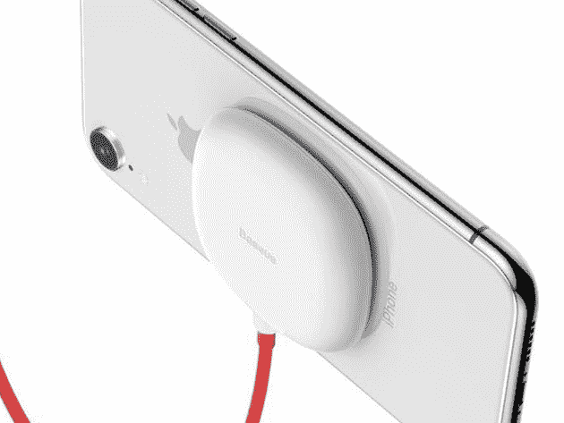
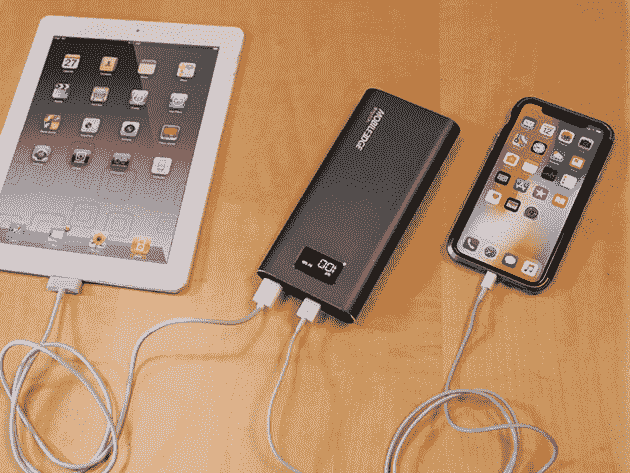

# 这些电源组和无线充电器高达 60%的折扣，让您与外界保持联系

> 原文：<https://www.xda-developers.com/stay-connected-with-up-to-60-off-these-power-banks-and-wireless-chargers/>

给你所有的设备和配件充电是一件永无止境的苦差事。然而，有办法让这个过程不那么痛苦。这些便携式电源组和智能无线充电器应该可以让你立刻恢复到 100%。现在，你可以在 XDA 开发者仓库获得高达 60%的 MSRP 折扣。

## **1)渴望 power pack 2:50000 mah 电池充电器**

****

这款 [便携式电源包](https://depot.xda-developers.com/sales/crave-powerpack-2-50000-mah-powerbank?utm_source=xda-developers.com&utm_medium=referral&utm_campaign=crave-powerpack-2-50000-mah-powerbank&utm_term=scsf-390765&utm_content=a0x1P000004XoMfQAK&scsonar=1) 拥有 50,000mAh 的超大容量和四个充电端口。这些输出在电源传输和 QC 3.0 之间分配，这意味着您可以以最高速度为笔记本电脑、手机、相机和其他设备充电。正常情况下 249.99 美元，现在的 [只要 189.99 美元](https://depot.xda-developers.com/sales/crave-powerpack-2-50000-mah-powerbank?utm_source=xda-developers.com&utm_medium=referral&utm_campaign=crave-powerpack-2-50000-mah-powerbank&utm_term=scsf-390765&utm_content=a0x1P000004XoMfQAK&scsonar=1) 。

## **2)离合器超薄便携式充电器**

****

号称世界上最薄的便携式充电器，只有一张信用卡大小，厚度只有 0.15 英寸。尽管有这些微小的尺寸， [这款充电器](https://www.youtube.com/watch?v=fG1YSSdMqGQ) 的容量为 2,300mAh，内置 iOS 设备的 Lightning 连接器。Clutch 获得了 iMore 的 4 星评价，目前 [九折，售价 35.99 美元](https://depot.xda-developers.com/sales/clutch-charger?utm_source=xda-developers.com&utm_medium=referral&utm_campaign=clutch-charger&utm_term=scsf-390769&utm_content=a0x1P000004XoMfQAK&scsonar=1) 。

## **3) SaniCharge 手机紫外线消毒杀菌剂**

****

平均而言，智能手机上的细菌数量是马桶上的 10 倍。[Sani charge](https://depot.xda-developers.com/sales/sanicharge-phone-uv-sanitizer-white?utm_source=xda-developers.com&utm_medium=referral&utm_campaign=sanicharge-phone-uv-sanitizer-white&utm_term=scsf-391826&utm_content=a0x1P000004XoMfQAK&scsonar=1)提供了一个快速的解决方案——这款洗手液利用紫外线在短短几分钟内消灭有害细菌。同时，它给你的手机充电，充当扩散器。价值 99.95 美元，这款三合一设备 [现在只要 37.99 美元](https://depot.xda-developers.com/sales/sanicharge-phone-uv-sanitizer-white?utm_source=xda-developers.com&utm_medium=referral&utm_campaign=sanicharge-phone-uv-sanitizer-white&utm_term=scsf-391826&utm_content=a0x1P000004XoMfQAK&scsonar=1) 。

## **4) 2 合 1 无线充电器+紫外线消毒杀菌剂**

****

杀菌的另一大选择， [这款无线充电器](https://depot.xda-developers.com/sales/2-in-1-wireless-charger-uv-sanitizer?utm_source=xda-developers.com&utm_medium=referral&utm_campaign=2-in-1-wireless-charger-uv-sanitizer&utm_term=scsf-391827&utm_content=a0x1P000004XoMfQAK&scsonar=1) 有一个 UV-C 灯，可以杀死 99.9%的病菌。底座提供 5W 和 10W 充电，您可以将消毒器与许多其他物品配合使用。它的零售价为 44.99 美元，但充电器-消毒器是 [现在 37.99 美元](https://depot.xda-developers.com/sales/2-in-1-wireless-charger-uv-sanitizer?utm_source=xda-developers.com&utm_medium=referral&utm_campaign=2-in-1-wireless-charger-uv-sanitizer&utm_term=scsf-391827&utm_content=a0x1P000004XoMfQAK&scsonar=1) 。

## **5)大理石无线充电板**

****

这款 [漂亮的无线充电器](https://depot.xda-developers.com/sales/carrara-mable?utm_source=xda-developers.com&utm_medium=referral&utm_campaign=carrara-mable&utm_term=scsf-391828&utm_content=a0x1P000004XoMfQAK&scsonar=1) 顶部表面由真正的意大利卡拉拉大理石制成。该 pad 可与所有 Qi 兼容设备配合使用，提供出色的充电速度和安全特性。平时 69 美元，弹珠充电器是 [现在只要 55.99 美元](https://depot.xda-developers.com/sales/carrara-mable?utm_source=xda-developers.com&utm_medium=referral&utm_campaign=carrara-mable&utm_term=scsf-391828&utm_content=a0x1P000004XoMfQAK&scsonar=1) 。

## **6) 4 合 1 多功能无线充电器**

****

这款 [4 合 1 无线充电器](https://depot.xda-developers.com/sales/versatile-charger?utm_source=xda-developers.com&utm_medium=referral&utm_campaign=versatile-charger&utm_term=scsf-391829&utm_content=a0x1P000004XoMfQAK&scsonar=1) 可以为两部手机、苹果手表和无线耳塞供电，是任何床头柜的完美补充。它适用于苹果和三星设备，有一个直立的讲台，让你可以查看时间。正常售价 60 美元，它的 [现在只要 40.95 美元](https://depot.xda-developers.com/sales/versatile-charger?utm_source=xda-developers.com&utm_medium=referral&utm_campaign=versatile-charger&utm_term=scsf-391829&utm_content=a0x1P000004XoMfQAK&scsonar=1) 。

## **7)吸力供电无线充电器**

****

这款 [创新无线充电器](https://depot.xda-developers.com/sales/suction-powered-wireless-charger?utm_source=xda-developers.com&utm_medium=referral&utm_campaign=suction-powered-wireless-charger&utm_term=scsf-391830&utm_content=a0x1P000004XoMfQAK&scsonar=1) 通过迷你吸盘吸附在手机背面。因此，在手机充满电的同时，您可以轻松地继续使用手机，手机两侧都留有稳固抓握的空间。它通常零售价为 69 美元，但你现在可以用 51.95 美元 抢吸费 [。](https://depot.xda-developers.com/sales/suction-powered-wireless-charger?utm_source=xda-developers.com&utm_medium=referral&utm_campaign=suction-powered-wireless-charger&utm_term=scsf-391830&utm_content=a0x1P000004XoMfQAK&scsonar=1)

## **8)核心功率 26,800mAh 便携式 USB 电池组**

凭借大容量和双 QC 3.0 USB 端口， [核心动力电池组](https://depot.xda-developers.com/sales/core-power-26-800mah-portable-usb-battery-charger?utm_source=xda-developers.com&utm_medium=referral&utm_campaign=core-power-26-800mah-portable-usb-battery-charger&utm_term=scsf-391831&utm_content=a0x1P000004XoMfQAK&scsonar=1) 帮助您在旅途中保持连接。IntelliQ 智能芯片技术允许电池识别每个设备的最佳输出，这意味着您可以将充电速度提高四倍。目前[101.99 美元](https://depot.xda-developers.com/sales/core-power-26-800mah-portable-usb-battery-charger?utm_source=xda-developers.com&utm_medium=referral&utm_campaign=core-power-26-800mah-portable-usb-battery-charger&utm_term=scsf-391831&utm_content=a0x1P000004XoMfQAK&scsonar=1) 结账时使用代码 **MOBILE15** 打八五折。

*价格随时变化*

**来自 XDA 开发者仓库的更多信息**