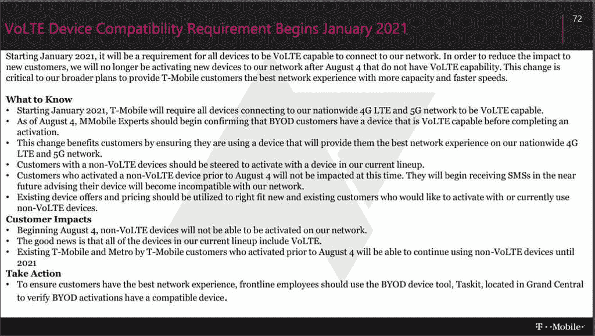

# 关闭 3G 后，T-Mobile 和美国电话电报公司将要求使用 VoLTE 进行通话

> 原文：<https://www.xda-developers.com/t-mobile-att-require-volte-phone-calls-shut-down-3g/>

网络技术的不断发展令人兴奋，但前提是你有办法跟上新技术的发展。在我们的行业，这意味着从运营商那里购买新的智能手机、路由器和套餐。此外，你必须确保你购买的任何东西都与你付费的网络兼容。本周再次提醒我们网络兼容性的重要性，美国电话电报公司和 T-Mobile 最终都会关闭他们的 3G 网络。这并不令人惊讶，因为两家运营商都在部署 5G 网络，但由于 Android 上 VoLTE 的复杂性质，值得注意的是。

如果你对 VoLTE 不熟悉，它代表“LTE 语音”,听起来确实如此。电话呼叫通过 4G LTE 连接而不是 2G 或 3G 连接进行路由。几年前，这被视为一件大事，因为 4G LTE 的更高带宽意味着可以传输更多数据，从而减少语音数据的压缩，从而为双方提供更好的通话质量。如今，VoLTE 已经成为一个标准，几乎所有的主要运营商都已经实现了它，并且所有带有蜂窝调制解调器的设备都支持这项技术。事实上，T-Mobile 的 [Q1 2020 年收益报告](https://s24.q4cdn.com/400059132/files/doc_financials/2020/q1/Investor-Factbook.pdf)称网络上“VoLTE 占总语音通话的 91%”。许多运营商已经关闭了他们的传统 2G 网络，因为绝大多数客户已经升级到与新网络技术兼容的设备，并且运营商也准备关闭他们的 3G 网络。

今天早些时候， [*AndroidPolice*](https://www.androidpolice.com/2020/07/23/t-mobile-will-soon-require-volte-on-all-phones-incomopatible-devices-kicked-off-january/) 公布了一张 T-Mobile 内部通知的截图，显示该运营商将要求所有连接到其 4G LTE 和 5G 网络的设备都使用 VoLTE。该出版物还报道了发给 AT & T 客户的电子邮件，通知他们他们的手机最终将与该运营商的网络不兼容。以下是你需要知道的关于 T-Mobile 和 AT & T 的 3G 语音网络即将关闭的消息。

## T-Mobile 的 VoLTE 要求-即将推出

 <picture></picture> 

T-Mobile's VoLTE Device Compatibility Requirements. Source: T-Mobile. Via: [AndroidPolice](https://www.androidpolice.com/2020/07/23/t-mobile-will-soon-require-volte-on-all-phones-incomopatible-devices-kicked-off-january/).

从 2020 年 8 月 4 日开始，T-Mobile 将停止在其网络上激活不支持 VoLTE 的新设备。T-Mobile 表示，其当前产品线中的所有设备(也就是说，通过它们销售的设备)都支持 VoLTE。

从 2021 年 1 月开始，任何不支持 T-Mobile 上 VoLTE 的设备将不再能够连接到运营商的 4G LTE 或 5G 网络。在 8 月 4 日之前激活非 VoLTE 兼容设备的现有 T-Mobile 和 Metro by T-Mobile(以前称为 MetroPCS)客户将通过短信被告知，他们的设备将从 2021 年 1 月开始与网络不兼容。

虽然尚未得到证实，但有可能通过 Sprint 购买的一些设备会受到这一变化的影响。Sprint 一直要求连接到其网络的设备进行认证，该认证包括 VoLTE 兼容性。然而，T-Mobile 正在重组 Sprint 的网络，以扩展自己的 5G 网络，因此一些 Sprint 设备可能不会与新的 T-Mobile 网络兼容。我们也不知道这一变化将如何影响使用 T-Mobile 网络的无数其他移动运营商的设备，包括 Ting、Consumer Cellular 和 Mint Mobile。

T-Mobile 就此通知向 *AndroidPolice* 发布了以下声明:

> #### 我们在建设真正变革性的全国 5G 网络方面取得了巨大进展。作为其中的一部分，我们将逐步淘汰一些旧技术，为 LTE 和 5G 释放更多容量。为了做好准备并为客户提供最佳体验，那些在 T-Mobile 激活新线路的人将需要一个支持 VoLTE 的设备，这是我们多年来一直提供的产品，代表了网络上绝大多数的设备。

然而，该运营商拒绝明确证实其 2G 和 3G 语音网络关闭的时间表。

## 美国电话电报公司的 3G 关闭-2022 年 2 月到来

本周早些时候，美国电话电报公司(糟糕地)警告许多客户，他们应该尽快升级他们的智能手机，因为他们的设备很快就会与运营商的网络不兼容。美国电话电报公司向客户发送电子邮件，告诉他们他们的设备“与新网络不兼容，需要更换才能继续接收服务。”美国电话电报公司没有明确向客户提及的部分是，他们在 2022 年 2 月之前不会受到这一变化的影响[。这封邮件的措辞明确建议客户采取紧急行动升级他们的设备，甚至概述了“轻松”获得新设备的步骤。](https://www.anrdoezrs.net/links/100122946/type/dlg/sid/UUxdaUeUpU29176/https://www.att.com/support/article/wireless/KM1324171)

值得称赞的是，美国电话电报公司*至少在 T-Mobile 之前就通知了用户即将关闭的 3G 网络，但他们做得非常糟糕。在& T 向 [*AndroidPolice*](https://www.androidpolice.com/2020/07/22/att-tells-customers-to-change-their-phones-or-they-wont-work-anymore/) 提供了一份声明，澄清这封电子邮件是它计划发送给客户的许多邮件中的第一封，以告知他们该运营商的 3G 网络即将关闭。以下是运营商发给刊物的声明:*

> #### 这封电子邮件是计划让客户了解我们的 3G 网络将于 2022 年初关闭的众多邮件之一。它应该包括不再支持某些设备的日期。我们对这可能造成的任何困惑表示歉意，并将在未来的更新中更加明确。

因此，美国电话电报公司和 T-Mobile 一样，要求所有连接到其网络的设备都支持 VoLTE。美国电话电报公司称之为“高清语音”，和 T-Mobile 一样，将屏蔽不支持语音和数据服务的手机。与 T-Mobile 不同，AT & T 将 VoLTE/HD 语音设备列入白名单。这个白名单，在[这里](https://www.anrdoezrs.net/links/100122946/type/dlg/sid/UUxdaUeUpU29176/https://www.att.com/idpassets/images/support/wireless/Service-Capabilities-Unlocked-Devices-ATT-Network.pdf)可以找到，包括基本手机，自 Pixel 2 以来的所有谷歌 Pixel 手机，LG G7 和 V35，9 款摩托罗拉设备，一加 7 Pro 和 7T Pro，以及自 S8 以来的所有三星 Galaxy 旗舰产品。

## 这对自带设备、解锁设备和定制 rom 意味着什么

如果你最近直接从美国电话电报公司或 T-Mobile 购买了一部智能手机，那么你很可能没有什么可担心的。然而，如果你使用的是未锁定的设备或定制 ROM 上的设备，那么你就要注意接下来会发生什么。由于美国电话电报公司将设备列入了 VoLTE 兼容性白名单，从 2022 年 2 月开始，你将无法通过 BYOD 连接到运营商，除非运营商改变其做法或列入更多设备的白名单。没有理由他们不能——毕竟 VoLTE 是一个标准协议——但是到目前为止他们还没有。你，设备制造商，或者定制 ROM 开发者/修改者对此无能为力。

另一方面，虽然 T-Mobile 没有使用白名单来兼容 VoLTE，但许多解锁设备都不支持它。例如，最近发布的华硕 ROG 手机 3 目前不支持网络上的 VoLTE。并不是说这些手机*不能*在 T-Mobile 上支持 VoLTE，只是设备制造商没有做工作来彻底支持它。[我们 ROG Phone II 论坛上的修改者](https://forum.xda-developers.com/rog-phone-2/how-to/guide-enabling-volte-vowifi-v2-t4028073)已经想出了在 T-Mobile 上启用 VoLTE 所需的步骤，证明在工厂多做一点工作就可以启用支持。

理论上，只要你的 Android 设备有一个工作的 IMS (IP 多媒体子系统)栈，它应该支持 T-Mobile 上的 VoLTE(但不支持美国电话电报公司，因为它有白名单系统。)配备高通调制解调器的典型 Android 设备附带一个特权应用程序，该应用程序桥接无线电接口层(RIL)和 IMS，[开发人员将该应用程序捆绑在他们的定制 rom 中，以支持 VoLTE】。例如，LineageOS 要求维护人员支持 VoLTE](https://www.xda-developers.com/how-to-enable-volte-qualcomm-devices-running-generic-system-images-gsis/) [，如果股票 ROM 支持的话](https://github.com/LineageOS/charter/blob/master/device-support-requirements.md#ril)。如果普通的 ROM 不支持它，那么一旦 T4 的 T 或 T-Mobile 关闭了他们的 3G 网络，你就不太可能在上面使用这个设备。

我们需要谈论的另一件事是对海外购买的手机的支持。如果你的手机有合适的硬件(几乎所有的都有)和合适的 IMS 配置(有点不确定)来支持 T-Mobile 和美国电话电报公司的 VoLTE，那么你就可以在这两个网络上打 VoLTE 电话，前提是你家乡的运营商有漫游协议。

## 如何检查你的手机是否支持 VoLTE

有一个非常简单的方法来检查你的手机是否支持当前运营商的 VoLTE。只需从谷歌 Play 商店安装“网络模式通用”应用程序，打开移动数据(并关闭 Wi-Fi，以免意外触发 VoWiFi)，然后打电话给另一个号码。如果“语音网络类型”行显示“LTE”，则您的电话呼叫正在通过 LTE 进行路由。恭喜你，你的手机支持运营商 VoLTE！如果您看到除 LTE 之外的任何内容，如 GSM、WCDMA、UMTS 或仅 3G，则您的手机不支持网络上的 VoLTE。在这种情况下，请向您的运营商的客户支持咨询您的下一步选择。

感谢 [*AndroidPolice*](https://www.androidpolice.com/2020/07/22/no-your-phone-is-not-going-to-stop-working-on-att-soon-heres-what-you-need-to-know/) 让我们关注这个应用。