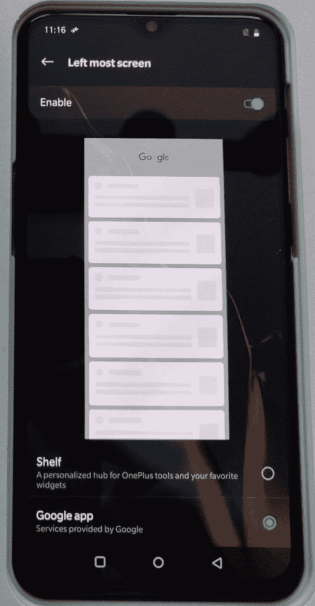

# T-Mobile 一加 6T 的发射器有一个内置的谷歌提要

> 原文：<https://www.xda-developers.com/t-mobile-oneplus-6t-launcher-google-feed/>

# T-Mobile 一加 6T 的发射器有一个内置的谷歌提要

除了令人印象深刻的规格，T-Mobile 版本的一加 6T 在其发射器中获得了一个独家的对 Google Feed 的原生支持！

一加 6T 是一辆令人印象深刻的汽车，最近开始在全球范围内销售。许多人得到了这款设备，但除了令人印象深刻的规格， [T-Mobile 的一加 6T 版本](https://www.xda-developers.com/oneplus-6t-t-mobile-model-details/)有一个独家的宝石——在其启动器中支持 Google Feed！

两天前，XDA 论坛成员 cheer up 38 T1 首次引起了人们的注意，他指出，在股票一加启动器中有一个选项，可以在书架(一加小工具屏幕)和谷歌提要(自从最近更名为 T3 后，现在被称为谷歌发现)之间进行选择。

 <picture></picture> 

Credits: XDA Senior Member [cheerup38](https://forum.xda-developers.com/member.php?u=2875170)

今天晚些时候，Reddit 上出现了 T-Mobile 的发射器版本[的摘录 APK。唯一的问题是，用户反映他们无法简单地将它安装在他们的全球一加 6T 设备上。T-Mobile 版本的发射器版本号为 3.0.2，而“常规”一加 6T 的版本号为 3.1.0。这可能是安装失败的原因，但问题仍在调查中。](https://www.reddit.com/r/oneplus/comments/9uec1u/does_anyone_have_the_6t_launcher_apk_with_the/)

 **值得注意的是，一加发射器 3.10 版本在一加 6T 和 OnePlus 6 上实现了一个新的导航手势，所以很奇怪 T-Mobile 版本与旧的发射器版本一起发布。T-Mobile 用户报告说，在将启动器从版本 3.0.2 更新到 3.10 时没有问题，同时保留了 Google Discover 功能。这表明该功能可以通过功能标志来启用，尽管我们仍在研究如何在不修改 APK 的情况下启用它。

这不是我们第一次听说一加设备上的 Google Feed，但这是一加第一次在他们的发布平台上正式支持这项功能。有可能一加只是在测试 T-Mobile 版本的 Google Feed 集成，他们很快就会把它和应用程序更新一起带给其他人。敬请期待！**