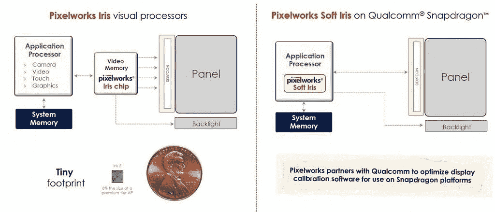

# TCL 10 系列将 Pixelworks 技术作为扩展合作伙伴关系的一部分

> 原文：<https://www.xda-developers.com/tcl-10-pixelworks-display/>

在今年早些时候拉斯维加斯的消费电子展上，TCL [戏弄了 TCL 10 系列](https://www.xda-developers.com/tcl-10-5g-10l-and-10-pro-affordable-mid-range-smartphones/)，这是 TCL 自有品牌的三款中端智能手机。除了设计和一些基本规格，我们对新的智能手机系列了解不多。然而，今天 TCL 公布了新智能手机的完整规格、定价、可用性和功能。他们还宣布延长与显示和视觉处理公司 Pixelworks 的合作伙伴关系，将后者的技术引入 TCL 的新 10 系列。

作为今天发布的一部分，Pixelworks 确认 10 Pro、10L 和 10 5G 采用 Pixelworks 的第四代 Iris 芯片，这是一种显示处理芯片。TCL 10 系列使用这种 Iris 芯片进行 HDR 色调映射、实时 SDR 到 HDR 转换和图像清晰度增强。

在 10 系列之前，TCL 第一款采用 Pixelworks 显示技术的智能手机是 [TCL Plex](https://www.xda-developers.com/tcl-unveils-the-mid-range-plex-with-triple-cameras-new-alcatel-devices/) 。在 10 系列中加入 Pixelworks tech 是两家公司合作关系的延伸。因此，我们可以预计未来的 TCL 智能手机也将采用 Pixelworks 显示技术，甚至可能采用 Pixelworks 最新的 Iris 5 芯片。

Pixelworks 最新的显示芯片，[Iris 5](https://www.xda-developers.com/pixelworks-iris-5-visual-processor-android-display-experience-oppo-find-x2/)，目前为止只在黑鲨 3 系列和 OPPO Find X2 系列中发现。下面嵌入的图片来自 Pixelworks 与我们分享的一张幻灯片。幻灯片显示了 Pixelworks 提供的各种集成:软虹膜(用于纯软件显示增强)和虹膜视觉处理芯片(用于硬件加速显示增强)。

 <picture></picture> 

Source: Pixelworks

10 Pro 采用曲面 AMOLED 显示屏，可能来自中国华星光电科技(CSOT)，这是一家 TCL 旗下的中国显示器制造商。另一方面，10L 和 10 5G 配备的液晶显示器很可能也是由 CSOT 制造的。因此，TCL 10 系列不仅代表了该公司推广自有智能手机品牌的最大努力，也代表了他们在高端有机发光二极管市场与其他显示器制造商竞争的尝试。

**[TCL 10L 论坛](https://forum.xda-developers.com/tcl-10l)** ||| **[TCL 10 Pro 论坛](https://forum.xda-developers.com/tcl-10-pro)| |**| |[TCL 10 5G 论坛](https://forum.xda-developers.com/tcl-10-5g)****