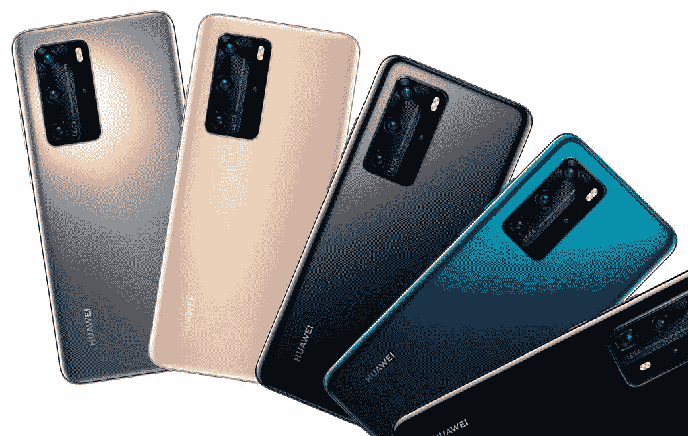

# 告诉我们您想在 HDC 2020 上看到什么，并赢取一台华为 P40 Pro(面向所有国家开放)

> 原文：<https://www.xda-developers.com/tell-us-what-you-want-to-see-at-hdc-2020-and-win-a-huawei-p40-pro-open-to-all-countries/>

2020 华为开发者大会将于 9 月 10-12 日举行。这个会议是华为的年度活动，开发者可以在这里了解正在开发的令人兴奋的新技术。预计他们将谈论 HMS 5.0 以及随该更新一起推出的新开发人员工具包。主题还将包括鸿蒙系统和 EMUI 11，这是华为手机最新的操作系统更新。

该活动将包括:

*   300 多个主题涉及开放功能
*   400 多位行业资深人士分享见解
*   500 多家科技公司帮助打造全新的生态系统
*   还有更多

要参加活动并了解更多关于 2020 华为开发者大会的信息，请访问此处的[官方网站，然后在此处](https://developer.huawei.com/consumer/en/events/hdc2020/index.html?channelname=HuoDong7&ha_source=events)进入竞赛主题[。](https://forum.xda-developers.com/android/huawei-developers/tell-want-to-huawei-developer-t4155113)

**华为开发者大会 2020 活动日期:2020 年 9 月 10-12 日**

## **赢一台华为 P40 Pro**

除了 2020 年 HDC 上所有令人兴奋的话题，你还想看到什么？这是您赢取华为 P40 Pro 的机会。你所要做的就是在这个帖子里留下评论，详细说明你希望在这个活动中包括什么。我们将从世界各地挑选一名幸运的获胜者，获得一台新的华为 P40 Pro。只需留下详细评论即可进入。

**竞赛规则:**

[**进入赢取 P40 Pro！**](https://forum.xda-developers.com/android/huawei-developers/tell-want-to-huawei-developer-t4155113)

 <picture></picture> 

HUAWEI P40 Pro

许多人认为华为 P40 Pro 是目前市场上最好的摄影手机。TIPA 世界奖提名这款手机为最佳拍照智能手机，这要归功于这款手机令人惊叹的拍照技术。P40 Pro 有一个 50MP 摄像头，配有 1/1.28 英寸超视觉传感器。它可以吸收大量的光线，这意味着在弱光环境下拍摄的照片看起来非常棒。将这一点与实时深度感应相机相结合，您可以在照片中创建专业级的散景效果。

使用 100 倍超变焦阵列获得远处物体的详细照片。在 3 倍光学变焦、20 倍混合变焦或 100 倍最大变焦之间进行选择，获得任何智能手机中最佳的变焦相机。

华为 P40 Pro 还配有 40MP 超宽电影摄像机。这款相机具有 1/1.54 英寸的传感器，超低光视频，超慢动作视频，长焦视频和 4K 延时。这是一款功能齐全的电影摄像机，旨在为用户提供拍摄完美照片所需的所有工具。

###### 我们感谢华为赞助这篇文章。我们的赞助商帮助我们支付与运行 XDA 相关的许多费用，包括服务器成本、全职开发人员、新闻撰稿人等等。虽然您可能会在门户内容旁边看到赞助内容(这些内容将始终被标记为赞助内容),但门户团队对这些帖子不承担任何责任。赞助内容、广告和 XDA 仓库完全由一个独立的团队管理。XDA 绝不会通过接受金钱来赞扬一家公司，或以任何方式改变我们的观点或看法，从而损害其新闻诚信。我们的意见不能被收买。