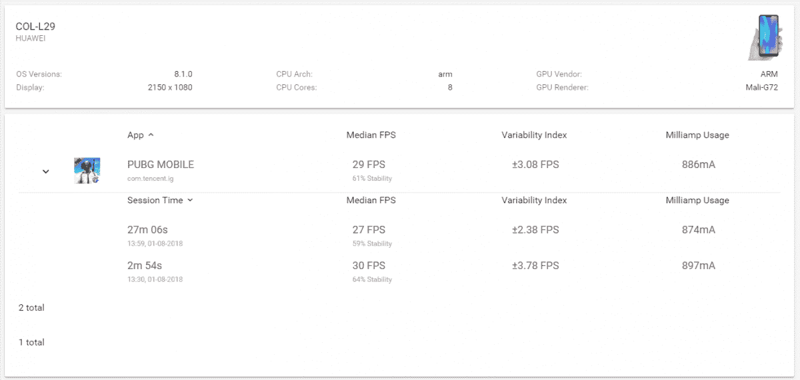
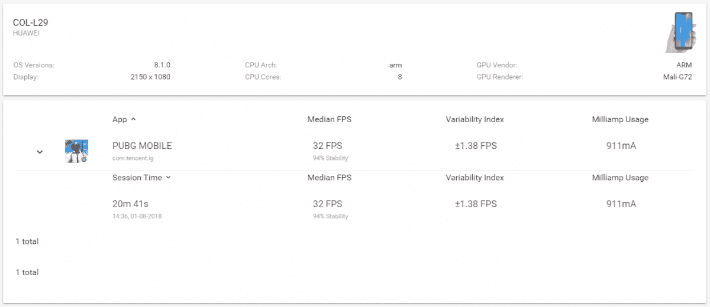

# 测试 Honor 的 GPU Turbo 更新

> 原文：<https://www.xda-developers.com/testing-honors-gpu-turbo-update/>

我们得到了 Honor 即将推出的 GPU Turbo 更新的早期 OTA。Honor 声称这一更新将使你的游戏性能提高 60%。这将提供更高的帧率，更流畅的游戏，以及更好的整体性能。GPU Turbo 也有助于节省电池。Honor 声称，在玩游戏时，你的手机将消耗大约 30%的电池电量。

为了测试这一点，我们在没有 GPU Turbo 更新的 Honor 10 上玩了一轮 PUBG，然后在有 GPU Turbo 更新的 Honor 10 上玩了一轮。两款手机的所有规格都相同。

我们使用 GameBench 来监控两种设备的游戏性能。这是结果。

| 

PUBG 统计

 | 

荣誉 10(无 GPU Turbo)

 | 

荣誉 10(带 GPU Turbo)

 |
| --- | --- | --- |
| 中值 FPS | 29 FPS | 32 FPS |
| 可变性指数 | 3.08 FPS | 1.38 FPS |
| 稳定性 | 61% | 94% |
| 游戏时间 | 27 分 06 秒 | 20 分 41 秒 |
| 电池使用 | 874 毫安 | 911 毫安 |

 <picture></picture> 

GameBench Results for Honor 10 without GPU Turbo Update

 <picture></picture> 

GameBench Results for Honor 10 with GPU Turbo Update

通过 GPU turbo 更新，性能有了显著提高，同时保持了更高、更一致的帧速率。

目前，只有少数游戏兼容 GPU 加速功能。这些游戏包括 PUBG、Mobile Legends 和 Asphalt 9。希望将来会有更多的游戏加入列表。

Honor 计划在 8 月 3 日向所有 Honor 10 用户推出此更新。

###### 我们感谢 Honor 赞助了这篇文章。我们的赞助商帮助我们支付与运行 XDA 相关的许多费用，包括服务器成本、全职开发人员、新闻撰稿人等等。虽然您可能会在门户内容旁边看到赞助内容(这些内容将始终被标记为赞助内容),但门户团队对这些帖子不承担任何责任。赞助内容、广告和 XDA 仓库完全由一个独立的团队管理。XDA 绝不会通过接受金钱来赞扬一家公司，或以任何方式改变我们的观点或看法，从而损害其新闻诚信。我们的意见不能被收买。