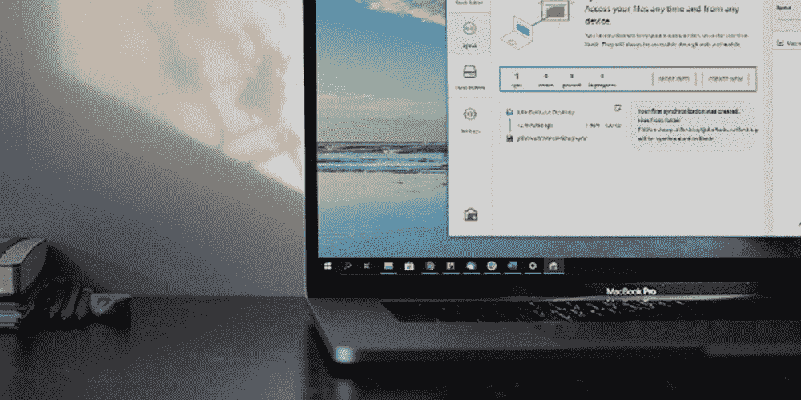
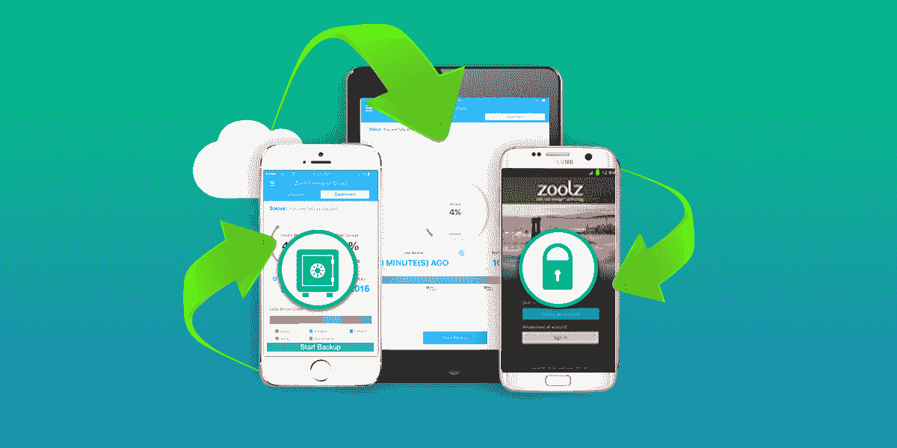

# 这个假日季节云存储和备份的 5 个最佳交易

> 原文：<https://www.xda-developers.com/the-5-best-deals-on-cloud-storage-and-backup-this-holiday-season/>

无论你是想备份照片，还是想在设备间同步文件，云存储空间总是有用的。以下是 XDA Developers Depot 这个假期云服务的最优惠价格——现在结账时使用 code MerrySave15 可以享受八五折优惠。

## **极地备份云存储:终身订阅**

****

基于亚马逊网络服务(AWS)技术， [极地备份](https://depot.xda-developers.com/sales/polar-backup-lifetime-subscription-1tb?utm_source=xda-developers.com&utm_medium=referral&utm_campaign=polar-backup-lifetime-subscription-1tb&utm_term=scsf-355030&utm_content=a0x1P000004N0ko&scsonar=1) 提供了慷慨 1TB 的安全备份。您的文件受 AES-256 加密保护，您可以备份任何 PC、Mac 或外部驱动器。

价值 390 美元，终身备份是 [现在 34 美元](https://depot.xda-developers.com/sales/polar-backup-lifetime-subscription-1tb?utm_source=xda-developers.com&utm_medium=referral&utm_campaign=polar-backup-lifetime-subscription-1tb&utm_term=scsf-355030&utm_content=a0x1P000004N0ko&scsonar=1) 代码 **MerrySave15** 。

## **Degoo Premium:终身备份计划**

****

比 Dropbox、OneDrive 和 Google Drive 加起来还大的空间，[Degoo Premium](https://depot.xda-developers.com/sales/degoo-ultimate-2tb-backup-plan-lifetime-subscription?utm_source=xda-developers.com&utm_medium=referral&utm_campaign=degoo-ultimate-2tb-backup-plan-lifetime-subscription&utm_term=scsf-355392&utm_content=a0x1P000004N0ko&scsonar=1https://depot.xda-developers.com/sales/degoo-premium-lifetime-backup-plans-1tb?utm_source=xda-developers.com&utm_medium=referral&utm_campaign=degoo-premium-lifetime-backup-plans-1tb&utm_term=scsf-355391&utm_content=a0x1P000004N0ko&scsonar=1)给你充足的备份空间玩。该平台会自动备份您的数据，您可以与朋友和家人安全地共享文件。终身 1TB 备份价值 900 美元，现在[仅为 42.50 美元](https://depot.xda-developers.com/sales/degoo-premium-lifetime-backup-plans-1tb?utm_source=xda-developers.com&utm_medium=referral&utm_campaign=degoo-premium-lifetime-backup-plans-1tb&utm_term=scsf-355391&utm_content=a0x1P000004N0ko&scsonar=1)。你可以 51 美元升级到[2TB](https://depot.xda-developers.com/sales/degoo-ultimate-2tb-backup-plan-lifetime-subscription?utm_source=xda-developers.com&utm_medium=referral&utm_campaign=degoo-ultimate-2tb-backup-plan-lifetime-subscription&utm_term=scsf-355392&utm_content=a0x1P000004N0ko&scsonar=1)，59.50 美元获得[3TB](https://depot.xda-developers.com/sales/degoo-premium-lifetime-3tb-backup-plan?utm_source=xda-developers.com&utm_medium=referral&utm_campaign=degoo-premium-lifetime-3tb-backup-plan&utm_term=scsf-355393&utm_content=a0x1P000004N0ko&scsonar=1)，或者 85 美元抢到 10TB 计划。

## **Koofr 云存储计划:终身订阅**

[库弗](https://depot.xda-developers.com/sales/koofr-cloud-storage-plans-lifetime-subscription-25gb?utm_source=xda-developers.com&utm_medium=referral&utm_campaign=koofr-cloud-storage-plans-lifetime-subscription-25gb&utm_term=scsf-355395&utm_content=a0x1P000004N0ko&scsonar=1) 让事情变得简单。该平台易于使用，没有眼花缭乱。它还允许您连接其他云帐户，以便您可以在一个位置查看所有文件。更好的是，没有文件大小限制。

价值 270 美元，25GB 终身计划是 [现在 17 美元](https://depot.xda-developers.com/sales/koofr-cloud-storage-plans-lifetime-subscription-25gb?utm_source=xda-developers.com&utm_medium=referral&utm_campaign=koofr-cloud-storage-plans-lifetime-subscription-25gb&utm_term=scsf-355395&utm_content=a0x1P000004N0ko&scsonar=1) 。你可以升级到 100GB 的 [售价 30.66 美元](https://depot.xda-developers.com/sales/koofr-cloud-storage-plans-lifetime-subscription-100gb?utm_source=xda-developers.com&utm_medium=referral&utm_campaign=koofr-cloud-storage-plans-lifetime-subscription-100gb&utm_term=scsf-355397&utm_content=a0x1P000004N0ko&scsonar=1) ，250GB 的 [仅需 59.50 美元](https://depot.xda-developers.com/sales/koofr-cloud-storage-plans-lifetime-subscription-250gb?utm_source=xda-developers.com&utm_medium=referral&utm_campaign=koofr-cloud-storage-plans-lifetime-subscription-250gb&utm_term=scsf-355396&utm_content=a0x1P000004N0ko&scsonar=1) ，或者 1TB 的 [仅需 110.50 美元](https://depot.xda-developers.com/sales/koofr-cloud-storage-plans-lifetime-subscription-1tb?utm_source=xda-developers.com&utm_medium=referral&utm_campaign=koofr-cloud-storage-plans-lifetime-subscription-1tb&utm_term=scsf-355398&utm_content=a0x1P000004N0ko&scsonar=1) 。

## **ThunderDrive 云存储:终身订阅**

运行在强大的 Tier IV 数据中心设施上，[ThunderDrive](https://depot.xda-developers.com/sales/thunderdrive-pro-2tb-lifetime-subscription?utm_source=xda-developers.com&utm_medium=referral&utm_campaign=thunderdrive-pro-2tb-lifetime-subscription&utm_term=scsf-355401&utm_content=a0x1P000004N0ko&scsonar=1)存储比亚马逊快 6 倍。您可以通过任何桌面或移动设备访问您的文件，256 位 AES 加密让您完全放心。正常 1200 美元，终身 2TB 订阅现在 [只要 33.15 美元](https://depot.xda-developers.com/sales/thunderdrive-pro-2tb-lifetime-subscription?utm_source=xda-developers.com&utm_medium=referral&utm_campaign=thunderdrive-pro-2tb-lifetime-subscription&utm_term=scsf-355401&utm_content=a0x1P000004N0ko&scsonar=1) 。如果你愿意，你可以花 24.65 美元 购买 [的终身个人计划(500GB)。](https://depot.xda-developers.com/sales/thunderdrive-personal-500gb-lifetime-subscription?utm_source=xda-developers.com&utm_medium=referral&utm_campaign=thunderdrive-personal-500gb-lifetime-subscription&utm_term=scsf-355402&utm_content=a0x1P000004N0ko&scsonar=1)

## **Zoolz 双云存储:终身订阅**

结合冷藏和即时存取储存， [Zoolz](https://depot.xda-developers.com/sales/unlimited-users-unlimited-servers?utm_source=xda-developers.com&utm_medium=referral&utm_campaign=unlimited-users-unlimited-servers&utm_term=scsf-355404&utm_content=a0x1P000004N0ko&scsonar=1) 提供难以置信的价值。Instant Vault 非常适合您每天使用的文件，而 Archive Backup 则适合家庭照片和其他珍贵文件。 花费 101.15 美元 即可获得无限用户终身 1TB 冷存储 [。](https://depot.xda-developers.com/sales/unlimited-users-unlimited-servers?utm_source=xda-developers.com&utm_medium=referral&utm_campaign=unlimited-users-unlimited-servers&utm_term=scsf-355404&utm_content=a0x1P000004N0ko&scsonar=1)

*价格随时变化*