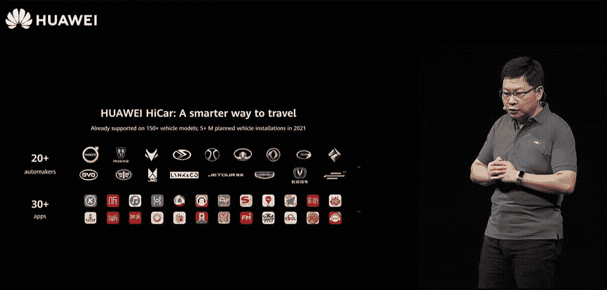
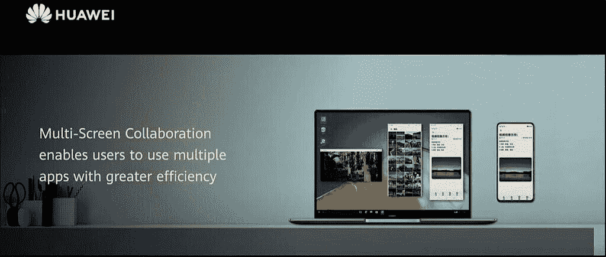
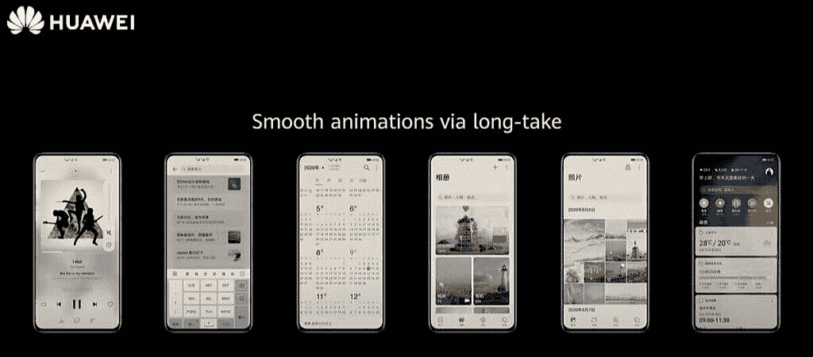

# 华为开发者大会 2020 最佳公告

> 原文：<https://www.xda-developers.com/the-best-announcements-from-hdc-together-2020/>

在 2020 年华为开发者大会的第一天，我们看到最大的宣布发生在他们的第一个初始主题演讲中。HDC。“在一起”活动从 9 月 10 日开始，将持续到 9 月 12 日。每个主题演讲都在网上播放，任何想参加的人都可以参加。如果您错过了开幕主题演讲，您可以观看下面的完整回放。你可以从华为在 twitter 上发布的这个简短摘要开始。

## 共同构建全连接、全场景的智能生态

##### *余承东(理查德·余)*

* * *

### HMS Core 5.0

在第一个活动中，Richard Yu 概述了公司最近的成功，并强调了其当前的重点领域。在本次演讲中，他们向我们介绍了 **HMS Core 5.0** 。开发者工具的这次更新为我们带来了新的套件，如相机套件、共享套件、cast+套件和无线套件。这些新套件有望使通信和传输变得前所未有的便捷。

HMS 现在拥有一个 180 万人的开发者社区，96，000 个应用程序现在已经在全球范围内集成了 HMS core。在 H1 2020 年，AppGallery 的应用下载量已达到 2610 亿次。随着 HMS 和 AppGallery 服务继续大幅增长，华为为希望接触中国观众的海外开发者提供了广泛的支持。

停留在 HMS 的话题上，华为谈到了他们的 Cyberverse 项目，这个项目使用了华为 AR 地图。该项目包括 3d 地图处理工具、沉浸式渲染功能、空间计算功能和 3D 场景编辑工具。最终目标是打造一个谷歌地图和必应地图的竞争对手。

华为 HiCar 被宣布为一种解决方案，将提供更智能的旅行方式。HiCar 将成为苹果 Carplay 和 Android Auto 的替代产品。华为已经与 20 多家汽车制造商合作，并支持 30 多种应用。

 <picture></picture> 

Huawei HiCar

我们希望有一天，街上的每辆车都能享受到 HiCar 的体验。

* * *

### 鸿蒙系统 2.0

Richard Yu 接着宣布了大会最重要的消息之一，即鸿蒙系统 2.0。该操作系统旨在成为移动设备和计算机的跨平台解决方案。华为向我们展示了鸿蒙系统将超越的许多不同情况，比如基于手表的导航。自适应 UX 框架意味着开发人员只需开发一次应用程序，它就会自动适应各种类型的设备。

我们花了很多时间来研究鸿蒙系统 2.0 中的一些新特性。这有望成为移动操作系统的一个强大而令人兴奋的新补充，观察这个新平台如何发展将是一件有趣的事情。要了解更多关于鸿蒙系统 2.0 的信息，请访问 developer.harmonyos.com

* * *

### EMUI 11

下一个重大宣布是 EMUI 11。EMUI 是华为版本的 Android，专为华为制造，支持智能手机和平板电脑。下一次更新基于 Android 11。

新的 UI 动画投入了大量的精力。华为使用眼球追踪技术来研究人类如何与 EMUI 互动，并改变了他们的设计，使其尽可能少地需要眼球运动。这是 EMUI 11 中所有新动画背后的关键

 <picture></picture> 

EMUI 11

 <picture></picture> 

EMUI 11

EMUI 11 非常注重多屏协作。分屏一直是 EMUI 的一个功能，但手机的屏幕很小，也很有限。EMUI 11 现在可以利用 PC 来显示智能手机的其他屏幕。展示了一个演示，其中一个图形可以无缝地从 PC 显示器拖到平板电脑显示器上。这与您在连接到同一台电脑的两台显示器上拖动应用程序窗口的行为相同。一旦 EMUI 11 在更多设备上可用，这项新功能看起来会非常有趣。

AI 字幕将是这次更新的另一个重要特征。实时为视频添加字幕的能力是一个重要的辅助功能，我们已经在最近的 Android 更新中看到了这一功能。然而，如果你也能翻译你的字幕，它会带来更多的机会。新的人工智能字幕可以将英语、日语和韩语翻译成中文。

要更深入地了解 EMUI 11，请参阅我们的文章:

[**EMUI 11 上手:华为最新安卓更新让多任务更简单**](https://www.xda-developers.com/emui-11-huawei-honor-android-update-hands-on/)

这些都是我们从 HDC 看到的最大的公告。在一起 2020。您可以在活动页面[点击](https://developer.huawei.com/consumer/en/events/hdc2020/)继续观看活动现场直播。

###### 我们感谢华为赞助这篇文章。我们的赞助商帮助我们支付与运行 XDA 相关的许多费用，包括服务器成本、全职开发人员、新闻撰稿人等等。虽然您可能会在门户内容旁边看到赞助内容(这些内容将始终被标记为赞助内容),但门户团队对这些帖子不承担任何责任。赞助内容、广告和 XDA 仓库完全由一个独立的团队管理。XDA 绝不会通过接受金钱来赞扬一家公司，或以任何方式改变我们的观点或看法，从而损害其新闻诚信。我们的意见不能被收买。