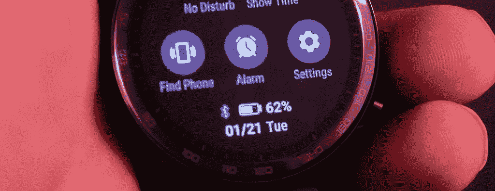
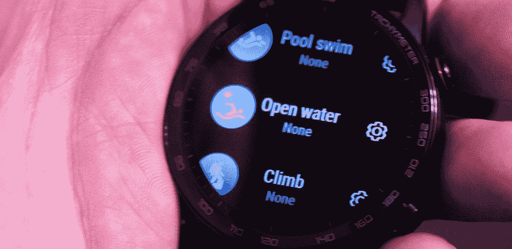
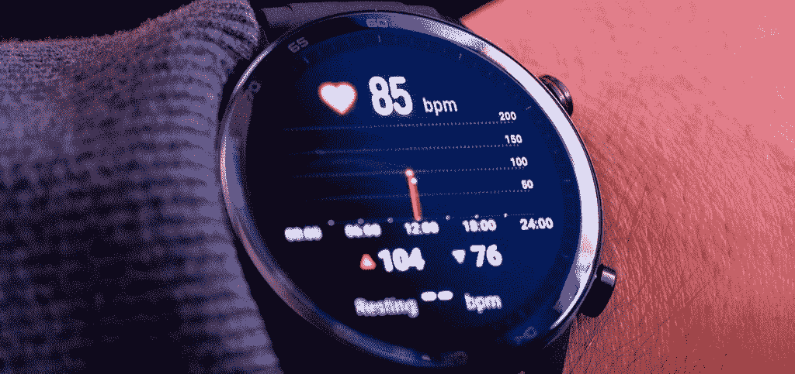
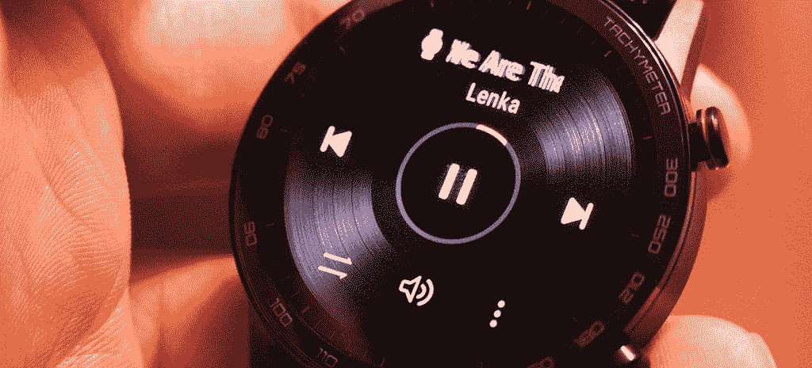

# 荣誉魔法手表 2 的最佳功能

> 原文：<https://www.xda-developers.com/the-best-features-of-the-honor-magicwatch-2/>

HONOR MagicWatch 2 是市场上最先进的智能手表之一，具有许多令人兴奋的功能。HONOR 让我们试用这款手表，在使用了一段时间后，我们发现了 HONOR MagicWatch 2 的一些我们最喜欢的功能。

## 14 天电池续航时间

 <picture></picture> 

HONOR MagicWatch 2 Battery Life Indicator

麒麟 A1 是一个超级强大和高效的芯片组。这款手表在任何时候都表现完美，只是在消耗电池。在需要充电之前，电池可以持续使用 14 天。用磁性充电器给手表充电很简单，而且充电速度很快。

## 15 种基于目标的健身模式

 <picture></picture> 

HONOR MagicWatch 2 Fitness Modes

健身追踪是这款手表最强的方面。根据您正在进行的锻炼类型，有 15 种基于目标的健身模式。每个人都有实时可行建议的 voiceover 指导。它就像你自己的私人教练，记录你所有的锻炼数据，并帮助你提高。

## 华为麒麟 A1 芯片组

 <picture></picture> 

HONOR MagicWatch 2 Powered by the Kirin A1 Chipset

麒麟 A1 芯片组是华为内部开发的芯片组。这是一款低功耗超高效芯片组，专为这类设备而设计。A1 芯片组的强大功能是手表流畅性能的原因。手表软件的每个方面都快速可靠。A1 是可穿戴设备的游戏规则改变者，MagicWatch 2 就是一个很好的例子。

## 游泳心率监测

 <picture></picture> 

HONOR MagicWatch 2 Heart Rate Monitoring

凭借 50 米防水和全新的华为 TruSeen 3.5，MagicWatch 2 可以帮助您更好地了解您的游泳表现，准确测量您的心率，包括 SWOLF、距离、卡路里和速度。在游泳训练中随身携带 HONOR MagicWatch 2，准确跟踪您的心率。

## 无线音乐播放

 <picture></picture> 

HONOR MagicWatch 2 Music Controls

大多数时候，你的智能手表能够通过手机上的蓝牙连接来控制媒体播放。HONOR MagicWatch 2 拥有 4GB 的板载存储空间，供您存储本地音乐文件。然后你可以直接连接到你的蓝牙耳机，听你的音乐，不需要你的手机。这是一个如此伟大的功能的原因是因为许多人喜欢在慢跑和锻炼时把手机留在身后。更容易的是，只带着手表，仍然可以访问所有的音乐。

这些都是 HONOR MagicWatch 2 我们最喜欢的功能。点击以下链接，了解更多腕表信息。

[**获得荣誉魔法手表 2**](https://www.hihonor.com/global/products/accessories/honor-magic-watch2-46mm/)

###### 我们感谢 HONOR 赞助了这篇文章。我们的赞助商帮助我们支付与运行 XDA 相关的许多费用，包括服务器成本、全职开发人员、新闻撰稿人等等。虽然您可能会在门户内容旁边看到赞助内容(这些内容将始终被标记为赞助内容),但门户团队对这些帖子不承担任何责任。赞助内容、广告和 XDA 仓库完全由一个独立的团队管理。XDA 绝不会通过接受金钱来赞扬一家公司，或以任何方式改变我们的观点或看法，从而损害其新闻诚信。我们的意见不能被收买。