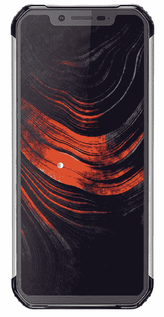
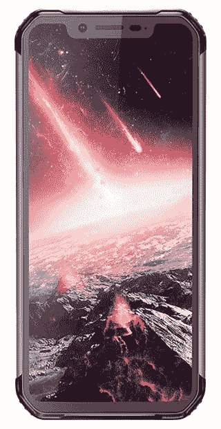

# Blackview BV9600 Pro/Plus 开始预售

> 原文：<https://www.xda-developers.com/the-blackview-bv9600-pro-plus-kicks-off-presale/>

Blackview 在发布 BV9600 时，将他们的最新手机之一称为“世界顶级坚不可摧的手机”。自上一款机型以来，Blackview 进行了多次关键升级，旨在打造市场上最好的坚固手机之一。

Blackview 刚刚推出了 BV9600 的 Pro 和 Plus 版本。BV9600 Pro 现在可以购买，而 BV9600 Plus 目前正在进行 [Indiegogo 活动](https://goo.gl/M3tX6d)。预售将持续整个 11 月，起价为 369.99 美元。预售持续的每一天，价格都会上涨 4 美元。所以一定要尽快拿到你的。

| 

BV9600 Plus

 | 

BV9600 Pro

 |
| --- | --- |
| 显示屏内指纹读取器 | 侧置指纹读取器 |
| 安卓 9.0 派 | 安卓 8.1 奥利奥(计划升级到安卓 9.0 派) |
| 6.21 英寸 AMOLED 显示屏，分辨率为 1080*2248 | 6.21 英寸 AMOLED 显示屏，分辨率为 1080*2248 |
| 2.0GHz P60 处理器/Mali-G72-MP3 | 2.0GHz P60 处理器/Mali-G72-MP3 |
| 6GB 内存/128GB 存储空间 | 6GB 内存/128GB 存储空间 |
| 16MP +8MP 后置摄像头，8MP 前置摄像头 | 16MP +8MP 后置摄像头，8MP 前置摄像头 |
| 5580 毫安时电池 | 5580 毫安时电池 |

## 防水材料

BV9600 采用防水设计，可完全潜水。不管你是把它扔进水池、水槽，还是像海洋一样的盐水中，你的手机仍然可以正常工作。人们甚至测试过将手机放入冰中冷冻，然后放入滚烫的水，而不会影响手机。

## 防跌落

就耐用性而言，这款手机可以从楼梯上摔下来，被自行车碾过，或者埋在泥里，其 IP-68 耐用性评级。这也适用于手机的显示屏，具有防碎屏幕。

## 防尘的

不要害怕把你的手机带进有防尘设计的车间。让沙子、锯屑、金属屑或任何其他细小颗粒远离你的手机。

Blackview 正在确保需要极其耐用的手机的客户不会错过当今旗舰设备的任何高级功能。这就是 BV9600 包括 AMOLED 显示屏、双镜头三星摄像头、强大的游戏 GPU 和显示指纹传感器等功能的原因。

5580mAh 大电池搭配强大的电池寿命优化软件，至少可使用一天。事实上，即使你只是整天玩游戏，你也可以在充电前玩 13 个小时。

 <picture></picture> 

BV9600 Pro

 <picture></picture> 

BV9600 Plus

[**跟随 BV9600 Plus Indiegogo 战役**](https://www.indiegogo.com/projects/blackview-most-reliable-uncrackable-smartphone/coming_soon/)

[**预订 BV9600 Pro**](http://promo.blackview.hk/new-rugged-phone-bv9600-pro-plus-hot-presale/)

###### *我们感谢 Blackview 赞助这篇文章。我们的赞助商帮助我们支付与运行 XDA 相关的许多费用，包括服务器成本、全职开发人员、新闻撰稿人等等。虽然您可能会在门户内容旁边看到赞助内容(这些内容将始终被标记为赞助内容),但门户团队对这些帖子不承担任何责任。赞助内容、广告和 XDA 仓库完全由一个独立的团队管理。XDA 绝不会通过接受金钱来赞扬一家公司，或以任何方式改变我们的观点或看法，从而损害其新闻诚信。我们的意见不能被收买。*