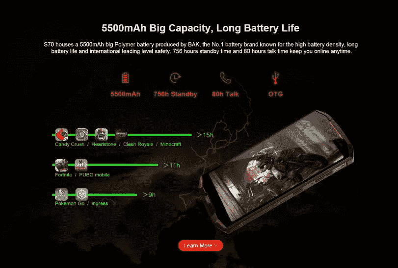
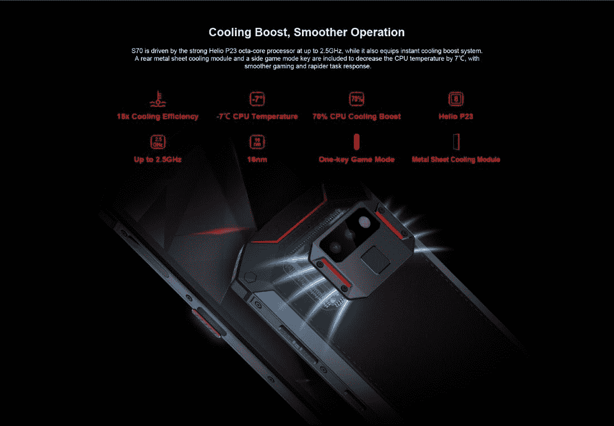

# DOOGEE S70 是世界上第一款坚固耐用的游戏智能手机

> 原文：<https://www.xda-developers.com/the-doogee-s70-is-the-worlds-first-rugged-gaming-smartphone/>

DOOGEE 一直在对他们最近发布的手机进行实验。他们的手机带来了独特和原创的设计、出色的规格、大容量电池和耐用的构造。他们最新的加固手机旨在将两个非常重要的功能结合在一起，成为世界上第一个组合:耐用性和游戏性。

DOOGEE S70 是第一款坚固的游戏智能手机。这款手机将专注于提供惊人的游戏体验，同时保持高耐用性标准。

| 

DOOGEE S70 规格

 |  |
| --- | --- |
| Game Mode 丨 Gamepad | 2400 万感光单位 |
| IP68 丨 IP69K 丨 MIL-STD-810G | 1.4μm 大像素 |
| 5.99 英寸 FHD+屏幕(18:9) | 1600 万像素三星前置摄像头 |
| Helio P23 八核 2.5GHz | 5500mAh 电池 |
| 6GB+64GB 丨 Cooling Boost | 24W 闪光充电器 |
| 1250 万像素索尼 IMX363 后置摄像头 | 无线充电 |
| 双 PD 自动对焦 | 国家足球联盟 |

DOOGEE S70 拥有强大的 GPU 和 6GB 的内存。S70 在运动补偿技术、图像质量增强和暗光处理方面具有出色的兼容性。这款出色的手机实现了无阻碍的游戏性能，让您在游戏世界中自由自在。

摄像头也是这款设备的一个重点。主摄像头由一个 12MP 索尼 IMX363 和一个 5MP 景深镜头组成。这种组合将使用 f/1.8 光圈拍摄更清晰的照片。该相机使用 140 万像素，为您提供出色的弱光性能。

自拍相机是 16MP 三星传感器，f/2.0 光圈。使用美颜模式拍摄令人惊艳的高质量自拍。

 <picture></picture> 

Get more game time with the large 5500mAh battery

 <picture></picture> 

Extreme cooling efficiency keeps temperatures low even when gaming.

与以前的型号不同，S70 是一款先进的全网通坚固型手机。它支持全球网络频率，覆盖范围比 iPhone 更广。

DOOGEE S70 强大的规格和巨大的 5500 毫安时电池在一些最受欢迎的游戏中接受了测试。以下是你可以期待的以下应用程序的播放时间。

糖果粉碎/心石/皇家冲突/《我的世界》: **15 小时**

堡垒之夜/ PUBG Mobile: **11 小时**

口袋妖怪 Go / Ingress: **9 小时**

DOOGEE 实现了几个功能来增加这款手机的耐用性。你会发现屏幕是防碎的，铝合金框架，边角保护，悬浮边框。这款手机的防护等级为 IP68，防水防尘。

S70 内置的功能将使这款手机在您玩喜爱的游戏时具有高性能。但 DOOGEE 明白，为了让一部手机真正被称为“游戏手机”，你必须拥有一些新的硬件，让 Android 上的游戏变得更好。这就是 G1 出现的原因。这款游戏手柄专为 S70 设计。您可以将此配件夹在手机上，以启用游戏操纵杆控制器。请观看此视频，了解它的实际应用。

关注 DOOGEE S70 的 Indiegogo 活动，获取这款智能手机的最新信息。

[**DOOGEE S70 INDIEGOGO 战役**](https://www.indiegogo.com/projects/doogee-s70-world-s-first-gaming-rugged-smartphone/coming_soon)

[**DOOGEE S70 官网**](https://www.doogee.cc/sale/s70/)