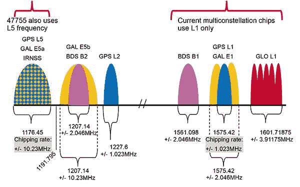

# 荣誉视图 20 使用双频 GPS 信号更好

> 原文：<https://www.xda-developers.com/the-honor-view20-uses-dual-frequency-gps-for-a-better-signal/>

自从手机开始配备 GPS 以来，这项技术并没有太大的进步。在很长一段时间里，如果你买了一部廉价的智能手机，你或多或少会得到与最昂贵的旗舰手机相同的 GPS 性能。这是因为标准是在任何智能手机中使用单频 GPS 接收器。随着双频 GPS 技术的实施，一些制造商开始改变这种状况。这项技术旨在为您提供更精确的 GPS 信号。

 <picture></picture> 

Broadcom BCM47755 via GPSWorld

点击此处了解有关双频全球导航卫星系统的更多信息: [**双频全球导航卫星系统——您的手机可能缺少的一项重要定位功能**](https://www.xda-developers.com/dual-frequency-gnss-important-location-feature-your-phone-probably-missing/)

当 Honor 设计 Honor View20 时，他们认为为消费者提供更精确的 GPS 非常重要。荣誉观 20，以及未来的荣誉设备，有改进的双频全球定位系统。这使得手机在高楼林立的环境中更加准确。大型建筑和结构会通过从不同表面反射卫星信号来混淆单频 GPS 电话，使您手机的 GPS 精度高达 5 米。双频 GPS 通过跟踪卫星接收的不同无线电频率上的两个信号来解决这个问题。使用这种方法，荣誉视图 20 可以实现高达 30 厘米的精度，而不是 5 米。

 <picture></picture> 

Honor View20 with Dual-Frequency GPS

除了更精确的 GPS，Honor View20 在其他手机无法覆盖的地区也有更强的信号。我们把荣誉观带到了一个多层停车场，在那里任何普通的电话都会失去信号。关闭数据，使用谷歌地图的本地离线地图，我们在一加 6T 和 Honor View20 上推出了地图应用。正如你在视频中看到的，荣誉视图 20 能够立即找到信号，而一加 6T 从来没有得到信号。

*ObePlus 6T(左)荣誉视图 20(右)*

我们可能会在大多数未来的荣誉设备中看到双频 GPS，提供更精确的 GPS 信号。

[**荣誉观 20 论坛**](https://forum.xda-developers.com/honor-view-20)

###### 我们感谢 HONOR 赞助了这篇文章。我们的赞助商帮助我们支付与运行 XDA 相关的许多费用，包括服务器成本、全职开发人员、新闻撰稿人等等。虽然您可能会在门户内容旁边看到赞助内容(这些内容将始终被标记为赞助内容),但门户团队对这些帖子不承担任何责任。赞助内容、广告和 XDA 仓库完全由一个独立的团队管理。XDA 绝不会通过接受金钱来赞扬一家公司，或以任何方式改变我们的观点或看法，从而损害其新闻诚信。我们的意见不能被收买。