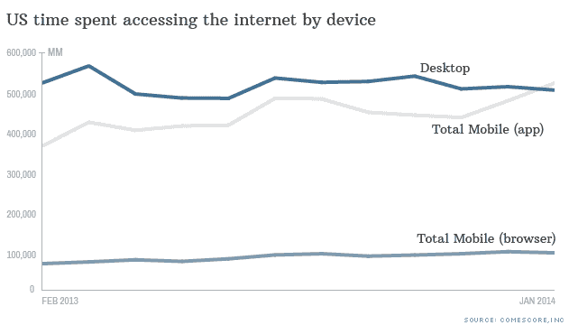

# 移动互联网的速度和它是如何被抑制的

> 原文：<https://www.xda-developers.com/the-need-for-better-internet-on-our-phones/>

如今，移动互联网是智能手机必不可少的一部分……嗯，对我们 75%的人来说是这样的。尽管住在一个我最快的网络达到 5 兆下载速度的地方，在非常断断续续的 3G 网络上，它肯定是我使用的一个重要部分，以至于*即使有我的第三世界网络，*我简直无法理解为什么还有四分之一的用户没有数据套餐。看看这部分智能手机用户是否与廉价或低端智能手机用户分享了很大一部分，这将是一件有趣的事情，这些用户不可否认地认为拥有数据套餐没有什么好处，特别是在 2G 和 3G 网络较慢的第三世界国家。但随着 Whatsapp [等应用程序主导拉丁美洲市场](https://agenda.weforum.org/2014/06/social-media-worldwide/)(我在这里的经历很好地反映了这一点)，许多预算用户仍然有数据套餐，甚至 20 MB 的数据上限套餐([是的，这是一件事](http://i.imgur.com/LJ5oFHN.png)这里)也被最贫穷的智能手机用户广泛采用。

因此，随着移动互联网的崛起，以及不断趋向于让你的手机名正言顺地被称为“智能”的必要性，有几个因素对良好的移动互联网体验至关重要。三个最重要的因素无疑是*速度*、*数量*，以及有时被忽视的*可用性*。可用性和数量主要由您的运营商决定，以及他们有多少基础设施和慷慨程度。另一个重要因素是上传和下载的速度，它不仅高度依赖于你所在的网络类型和运营商的管理方式，还高度依赖于你的硬件是否支持所述网络。

这种硬件支持必须被发明、设计、构建并放入您的手机中，以便您享受下一层网络速度，并且这些速度的理论最大值不仅随着新“代”(用技术术语来说)而增加，而且随着技术代内的改进而增加。也许近年来谈论最多的改进来自骁龙 805 及其对 Cat 6 LTE 的支持( *Cat* 代表*类别*，而不是 cats……遗憾的是)，它最初是与去年在韩国发布的[Galaxy S5 LTE-A 一起推出的。该设备的下载速度上限为 300 Mbps。现在**非常重要的是**澄清 MB(兆位)和 Mb(兆字节)不是**同一个东西。许多开利员工对此感到困惑，我曾就此与不知情的经理发生过争执:**](https://www.qualcomm.com/news/releases/2014/06/18/qualcomm-powers-worlds-first-commercial-lte-advanced-category-6-smartphone)

首先，他们出售每秒“兆比特”，因为这个数字会更大，我认为他们知道用户会将这个数字与他们在设备存储中更经常看到的数字相混淆。Cat 6 LTE 的理论最大值转化为每秒 37.5 兆字节(1 字节 8 位)的下载速度，这仍然是*疯狂的*。但是有许多人认为他们 50 Mbps 的互联网可以让他们在 1 秒钟内下载 50 Mbps 的文件，而实际上至少要花 8 倍的时间，这还没有考虑到可能影响这个速度的数百个因素。

这里的每个人都知道，或者因为你是一个爱好者，或者因为市场营销，现在的手机都有 4G LTE，比 3G 早几年，我们仍然偶尔听到 2G。让我们先了解一下它们是什么。

## **G 为 Gen**

在无线技术领域,“G”代表“一代”。每一代都与上一代不兼容，这就是为什么调制解调器必须适应更新和更老的技术以获得完全覆盖-所以如果你想要新一代，你必须升级你的手机。每一代的飞跃带来的直接显著改进是速度，因为 4G 明显快于 3G，而 3G 又明显快于 2G。

第一代是旧的模拟蜂窝系统，到了第二代，我们看到了向数字系统的飞跃——这在当时相当缓慢。许多手机，甚至是新手机，都保留了 2G 网络，因为在许多市场中，它是主要网络之一，在一些更先进的市场中，它是备用解决方案。2G 手机的网速从每秒 9.6 千比特到大约 200 比特不等。很容易让人想起和它同居的拨号上网时代。

第三代(3G)以 200 Kbps 的速率开始，使用 HSPA 和 HSPA+技术，理论上最高可达 82 Mbps..但是不要到处去找。不过，3G 覆盖了很多标准，已知的包括 UMTS、CDMA2000、EDGE(blackberry throwback……)和 HSPA。

然后是 4G，LTE 和 WiMAX 等系统，声称现实生活中的速度为每秒 5 兆比特或更高，但在可用性和一致性方面实现了标准化，以达到家庭电缆连接的感觉。现在我们已经有了 4G 版本，有望达到每秒几百兆的速度。4G 的另一个好处是其“全 IP”特性，允许他们用 IP 语音系统取代旧的基于电路的语音电话呼叫……随着互联网呼叫的广泛采用，这一点开始显现出来。

********

 **## **Cat 6 LTE 对我意味着什么？**

因此，当 Cat 6 LTE S5 问世时，它的理论最高下载速度是几个月前推出的传统 S5 的两倍。Cat 6 设备具有优势，因为它们查看可用载波频谱的条带，并将两个不同的频段组合成一个更宽、更快的连接，最高可达 40 MHz。这种载波聚合并不新鲜，Galaxy S4 是第一个采用这种技术的公司，合并了高达 20 MHz 的频谱(使用 Cat 4)。

尽管这些新技术有着疯狂的速度限制，但在现实世界中你不会经常看到它们...如果有的话。任何时候的负载，以及区域覆盖和可用性，都会影响(并破坏)你的速度。例如，来自伦敦的 EE 运营商在他们的 Cat 4 LTE 服务测试中只看到了 60 Mbps 的峰值。这取决于你的运营商提供的“频谱通道”,以及它们在某个特定地点是否因大量使用而拥挤。但随着 Cat 6 LTE 接入两个独立的频段，他们将能够在一些频段创造更多空间，这意味着**即使那些没有 Cat 6 手机的人也将受益于**，因为每条车道上的流量都将减少。

## **速度值得吗？**

这个问题很棘手。对于社交媒体照片分享和网络浏览等许多用途来说，从现在起的速度升级*并不意味着太多。特别是考虑到上传的图片大小是[高度压缩的](http://www.xda-developers.com/a-look-into-instagrams-compression-quality/)……但是视频下载和上传会带来巨大的收益。随着制造商推动更高分辨率的屏幕今年在 4K 上市，合适的 4K 媒体将很快跟进。无论是通过流媒体还是批量下载，我们的文件都会变得越来越重——因此，如果我们想要那部清晰的 4K 电影，我们需要越来越快的速度。因此，就像科技领域的大多数事情一样，我们家中的显示器、这些显示器的媒体、我们口袋中同样质量的相同媒体的需求以及访问所述媒体的下载速度要求之间似乎存在协同作用。技术是一个错综复杂的互联网络，它很少离开它的节点。*

更高下载速度的另一个短期但值得一提的副作用是，Instagram、脸书等社交媒体平台*应该*提高它们的压缩标准，以允许更丰富的图像，理论上，这些图像将在适当的时候上传。在你手机未来的 4K 显示屏上看到分辨率高于 600x600 的图像不是很好吗？但是社交平台、视频流和任何类型的下载可以变得越来越快，但仍然必须回答一个微小的细节问题…

********

 **## **数据封顶！**

 尽管[我们花了大量的时间在手机上下载数据](http://money.cnn.com/2014/02/28/technology/mobile/mobile-apps-internet/)，但蜂窝网络数据并没有跟上步伐……运营商正在应对这种使用量的增加——以及随之而来的拥堵——不是通过基础设施投资，而是通过各种形式的数据上限。虽然移动互联网是一种“有限”的资源(毕竟，你只能在运营商频段中容纳这么多流量)，但数据上限对所有用户都有巨大的负面影响，不仅仅是那些愿意通过过度使用来滥用系统的用户。思科预测，到 2018 年，每月移动数据流量将达到 15.9 艾字节……约为 159 亿兆字节。因此，如果没有新的解决方法，拥堵只会变得更糟。

********

 **## **美国方式**

2014 年 8 月，Sprint [将美国消费者的数据量](http://newsroom.sprint.com/news-releases/its-a-new-day-for-data-for-american-consumers-1.htm)增加了一倍……这引发了很多反对

互联网上到处都是谣言，因为就像 Ars Technica 的 Jon Broadkin 直言不讳地说的那样，**运营商的网络规模不会在一夜之间翻倍。容量一直都在"*。这是真的——他们只是决定增加数据，很快其他人也跟着增加。*

 *这些网络还通过使用无限计划下载大量数据来“抑制”那些“贪婪”的用户，但根据主要运营商的说法，只有前 5%的用户面临这种情况。节流和数据上限是美国运营商政权的镰刀和锤子，这个政权是腐败的。该网络并不真正分析用户过去的使用模式，他们那个月使用了多少数据，或者在何时何地使用了多少数据——它只是根据乐队目前的压力大小进行调节。这意味着每个人都受到那些试图将他们的移动连接用作家庭 Wi-Fi 的无限计划的数据囤积者的影响。高峰时间管理和其他阈值也不起作用。

数据上限的一个大问题是，它们让难以置信的新一代产品和标准变成了浪费金钱。他们使得这些技术和服务的优点在超过某一点后变得毫无用处。想想看:一个每秒 300 兆的连接会在 **13.333 秒**内耗尽你的 500 兆数据上限。想象一下，如果你的朋友在使用你的手机时，意外地(或者是自愿地，但他不应该是你的朋友)点击了一个下载链接，这个链接大到足以在一次快速操作中耗尽你的大量数据，这将是多么可怕？你可能会因为一些愚蠢的错误而变得没有数据(或者速度变慢)，比如一个应用程序默认为高质量的流。

此外，一旦你超过了你的数据上限，你就有被无节制的风险(因此在前面的段落中是“无速度的”)。所以一旦进入拥堵区域，就可以和你的猫 6 下载速度吻别了。所以他们迫使你对他们大力推广的服务极其小心。你完全有理由不使用他们的服务，尽可能多地使用 Wi-Fi，即使速度较慢，即使你是无限的，也可以在月底前不面临严重的劣势。

因此，虽然每个人的无限数据并不理想(因为前面提到的蜂窝基础设施的限制)，但这些数据上限严重损害了向美国人提供的服务——顺便说一下，支付最高价格的美国人

虽然 T-Mobile 和 Sprint 等一些网络仍然提供无限的数据，但可悲的是，美国覆盖最广、性能最好的网络正在诉诸这些廉价的反资助活动，通过设置障碍来解决问题，导致低于标准的移动体验。

********

 **## **进步与贪婪**

因此，正如我们所看到的，对于推动这些技术向前发展的大型原始设备制造商来说，最重要的市场无疑是最昂贵的移动连接市场，以及就上述价格而言，不太理想的服务市场。这样的服务降低了这些技术的*影响力*，最终塑造了我们喜爱的服务——以及许多行业的进步。就像网飞不会以我们今天的网速和宽带互联网的发明而存在一样，我们几乎无法预测我们会错过什么样的服务，因为运营商的贪婪限制了我们智能手机的智能范围。由于美国市场是移动设备制造商销售最旺的市场之一，而且对移动世界来说是如此重要的一个地区，这些限制间接影响到我们所有人，因为众所周知，像美国这样的国家最终决定了许多国家的技术标准，许多原始设备制造商首先适应和调整美国的需求。

幸运的是，重要的市场都有诚实的服务，像韩国这样的国家一直在推动移动互联网向前发展。他们现在正在投资 5G 无线服务，这将比目前的 4G 网络快几百倍，下载速度超过每秒 800 兆字节(**是的，这次是兆字节**)。希望美国消费者不再墨守成规，并集体要求他们的服务收拾残局，向他们提供他们所吹捧的承诺。希望官僚企业能帮助消费者对抗资本主义的贪婪。希望《萤火虫》能重新播出。所有这些事情都不太可能，但我们仍然可以抱有希望...现在是 2015 年，美国，你太富有了，不应该这样…表现得像一个第一世界的超级大国。

##### 个人经历附件:在我生活的国家，获得无限数据套餐非常便宜(不过包括超过门槛的严格限制)，它允许你接入质量非常差的 3G 网络，要么根本不存在，要么在你想做一些有价值的事情时就被限制(比如 skype 通话或流媒体)...但是你可以不断尝试，最终得到你需要的一切。服务很差，而且非常贵(相比之下，一旦你调整到我们的工资)，客户支持很糟糕。我曾经在美国生活过几个月，也体验过美国的移动速度……当我得知他们强大的 4G 网络遭遇了我的第三世界国家给我们带来的许多问题，加上所有这些限制，严重削弱了某些运营商几乎所有人的体验时，我感到非常失望。我回到了我的穷国糟糕的互联网，心想“至少我有无限的数据…”*********