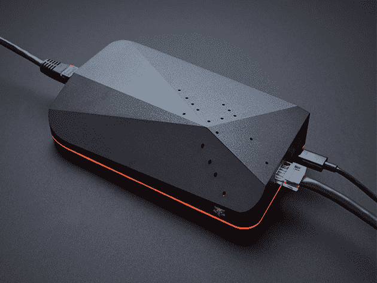
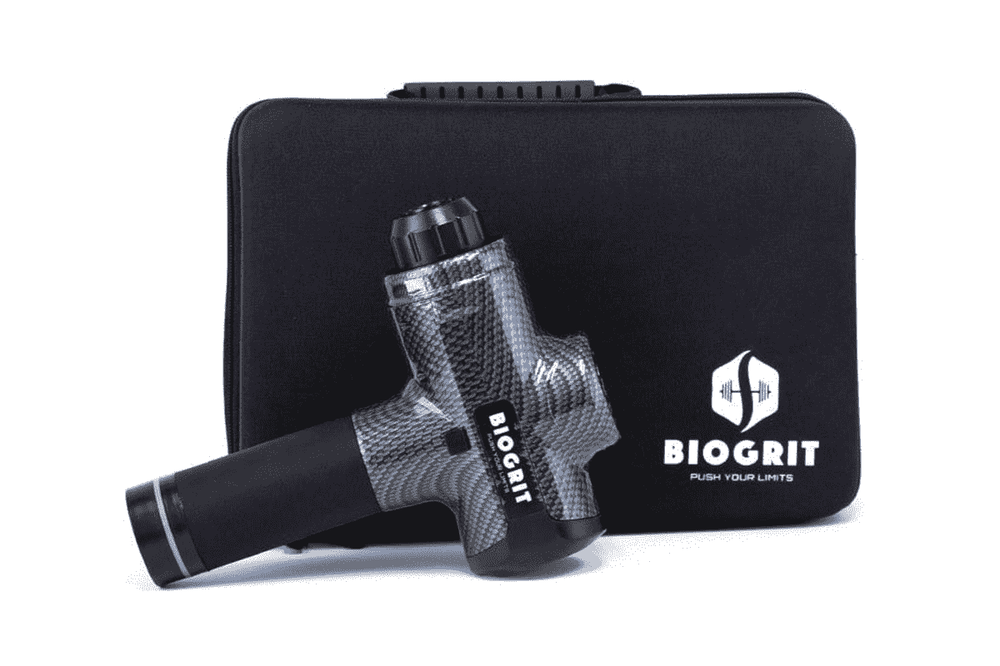

# 这些来自 XDA 商店的畅销商品在劳动节的时候会有额外的折扣

> 原文：<https://www.xda-developers.com/these-bestselling-deals-from-the-xda-shop-are-extra-discounted-for-labor-day/>

XDA 开发者仓库的虚拟货架上总是堆满了一些很棒的交易。但是为了庆祝劳动节，我们挑选了一些你最喜欢的产品，并进一步降低了价格。在 9 月 7 日之前，使用代码 **GOFORIT15** 参与以下任何一项交易，即可额外享受八五折优惠。

## **带谷歌助手的 TicWatch Sport 智能手表**

****

这款时尚防水的手表以合理的价格提供了令人难以置信的功能。[TIC watch S](https://depot.xda-developers.com/sales/ticwatch-sport-smartwatch-with-google-assistant-black?utm_source=xda-developers.com&utm_medium=referral&utm_campaign=ticwatch-sport-smartwatch-with-google-assistant-black&utm_term=scsf-430642&utm_content=a0x1P000004Y5PuQAK&scsonar=1)追踪你的运动、路线、步数和心率。它还可以在谷歌助手的支持下处理一系列 Android 应用程序，电池续航时间为 48 小时。正常情况下 99 美元，手表是 [现在只要 67.99 美元](https://depot.xda-developers.com/sales/ticwatch-sport-smartwatch-with-google-assistant-black?utm_source=xda-developers.com&utm_medium=referral&utm_campaign=ticwatch-sport-smartwatch-with-google-assistant-black&utm_term=scsf-430642&utm_content=a0x1P000004Y5PuQAK&scsonar=1) 带码。

## **SYFER:完整的网络安全 VPN 路由器**

讨厌在网上被跟踪？该设备插入您的 Wi-Fi 路由器，提供即时隐私保护。除了伪装您的身份， [SYFER](https://depot.xda-developers.com/sales/syfer-unlimited-smart-vpn-router-next-gen-smart-firewall-smart-home-iot-protection?utm_source=xda-developers.com&utm_medium=referral&utm_campaign=syfer-unlimited-smart-vpn-router-next-gen-smart-firewall-smart-home-iot-protection&utm_term=scsf-430643&utm_content=a0x1P000004Y5PuQAK&scsonar=1) 阻止勒索软件等威胁，保护您的孩子免受有害内容的侵害。价值 199 美元，它的 [现在只需 130.04 美元](https://depot.xda-developers.com/sales/syfer-unlimited-smart-vpn-router-next-gen-smart-firewall-smart-home-iot-protection?utm_source=xda-developers.com&utm_medium=referral&utm_campaign=syfer-unlimited-smart-vpn-router-next-gen-smart-firewall-smart-home-iot-protection&utm_term=scsf-430643&utm_content=a0x1P000004Y5PuQAK&scsonar=1) 同码。

## **keep solid VPN Unlimited:Infinity 计划**

****

另一个很棒的隐私选项是 [VPN 无限](https://depot.xda-developers.com/sales/keepsolid-vpn-unlimited-lifetime-subscription-5?utm_source=xda-developers.com&utm_medium=referral&utm_campaign=keepsolid-vpn-unlimited-lifetime-subscription-5&utm_term=scsf-430645&utm_content=a0x1P000004Y5PuQAK&scsonar=1) 。这项服务被称为 PC Mag 的顶级 VPN，它可以让你连接到世界各地的 400 多台服务器，具有无限的带宽和无日志记录。价值 299 美元的 Infinity 计划提供了 10 台设备上的 [终身保险，价格为 50.15 美元](https://depot.xda-developers.com/sales/keepsolid-vpn-unlimited-lifetime-subscription-5?utm_source=xda-developers.com&utm_medium=referral&utm_campaign=keepsolid-vpn-unlimited-lifetime-subscription-5&utm_term=scsf-430645&utm_content=a0x1P000004Y5PuQAK&scsonar=1) 【带代码】。

## **Google Home 的 LOFT 电池底座**

****

如果你拥有一个谷歌智能音箱，你真的应该得到一个 [LOFT 电池盒](https://depot.xda-developers.com/sales/loft-battery-base-for-google-home-carbon?utm_source=xda-developers.com&utm_medium=referral&utm_campaign=loft-battery-base-for-google-home-carbon&utm_term=scsf-430644&utm_content=a0x1P000004Y5PuQAK&scsonar=1) 。该配件通过磁铁夹住，可提供八小时的便携使用。在亚马逊上的评级为 4.4 星，电池从 49 美元降到了 14.44 美元[。](https://depot.xda-developers.com/sales/loft-battery-base-for-google-home-carbon?utm_source=xda-developers.com&utm_medium=referral&utm_campaign=loft-battery-base-for-google-home-carbon&utm_term=scsf-430644&utm_content=a0x1P000004Y5PuQAK&scsonar=1)

## **ExoGun DreamPro 叩诊按摩仪**

****

这款 [专业级按摩枪](https://depot.xda-developers.com/sales/exogun-dreampro-percussion-massage-device-ti?utm_source=xda-developers.com&utm_medium=referral&utm_campaign=exogun-dreampro-percussion-massage-device-ti&utm_term=scsf-430646&utm_content=a0x1P000004Y5PuQAK&scsonar=1) 有助于缓解紧张情绪，促进锻炼后更快恢复。它提供六种不同的速度，每种速度都经过科学优化，以促进血液流动并减少打结。它还有一个特殊的手柄，可以防止振动传到手臂上。 [原价 599 美元的 DreamPro 现在只要 101.99 美元](https://depot.xda-developers.com/sales/exogun-dreampro-percussion-massage-device-ti?utm_source=xda-developers.com&utm_medium=referral&utm_campaign=exogun-dreampro-percussion-massage-device-ti&utm_term=scsf-430646&utm_content=a0x1P000004Y5PuQAK&scsonar=1) 带代码。

## **Degoo Premium:终身 10TB 备份计划**

****

[Degoo Premium](https://depot.xda-developers.com/sales/degoo-premium-lifetime-backup-plans-10tb?utm_source=xda-developers.com&utm_medium=referral&utm_campaign=degoo-premium-lifetime-backup-plans-10tb&utm_term=scsf-430647&utm_content=a0x1P000004Y5PuQAK&scsonar=1)拥有足够的空间存储 18，620 小时的视频和数百万张照片和文档，是一款出色的云备份解决方案。它与桌面和移动设备配合使用，具有 256 位 AES 加密和安全文件共享功能。价值 3600 美元， [终身储存现为 84.99 美元](https://depot.xda-developers.com/sales/degoo-premium-lifetime-backup-plans-10tb?utm_source=xda-developers.com&utm_medium=referral&utm_campaign=degoo-premium-lifetime-backup-plans-10tb&utm_term=scsf-430647&utm_content=a0x1P000004Y5PuQAK&scsonar=1) 同码。

## **移动像素 DUEX Pro 便携式双显示器**

****

这款 [轻巧的 12.5 英寸显示屏](https://depot.xda-developers.com/sales/mobile-pixels-duex-pro-portable-dual-monitor-4?utm_source=xda-developers.com&utm_medium=referral&utm_campaign=mobile-pixels-duex-pro-portable-dual-monitor-4&utm_term=scsf-430648&utm_content=a0x1P000004Y5PuQAK&scsonar=1) 可以连接到笔记本电脑的侧面，作为第二块屏幕。它采用 IPS 技术，从任何角度都能提供出色的色彩，DUEX Pro 可与 PC、Mac 和 Linux 兼容。它在 Indiegogo 上筹集了超过 100 万美元，而 [现在只有 211.65 美元](https://depot.xda-developers.com/sales/mobile-pixels-duex-pro-portable-dual-monitor-4?utm_source=xda-developers.com&utm_medium=referral&utm_campaign=mobile-pixels-duex-pro-portable-dual-monitor-4&utm_term=scsf-430648&utm_content=a0x1P000004Y5PuQAK&scsonar=1) 。

## **CompTIA Linux 网络专业套装**

结合行业专家的两门课程，这款 [庞大的培训套装](https://depot.xda-developers.com/sales/the-comptia-linux-network-professional-bundle?utm_source=xda-developers.com&utm_medium=referral&utm_campaign=the-comptia-linux-network-professional-bundle&utm_term=scsf-430649&utm_content=a0x1P000004Y5PuQAK&scsonar=1) 帮助您掌握必备的 IT 技能。通过 62 小时的培训，您将获得通过 CompTIA Network+和 Linux+认证考试所需的知识。该培训价值 590 美元，但您可以通过代码 [花费 25.49 美元](https://depot.xda-developers.com/sales/the-comptia-linux-network-professional-bundle?utm_source=xda-developers.com&utm_medium=referral&utm_campaign=the-comptia-linux-network-professional-bundle&utm_term=scsf-430649&utm_content=a0x1P000004Y5PuQAK&scsonar=1) 立即获得。

## **BioGrit 按摩枪+ 8 个可更换的按摩头**

****

这款多功能按摩枪有 10 种不同的速度和 8 种不同的头部，可以让你瞄准每一个主要肌肉群。 [BioGrit](https://depot.xda-developers.com/sales/biogrit-massage-gun-8-replaceable-massage-heads-black?utm_source=xda-developers.com&utm_medium=referral&utm_campaign=biogrit-massage-gun-8-replaceable-massage-heads-black&utm_term=scsf-430650&utm_content=a0x1P000004Y5PuQAK&scsonar=1) 行动出奇的安静，充满电就能获得八小时的治疗。通常售价为 449 美元，这款按摩器是 [现在仅售 118.99 美元](https://depot.xda-developers.com/sales/biogrit-massage-gun-8-replaceable-massage-heads-black?utm_source=xda-developers.com&utm_medium=referral&utm_campaign=biogrit-massage-gun-8-replaceable-massage-heads-black&utm_term=scsf-430650&utm_content=a0x1P000004Y5PuQAK&scsonar=1) 带码。

## **2020 年高级道德黑客认证捆绑包**

想要在网络安全领域建立六位数的职业生涯？ [该捆绑包](https://depot.xda-developers.com/sales/the-2020-premium-ethical-hacking-certification-bundle?utm_source=xda-developers.com&utm_medium=referral&utm_campaign=the-2020-premium-ethical-hacking-certification-bundle&utm_term=scsf-430651&utm_content=a0x1P000004Y5PuQAK&scsonar=1) 提供 60 小时的实践培训，涵盖最新的威胁并致力于 CompTIA 认证。总共价值 1600 美元， [培训现在只要 50.99 美元](https://depot.xda-developers.com/sales/the-2020-premium-ethical-hacking-certification-bundle?utm_source=xda-developers.com&utm_medium=referral&utm_campaign=the-2020-premium-ethical-hacking-certification-bundle&utm_term=scsf-430651&utm_content=a0x1P000004Y5PuQAK&scsonar=1) 带代码。

*价格随时变化*