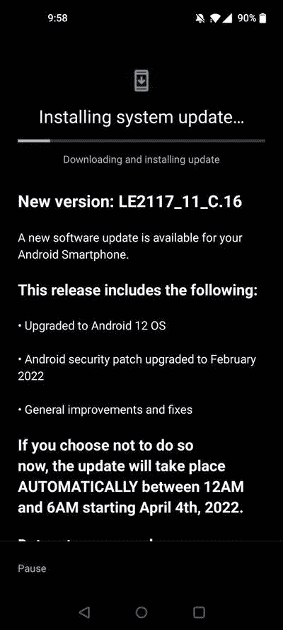

# T-Mobile 一加 9 和一加 9 Pro 终于获得了搭载 OxygenOS 12 的 Android 12 更新

> 原文：<https://www.xda-developers.com/tmobile-oneplus-9-oneplus-9-pro-android-12-oxygenos-12/>

解锁的一加 9 和 9 Pro 早在 2021 年 12 月就收到了 OxygenOS 12 的稳定 Android 12 更新。三个月后，T-Mobile 终于在美国推出了一加 9 系列的最新软件。该更新带有一个软件版本 **LE2117_11。C.16** (用于 9) / **LE2127_11。C.16** (针对 9 Pro)，除了带来对 Android 12 的跳转，还包括 2022 年 2 月的安全补丁。

 <picture></picture> 

Screenshot courtesy: OnePlus Community Member [RebelWolf](https://forums.oneplus.com/members/rebelwolf.3491462/)

T-Mobile 一加 9/9 Pro 的稳定 OxygenOS 12 OTA 的完整更新变更日志如下:

*   更新到 Android 12 OS
*   安卓安全补丁升级至 2022 年 2 月
*   常规改进和修复

**[一加 9 场 XDA 论坛](https://forum.xda-developers.com/f/oneplus-9.12151/) || [一加 9 场亲 XDA 论坛](https://forum.xda-developers.com/f/oneplus-9-pro.12153/)**

尽管变更日志很短，但 Android 12 版本为一加 9/9 Pro 带来了许多令人兴奋的变化，包括专注于新的生活质量功能和改进的全新用户界面，例如通知栏中始终可访问的书架。根据版本号字符串，T-Mobile OxygenOS 12 C.16 版本是在 3 月的第二周编译的，因此它应该与未锁定的 C.46 版本不相上下。尽管如此，解锁的型号已经在几天前收到了 2022 年 3 月 SPL 的软件版本 C.47，这表明 T-Mobile 变种在软件更新方面相当滞后。

**[一加 Android 12 追踪器:这里是 OxygenOS 12 官方所有 builds 下载安装](https://www.xda-developers.com/oneplus-oxygenos-12-android-12-update-tracker/)**

T-Mobile 还没有更新其 Android 更新跟踪页面的推出细节，但根据用户报告，这似乎是一个更广泛的推出。请记住，运营商机型上没有本地升级选项，所以您必须等待自动部署到您的设备上。或者，您也可以前往*设置* > *系统更新*手动检查更新状态。

T-Mobile 一加 9 与标准的一加 9 不同，它只有 8GB 内存和 128GB 内部存储。此外，颜色选择仅限于冬雾和星光黑。对于 Pro 机型，运营商仅提供晨雾配色的 12GB RAM/256GB 存储版本。

* * *

**来源:** [一加社区论坛](https://forums.oneplus.com/threads/oneplus-9-9-pro-t-mobile-a12-update-is-here.1558190/)