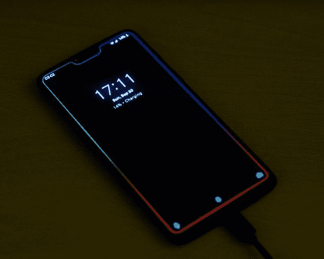

# XDA 论坛上的 2018 年度新独立应用

> 原文：<https://www.xda-developers.com/top-new-indie-apps-2018-xda-forum/>

XDA 是一个开发者社区。从一开始，我们就以几乎所有可能的方式支持移动设备上的定制开发，我们的态度在 2019 年完全没有改变。每年，我们的应用和游戏论坛都会发布大量的应用，我们很乐意与您分享我们的最爱。Android 开发者比 Google Play 商店拥有更多的自由来进行系统级的修改，这是 XDA 的一大特色。我们在论坛上收集了一些我们最喜欢的应用程序。这个列表没有特定的顺序，你可以去我们的论坛寻找更多！

[**访问 XDA 安卓应用&游戏论坛**](https://forum.xda-developers.com/android/apps-games)

* * *

## XDA 2018 年顶级独立应用

### 可达性光标

可达性光标是我今年在我们的论坛上发布的最喜欢的应用[之一。上面的视频展示了它是如何工作的。它添加了一个可以用来到达屏幕顶部的光标，有点像伸出你的手指。这对任何拥有大尺寸智能手机显示屏的人来说都是必备的，因为它使得单手操作设备时更容易触及显示屏的远角。它在非常高的智能手机上特别好用，比如 OnePlus 6。你可以看看下面 XDA 青年成员](https://www.xda-developers.com/use-tall-android-phone-one-handed/)[的帖子。](https://forum.xda-developers.com/member.php?u=9469014)

[**查看我们论坛上的可达性光标**](https://forum.xda-developers.com/android/apps-games/app-reachability-cursor-phone-t3846525)

### 边光壁纸

Borderlight 壁纸最初是 OnePlus 6 的一款应用[，是一种 AMOLED 动态壁纸，可以照亮你的显示器边缘。由于大众的需求，XDA 成员](https://www.xda-developers.com/borderlight-live-wallpaper-colors-oneplus-6/) [dax105](https://forum.xda-developers.com/member.php?u=5666298) 发布了一个支持*几乎所有*设备的版本。用户可以自己配置它，并与拥有相同设备的其他人共享他们的预设。这是一个非常酷的概念，你可以在下面的帖子中下载并尝试一下。我们选择了 Borderlight 壁纸，因为它是一种非常棒的壁纸，可以让你的手机脱颖而出。它对电池的影响很小，所以你的手机看起来很酷，不会消耗你宝贵的电池寿命。

[**查看我们论坛上的 Borderlight 壁纸**](https://forum.xda-developers.com/android/apps-games/live-wallpaper-borderlight-edge-t3861174)

### 去飞溅

对于那些喜欢定制设备主屏幕的人来说，DeSplash 非常棒。由 XDA 资深会员 [p32929](https://forum.xda-developers.com/member.php?u=5346826) 制作的 DeSplash 可以在你每次解锁你的设备时下载一个新的壁纸。这些照片都来自 Unsplash.com，一个充斥着世界各地专业摄影师拍摄的免费照片的网站。DeSplash 也是免费的，只是在应用程序中点缀了一些广告。下面是完整的特性列表。

*   100000 多张高分辨率照片
*   材料设计
*   新壁纸，每次你锁手机
*   自动设置新壁纸
*   各种图片类别
*   各种图片方向
*   各种图像质量

如果你一直在寻找壁纸，很难用 DeSplash 找到你喜欢的东西。有数以千计的壁纸很容易获得，所以你应该试一试！

[**在我们的论坛**](https://forum.xda-developers.com/android/apps-games/app-desplash-free-quality-wallpapers-t3865423) 查看化脓

## 远程指纹解锁

你曾经想用你的指纹解锁你的电脑吗？一般来说，你可以买一个设备来做这件事，但是直接从你的手机上做这件事不是很好吗？拥有远程指纹解锁功能的 XDA 成员 [Andrew-X](https://forum.xda-developers.com/member.php?u=5746760) 想出了一个办法来做到这一点，而且这是一个令人难以置信的[简单过程，让它在你的电脑上设置好](https://www.xda-developers.com/unlock-windows-pc-fingerprint-scanner-android/)。任何来自 Windows Vista 及更高版本的电脑都可以使用它，所以它也不是仅限于最新版本的 Windows。您可以查看以下功能的完整列表。

*   支持通过指纹扫描仪远程解锁本地和在线微软账户
*   设置 1 台电脑和 1 个帐户进行远程解锁
*   Wi-Fi 网络共享支持

专业功能(1.99 美元应用内购买)包括:

*   没有广告
*   添加多台 Windows 电脑
*   为每台 Windows PC 添加多个帐户
*   支持局域网唤醒

可以看看跟帖里的安装说明！

[app box Google play ro . Andrei mircius . remotefingauth]

[**在我们的论坛上查看远程指纹解锁**](https://forum.xda-developers.com/android/apps-games/app-remote-fingerprint-unlock-unlock-t3841148)

## 不要脸的插头:导航手势

我们自己的导航手势只是*有*在这里的某个地方被提及。就我个人而言，我没有参与它的开发，但我在我的 OnePlus 6 上非常喜欢它。它可以添加像 iPhone X，OnePlus 6 这样的手势，或者你自己定制的手势。这是一个很好的应用程序，它甚至可以禁用导航键，这样你就可以完全通过手势控制你的手机。我喜欢它，因为它可以最大化屏幕空间，尤其是当你的手机没有任何可见的按钮时，看起来会更好。所有的免费和高级功能如下。据我所知，绝对没有手势应用程序像我们自己的导航手势一样完整。内置系统手势也从来没有这么多的定制。

*   自由的
    *   主页
    *   背部
    *   最近的应用
    *   切换分屏*(需要安卓牛轧糖+)
    *   打开以前的应用程序(需要 Android 牛轧糖+)
    *   打开助手
    *   隐藏药丸

*   溢价
    *   拉下通知遮光板
    *   拉下速凝瓷砖
    *   打开电源菜单
    *   跳到上一个媒体轨道*
    *   跳到下一个媒体轨道*
    *   播放/暂停当前媒体曲目*
    *   切换键盘对话框
    *   启动应用**
    *   锁屏***
    *   截图****

*媒体操作不能保证适用于所有应用。媒体操作使用标准的 Android APIs 来处理大多数应用程序。

**如果你注意到一个应用程序在使用药丸触发 home 键后启动“缓慢”,那是因为早在 Android 4.4 KitKat 中就做出了一个模糊的改变。除非你有[这个暴露的模块](https://forum.xda-developers.com/xposed/modules/stopswitchdelay-remove-5s-delay-to-apps-t2688574)*或者一个安装了补丁的定制 ROM，否则别无选择。

* * *锁屏兼容绝大多数设备。它的工作原理是这样的:使屏幕亮度和显示超时最小，然后显示全屏黑色活动，直到手机实际进入睡眠模式从超时(~5 秒。)还有其他锁定屏幕的方法，但我们决定不采用，至少在这个版本中是这样。

* * * *截屏动作使用 MediaProjection API，通常用于录制屏幕。这里，我们只记录单帧的屏幕。这是前 Android P 的唯一工作方式。截图保存到/图片/导航手势

[**查看我们论坛上的导航手势**](https://forum.xda-developers.com/android/apps-games/official-xda-navigation-gestures-iphone-t3792361)

## pluvius[根]

Pluvius 是 XDA 知名开发者 MrBIMC 的一款很棒的主题化应用，它可以根据你当前启用的壁纸来为你的整个设备设计主题。有 14 天的试用期，之后你必须购买 2 美元的应用内购买才能继续使用。它与上面提到的 DeSplash 等应用程序配合得很好。它需要 root 访问才能工作，但之后，它可以在任何 Android 8.0 Oreo，Android 8.1 Oreo 或 Android Pie 设备上工作。你可以在上面的截图中看到 Pluvius 可以让你的整个 UI 看起来多么漂亮。这是非常可定制的，你只需改变*Pluvius 对新壁纸的反应，不管是什么颜色。*

[**在我们的论坛上查看 Pluvius**](https://forum.xda-developers.com/android/apps-games/app-pluvius-dynamic-oms-framework-t3814394)

## 亥伯龙发射器

Substratum 的制造商称，Hyperion Launcher 是一款高度可定制的启动器，适用于任何 Android 智能手机。它有很多特性，允许你定制成你想要的任何东西。Plus 版本解锁了更多的功能，但是基本启动器是完全免费的。这里没有太多要说的-这是一个很棒的发射器，有很多定制，所以如果你正在寻找不同的东西，那么你可能想试试 Hyperion 发射器。您可以控制界面的许多不同方面，添加手势，甚至根据自己的喜好更改动画。

[app box Google play projekt . launcher & HL = en]

[**在我们的论坛上查看 Hyperion 发射器**](https://forum.xda-developers.com/apps/substratum/official-hyperion-launcher-t3881654)

## 谷歌像素发射器模块[根]

一个需要 root 的应用程序，它可以修改 Google Pixel Launcher(和其他基于 Launcher3 的 Launcher ),以支持比平常更多的选项。下面是它可以添加的内容的完整列表。该应用程序是由 XDA 公认的开发者和公认的贡献者 [Quinny899](https://forum.xda-developers.com/member.php?u=3563640) 制作的！

*   改变图标(改变单个图标以及应用完整的图标包支持，并适用于从文件！)
*   更改标签
*   在主屏幕上隐藏时钟(需要辅助功能服务)
*   双击进入睡眠状态(通过一个小工具，阅读应用程序“调整”部分的说明)
*   夜灯/省电模式下系统界面和启动器的自动黑暗主题(需要 Android P)
*   修改部件大小(如果您愿意，可以缩小到 1x1)

[appbox xda com . Kieron Quinn . app . pixelaunchermods]

[**在我们的论坛**](https://forum.xda-developers.com/android/apps-games/app-pixel-launcher-mods-icon-packs-t3732483) 查看像素发射器模块

## 尼亚加拉发射器

如果 Hyperion Launcher 不合你的胃口，为什么不试试 XDA 青年成员 [8bitpit](https://forum.xda-developers.com/member.php?u=9435783) 的 [Niagara Launcher](https://www.xda-developers.com/niagara-launcher-minimalist-notifications/) ？这是一个极简的启动器，集成了你的通知。也有一些额外的功能，但没有什么令人生畏的，就像你可以对 Hyperion 或 Nova Launcher 这样的东西进行大量的修改。通知摘要可以直接在你的主页上阅读，所以你不需要拉下状态栏就能知道有什么在等着你。我从未见过像 Niagara Launcher 这么好的发射器，同时还保留了这种极简主义。它的一些主要特点如下。

*   基于列表，易于访问，外观简洁
*   由于可以随时访问滚动条，您可以快速打开应用程序
*   增强的通知“点”:直接在主屏幕上阅读摘要，并向右滑动以打开每个细节。
*   应用程序快捷方式(在 Android 7.1 中引入，其中一些是向后兼容的)
*   媒体播放器集成(需要通知访问)
*   隐藏应用程序以删除膨胀软件/预安装的应用程序
*   图标包支持

[**查看我们论坛上的尼亚加拉发射器**](https://forum.xda-developers.com/android/apps-games/app-niagara-launcher-fresh-clean-t3839100)

## 移动

如果你发现自己经常更换 rom，那么你可能想看看 XDA 资深会员 [SayantanRC](https://forum.xda-developers.com/member.php?u=7237343) 的 Migrate。它的基本目标是通过帮助你将所有的数据迁移到一个新的定制 ROM 上，成为一个更加自动化的 Titanium 备份。它创建一个可刷新的 zip 文件，其中有一个助手应用程序。您刷新 zip 文件，启动，并授予助手应用程序 root 访问权限。然后，它将恢复您的所有数据，包括通话记录，短信，默认键盘，保存的权限，等等。它可以做的事情非常多，如果你喜欢在我们的论坛上尝试定制的 rom，你应该去看看。

[**在我们的论坛上查看迁移**](https://forum.xda-developers.com/android/apps-games/app-migrate-custom-rom-migration-tool-t3862763)

## 边缘屏幕

你见过三星智能手机上的 Edge 功能吗？它可以让你用手机做许多不同的酷事情，包括启用一个小应用程序抽屉，你可以随时随地轻松访问。还有快速设置，你可以查看你的日历，你可以记录和截图你的显示，等等。感谢 XDA 资深会员 [alticode](https://forum.xda-developers.com/member.php?u=8444291) ，如果你想在你的智能手机上体验一下三星的体验，或许值得一试！这里是您可以启用的所有 9 个面板。

*   **Apps edge:** 轻松快捷地访问您最喜爱的应用。
*   **Contact edge:** 在您的联系人列表中访问您的常用联系人。用一种语调给他们打电话、发短信或发电子邮件。
*   **快速设置边缘:**允许用户控制一些快速设置，如打开/关闭手电筒、wifi、蓝牙、数据、飞行模式、音量增大/减小...
*   **虚拟键 Edge:** 用虚拟键代替你的硬键。忘记你的主页键，返回键，电源键或最近的应用程序，屏幕捕捉，屏幕录制。
*   **日历边缘:**创建、管理您的活动、会议或约会。
*   **音乐边缘:**用强大的音乐播放器随时听音乐。
*   **文件浏览器 Edge:** 通过剪切、复制、重命名、共享、删除操作管理您的文件。
*   **通话记录边缘:**管理通话记录
*   **计算器优势:**一个简单的计算器-让你的工作更快

[**在我们的论坛上查看边缘画面**](https://forum.xda-developers.com/android/apps-games/app-edge-screen-android-experience-t3809450)

## 安卓汽车网关

你用 Android Auto 吗？很多人都这样做，但它有局限性。装有 Android Auto 的老款汽车需要一直与你的汽车保持有线连接，只有新款汽车[开始推出可以使用蓝牙](https://www.xda-developers.com/wireless-android-auto-android-p/)。如果你有一辆这样的旧车，XDA 知名开发商 [Emil Borconi](https://forum.xda-developers.com/member.php?u=842765) 会为你提供解决方案。它需要一点工作才能工作，但你可以通过使用另一部手机或电视棒将你的手机无线连接到你的汽车上。你可以看看下面的帖子了解更多信息！

[appbox xda uk . co . bor coni . emil . aa gateway]

[**查看我们论坛上的 aa gateway**](https://forum.xda-developers.com/general/paid-software/android-3-0-proxy-gateway-android-auto-t3813163)

在过去的几年里，小工具在 Android 上已经是一个垂死的类别。它们有助于在主屏幕上一目了然地捕捉信息，但在大多数情况下，打开有问题的应用程序会更容易。但是，如果您可以从任何地方访问小部件会怎么样呢？由 XDA 知名开发商[开发的](https://forum.xda-developers.com/member.php?u=7055541)插件抽屉可以让你添加任意多的插件到一个可以从左或右滑动的抽屉里。这是一种独特的方式来访问你的手机上的小工具，是一个合适的组成部分，因为小工具已经从锁定屏幕中删除。

[**查看我们论坛上的小工具抽屉**](https://forum.xda-developers.com/general/paid-software/app-widget-drawer-t3866671)

## 午夜核心[根]

XDA 资深会员的 MidnightCore 是一个 Magisk 模块，它结合了我们论坛上的三个不同的修改——midnight fonts、MidnightMedia 和 MidnightMisc。这是一个用于定制手机的一体化套件，具有自定义字体、启动动画、UI 声音、锁定声音等。从技术上讲，这是一个根工具，而不是一个应用程序，但它是如此的通用，我觉得它值得一提。

[**在我们的论坛**](https://forum.xda-developers.com/apps/magisk/module-midnightcore-one-midnight-modules-t3762758) 查看午夜核心

## 1 歌词

在过去的几个月里，一个应用程序有了很大的发展，XDA 资深成员 T2 的歌词向你展示了你正在播放的歌曲的歌词。它的美妙之处在于，它几乎支持任何音乐流媒体服务，因为它直接从你的通知中读取歌曲播放。其主要特点如下。

*   **支持所有播放器** : Spotify，Google Play Music，Amazon Music，Samsung Music Player，以及所有你喜欢的流媒体服务和音乐播放器
***   **便捷访问**:点击实时通知，在歌词面板**显示(隐藏)歌词*****   **学习英语**:随着歌曲一起唱，除了英语之外的语言也支持***   **材质设计**:圆滑的新材质设计界面，动画流畅*   如果你喜欢，选择深色或黑色主题***   **吨级定制**:定制 app 的每一个细节***   **最小内存占用**:这个应用大约有 2 MB***   电池效率:该应用程序在后台什么也不做(没有广告，没有跟踪)，所以电池消耗远低于 1%(基于我的设备)************

 ******[appbox xda com . lyrics lover . one lyrics]

[**在我们的论坛上查看 1 首歌词**](https://forum.xda-developers.com/android/apps-games/app-1lyrics-instant-lyrics-spotify-t3812332)

## 过干

XDA 资深会员 over drop[brekane](https://forum.xda-developers.com/member.php?u=6013515)是最好的天气应用，你可能没有用过。它时尚、实用，而且高度可定制。有大量的功能使它真正独一无二，包括完整的 AMOLED 黑色模式。背景会根据天气变化，而且完全是动画。提供的功能如下。

*   简约现代的设计
*   每小时天气预报通知
*   黑暗天空气象提供商
*   24 小时天气预报
*   7 天预测
*   可扩展的预测，您可以在其中找到整个一周的详细信息
*   关于当前气压，云量，湿度，紫外线指数和更多的详细信息
*   陷波优化
*   城市管理器，您可以轻松管理您的位置
*   Android P 天气小工具
*   概览小部件
*   时钟部件、日期部件和电池部件

[**在我们的论坛**](https://forum.xda-developers.com/android/apps-games/weather-overdrop-t3791409) 查看透支

## 荣誉奖:谷歌摄像头端口

虽然 Google Camera 应用程序并不完全是独立开发，但是它的众多端口无疑是社区的贡献。这款官方应用是为谷歌 Pixel 开发的，但由于开发者在我们的论坛上投入了无数时间的工作，你可以在许多其他智能手机上使用它。你可以看看我们下面的论坛，所有最好的谷歌相机端口和模块。

[**加入谷歌相机 Mods 论坛**](https://forum.xda-developers.com/apps/google-camera-mods)******