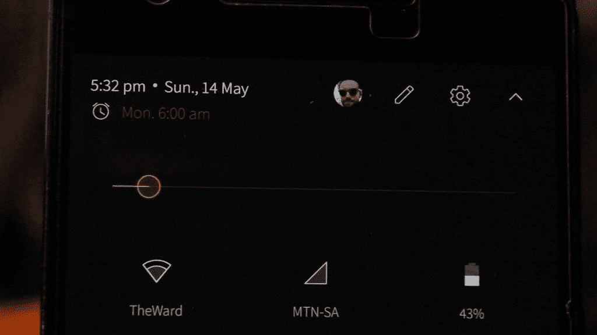
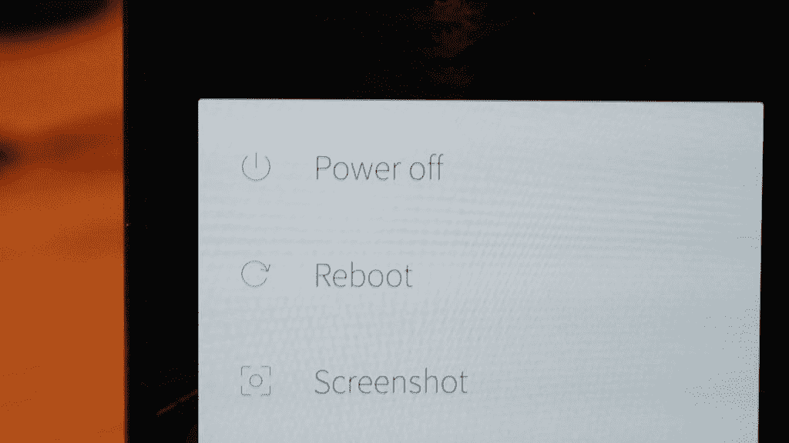
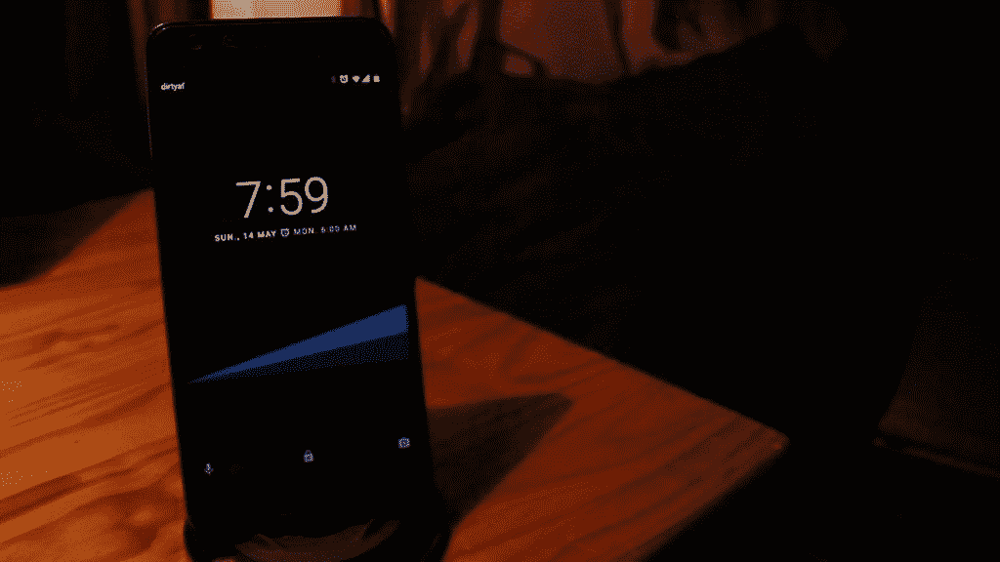
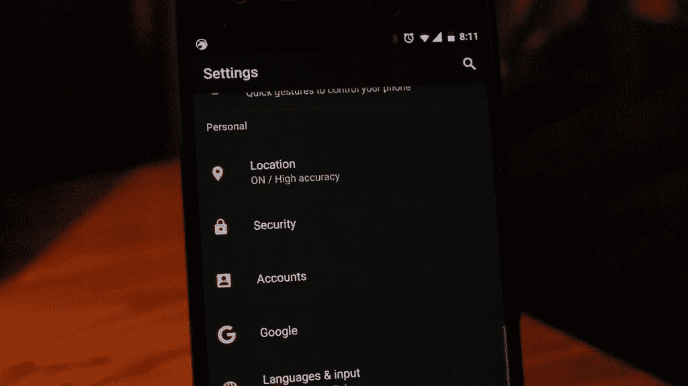
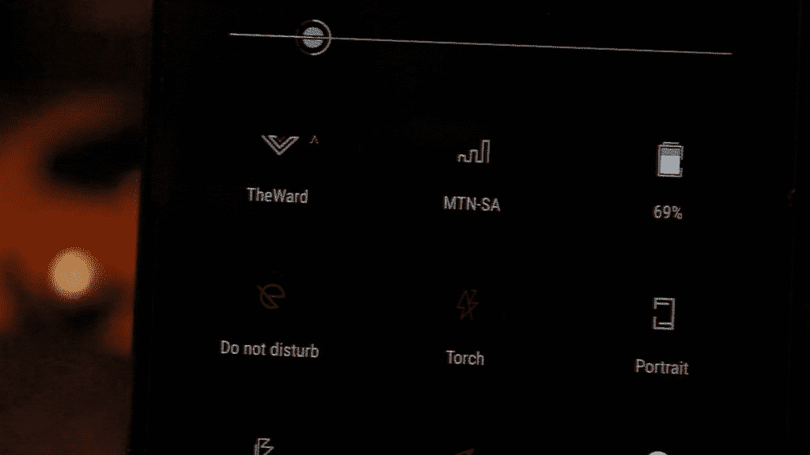
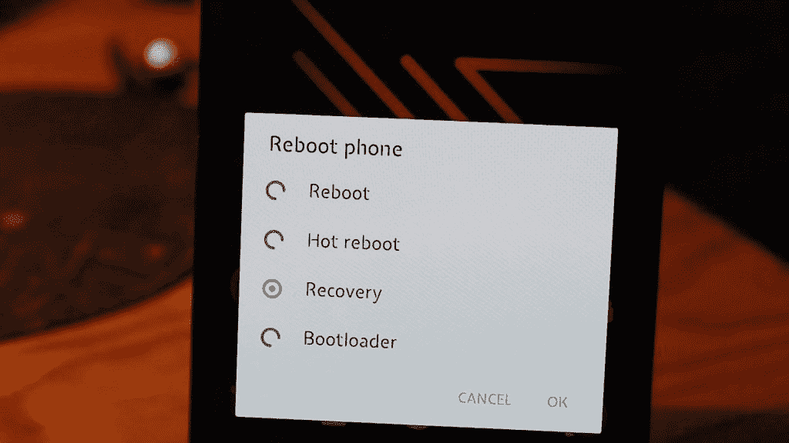

# 五月的底层主题第二部分

> 原文：<https://www.xda-developers.com/top-substratum-themes-for-may-part-2/>

在前一篇[文章](http://bit.ly/2qoUSdJ)中，我们精选了五月份的最佳底层主题。这主要是因为大量的时间和精力投入到创建这些 UI 调谐器之一。然而，在做了一些挖掘之后，一些更令人惊奇的主题出现了。

 <picture></picture> 

The Outline Substratum theme with quick settings menu

 <picture></picture> 

Outline theme with power menu showing.

接下来是大纲，一个确实需要得到更多认可的主题。有那么好。设计师决定采用轻薄、优雅的设计(实际上你并不经常看到这种设计)，他出色地完成了这一设计。他不仅仅停留在导航栏或快速设置上。这种轻薄的风格随处可见，甚至字体和应用程序都得到了改造。说到应用程序，大约有 80 个应用程序被主题化了。这已经很多了，即使是付费主题。主题本身是一个光明的主题，这是伟大的，因为许多主题都是黑暗的。此外，你还可以选择一些与光线非常匹配的颜色。

 <picture></picture> 

Not much to see besides its dark color

 <picture></picture> 

It does come with some great accent colors though

接下来是默认黑暗，一个不言自明的主题，实际上可能会吸引大多数用户。许多免费的主题有很多可供选择的功能，但是最终的结果没有达到目标。然而，这个主题坚持其根源，无论它们看起来多么简单。你可以选择一些强调色，它们看起来真的很好，并且有助于让你的黑色主题更有个性。一些默认应用程序也有一个黑暗的主题，比如你的联系人和信息应用程序，但不要期望太多。希望开发者能在未来为更多的应用添加主题。目前，它服务于一个简单、黑暗的主题，这是一件好事。

 <picture></picture> 

Some of the best quick settings around

 <picture></picture> 

Animations are found all over this theme

这款手机对手机细节的关注让我们措手不及。有点薄的用户界面有一个不完整的设计，可能类似于 S8 用户界面，即使这是更古老的。仅此一点就值得下载。但随后出现了许多主题应用程序(Google+，Keep，Hangouts 等)以及一些优雅的颜色，使它成为一个非常完美的主题。这些动画特别吸引人，还有它的深色壁纸。总的来说，这是一个伟大的免费主题，包含了大量的额外内容，将吸引许多轻主题爱好者。

底层主题根本不容易创建。你可以在这个[快速视频](http://bit.ly/2rniY5F)中找到更多关于这个令人惊叹的应用程序的信息，或者访问 XDA 官方论坛底层[这里](http://bit.ly/2pTGjLg)。