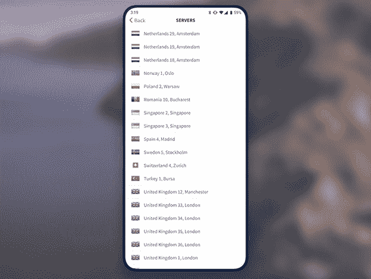
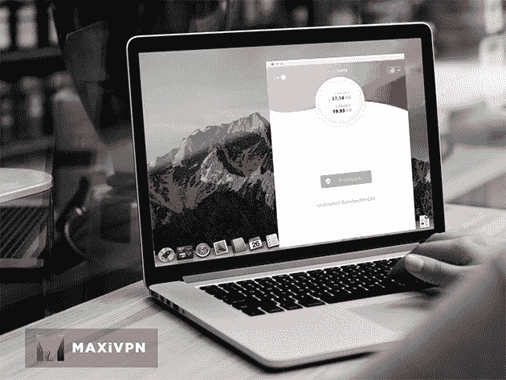
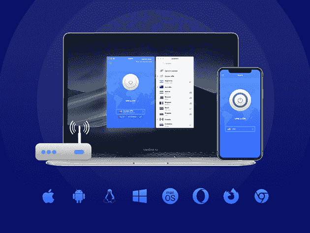
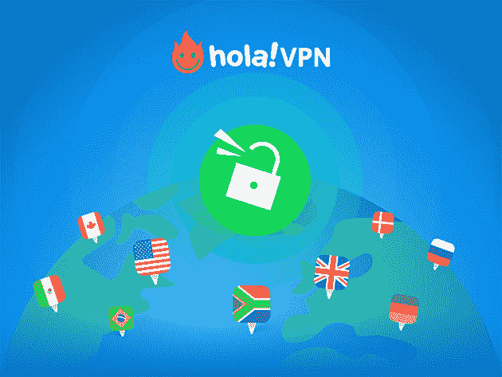
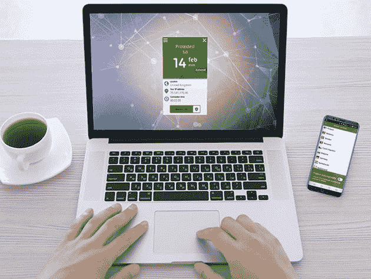
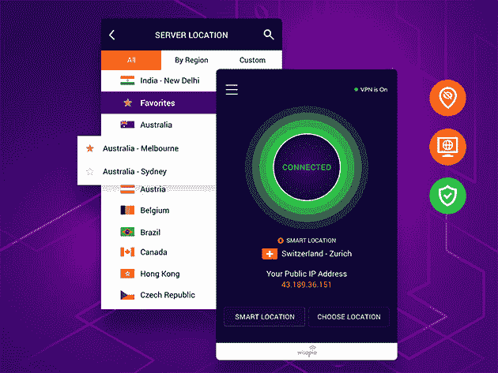

# 真正的私人浏览:本周 10 大最划算的 VPN 交易

> 原文：<https://www.xda-developers.com/true-private-browsing-10-of-the-best-deals-on-vpns-this-week/>

从亚马逊的追踪器到试图窃取你数据的网络罪犯，有很多很好的理由在网上保护自己。使用 VPN 是明智之举，本周在 XDA Developers Depot 有一些很棒的订阅交易。这里有一些最好的——现在有超过 90%的折扣。

## **Goose VPN: 2 年订阅**

同时在无限设备上提供保护， [鹅 VPN](https://depot.xda-developers.com/sales/goose-vpn-2-yr-subscription?utm_source=xda-developers.com&utm_medium=referral&utm_campaign=goose-vpn-2-yr-subscription&utm_term=scsf-424341&utm_content=a0x1P000004XwBOQA0&scsonar=1) 非常适合家庭使用。它还提供强大的加密和零日志记录；CNET 说，“我们认为 Goose VPN 是值得夸耀的东西。”价值 349 美元，两年期订阅现在 [只需 19.99 美元](https://depot.xda-developers.com/sales/goose-vpn-2-yr-subscription?utm_source=xda-developers.com&utm_medium=referral&utm_campaign=goose-vpn-2-yr-subscription&utm_term=scsf-424341&utm_content=a0x1P000004XwBOQA0&scsonar=1) 。

## **MaxiVPN 高级计划:6 个月订阅**

这个快速的提供商为您的所有设备提供安全加密，没有带宽限制或活动记录。 [MaxiVPN](https://depot.xda-developers.com/sales/maxivpn-premium-plan-6-month-subscription?utm_source=xda-developers.com&utm_medium=referral&utm_campaign=maxivpn-premium-plan-6-month-subscription&utm_term=scsf-424342&utm_content=a0x1P000004XwBOQA0&scsonar=1) 可访问 49 个国家的 300 多台高速服务器，也是流媒体的绝佳选择。目前，你只需花费 12 美元 (通常为 71 美元)就可以获得一份 [六个月的订阅。](https://depot.xda-developers.com/sales/maxivpn-premium-plan-6-month-subscription?utm_source=xda-developers.com&utm_medium=referral&utm_campaign=maxivpn-premium-plan-6-month-subscription&utm_term=scsf-424342&utm_content=a0x1P000004XwBOQA0&scsonar=1)

## **KeepSolid VPN Unlimited:终身订阅**

****

作为 PC Mag 最高 VPN 奖的获得者，这项服务可以让您访问分布在 80 个国家的 400 台高速服务器的网络。你可以使用 [VPN 无限制](https://depot.xda-developers.com/sales/vpn-unlimited-lifetime-subscription?utm_source=xda-developers.com&utm_medium=referral&utm_campaign=vpn-unlimited-lifetime-subscription&utm_term=scsf-424343&utm_content=a0x1P000004XwBOQA0&scsonar=1) 解锁网飞和其他主要流媒体网站，而军用级加密和一个 kill switch 可以保持你的浏览隐私。通常 199 美元，终身订阅是 [目前只要 39 美元](https://depot.xda-developers.com/sales/vpn-unlimited-lifetime-subscription?utm_source=xda-developers.com&utm_medium=referral&utm_campaign=vpn-unlimited-lifetime-subscription&utm_term=scsf-424343&utm_content=a0x1P000004XwBOQA0&scsonar=1) 。

## **通过 VeePN 的 VPN:终身订阅(5 台设备)**

****

[VeePN](https://depot.xda-developers.com/sales/veepn-lifetime-subscription-5-devices?utm_source=xda-developers.com&utm_medium=referral&utm_campaign=veepn-lifetime-subscription-5-devices&utm_term=scsf-424349&utm_content=a0x1P000004XwBOQA0&scsonar=1)专注于安全，非常适合保护您在公共网络上的连接。您可以获得银行级别的加密、多种 VPN 协议可供选择、一个内置的终止开关，以及 2，500 多台服务器可供选择。正常情况下 440 美元，终身服务覆盖五个设备 [现在是 24.99 美元](https://depot.xda-developers.com/sales/veepn-lifetime-subscription-5-devices?utm_source=xda-developers.com&utm_medium=referral&utm_campaign=veepn-lifetime-subscription-5-devices&utm_term=scsf-424349&utm_content=a0x1P000004XwBOQA0&scsonar=1) 。

## **Hola VPN Plus:终身订阅**

****

超过 2 亿人使用， [Hola VPN](https://depot.xda-developers.com/sales/lifetime-of-hola-vpn-plus?utm_source=xda-developers.com&utm_medium=referral&utm_campaign=lifetime-of-hola-vpn-plus&utm_term=scsf-424344&utm_content=a0x1P000004XwBOQA0&scsonar=1) 是世界上最流行的 VPN 之一。此 Plus 订阅为您提供了五台设备上的无限带宽，并可访问 190 个国家/地区的屏蔽服务器，非常适合流媒体。价值 717 美元，终身服务目前 [只需 34.99 美元](https://depot.xda-developers.com/sales/lifetime-of-hola-vpn-plus?utm_source=xda-developers.com&utm_medium=referral&utm_campaign=lifetime-of-hola-vpn-plus&utm_term=scsf-424344&utm_content=a0x1P000004XwBOQA0&scsonar=1) 。

## **BulletVPN:终身订阅**

****

顾名思义，[bullet VPN](https://depot.xda-developers.com/sales/lifetime-of-bulletvpn?utm_source=xda-developers.com&utm_medium=referral&utm_campaign=lifetime-of-bulletvpn&utm_term=scsf-424345&utm_content=a0x1P000004XwBOQA0&scsonar=1)速度快。这使得该服务非常适合解锁流媒体网站，包括网飞、iPlayer、Hulu、亚马逊 Prime、DAZN 等。它还提供强大的加密和无限的带宽。 [现在订购仅需 38.99 美元](https://depot.xda-developers.com/sales/lifetime-of-bulletvpn?utm_source=xda-developers.com&utm_medium=referral&utm_campaign=lifetime-of-bulletvpn&utm_term=scsf-424345&utm_content=a0x1P000004XwBOQA0&scsonar=1) 即可获得价值 540 美元的终身订阅。

## **种子 4。Me VPN:终身订阅(无限设备)**

****

如同 Wired、 [一样，这款轻量级 VPN](https://depot.xda-developers.com/sales/seed4-me-lifetime-subscription-unlimited-devices?utm_source=xda-developers.com&utm_medium=referral&utm_campaign=seed4-me-lifetime-subscription-unlimited-devices&utm_term=scsf-424346&utm_content=a0x1P000004XwBOQA0&scsonar=1) 提供了简单而有效的隐私保护。您可以用一个帐户覆盖您的所有设备，并且可以连接到 30 多个国家的服务器。正常情况下 432 美元，终身订阅是 [现在只要 39.99 美元](https://depot.xda-developers.com/sales/seed4-me-lifetime-subscription-unlimited-devices?utm_source=xda-developers.com&utm_medium=referral&utm_campaign=seed4-me-lifetime-subscription-unlimited-devices&utm_term=scsf-424346&utm_content=a0x1P000004XwBOQA0&scsonar=1) 。

## **personal VPN Pro:3 年订阅**

****

由拥有 15 年经验的安全专家打造， [这款高度安全的 VPN](https://depot.xda-developers.com/sales/personalvpn-pro-3-year?utm_source=xda-developers.com&utm_medium=referral&utm_campaign=personalvpn-pro-3-year&utm_term=scsf-424347&utm_content=a0x1P000004XwBOQA0&scsonar=1) 用 4096 位加密保护您的连接。你只需点击一下就可以启动 personalVPN，隐藏模式掩盖了你正在使用 VPN 的事实。三年期 Pro 订阅目前 [五折，79.99 美元](https://depot.xda-developers.com/sales/personalvpn-pro-3-year?utm_source=xda-developers.com&utm_medium=referral&utm_campaign=personalvpn-pro-3-year&utm_term=scsf-424347&utm_content=a0x1P000004XwBOQA0&scsonar=1) 。

## **SurfShark VPN: 2 年订阅**

****

被 VPN 实验室评为 8/10 星，[SurfShark VPN](https://depot.xda-developers.com/sales/surfshark-vpn-2-year-subscription?utm_source=xda-developers.com&utm_medium=referral&utm_campaign=surfshark-vpn-2-year-subscription&utm_term=scsf-424348&utm_content=a0x1P000004XwBOQA0&scsonar=1)在无限设备上提供无限带宽。您可以访问 61 个国家的 1，200 多台服务器，使用 AES-256-GCM 加密来保护您的数据，并采用严格的无日志记录策略。价值 290 美元，两年服役期是 [现在只有 69 美元](https://depot.xda-developers.com/sales/surfshark-vpn-2-year-subscription?utm_source=xda-developers.com&utm_medium=referral&utm_campaign=surfshark-vpn-2-year-subscription&utm_term=scsf-424348&utm_content=a0x1P000004XwBOQA0&scsonar=1) 。

## **SlickVPN:终身订阅**

[slick VPN](https://depot.xda-developers.com/sales/slickvpn-lifetime-subscription?utm_source=xda-developers.com&utm_medium=referral&utm_campaign=slickvpn-lifetime-subscription&utm_term=scsf-424350&utm_content=a0x1P000004XwBOQA0&scsonar=1)经过流媒体的磨练，足以在任何设备上进行高清观看。您仍然可以获得 AES-256 加密和零日志的安全性，同时该服务可以让您访问全球 125 个网关。正常价值 1200 美元，终身订阅为 [目前 19.99 美元](https://depot.xda-developers.com/sales/slickvpn-lifetime-subscription?utm_source=xda-developers.com&utm_medium=referral&utm_campaign=slickvpn-lifetime-subscription&utm_term=scsf-424350&utm_content=a0x1P000004XwBOQA0&scsonar=1) 。

*价格随时变化*