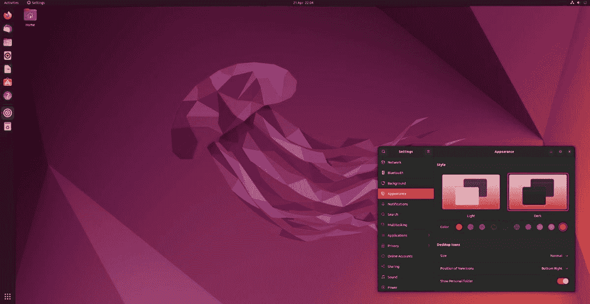

# Ubuntu 22.04 带来了更新的桌面，完全支持 Raspberry Pi 4

> 原文：<https://www.xda-developers.com/ubuntu-22-04-release/>

目前，Ubuntu 可能不是最流行的桌面 Linux 发行版，但它仍然是企业使用的首选之一，并且它是 Linux Mint 和 Elementary OS 等项目的技术基础。Ubuntu 每年都有两个主要的发布版本，按照计划，Ubuntu 22.04 LTS 现在可以使用了。

 <picture></picture> 

Credit: Canonical

Ubuntu 22.04 是一个长期支持(LTS)版本，这意味着它将获得五年的安全修复和精选应用程序更新支持。这意味着如果你不想定期处理重大更新，你可以在它上面呆上几年，或者你可以在 10 月份发布时更新到 22.10(这不会是 LTS 版本)。

主要的变化是 Ubuntu 现在使用 Gnome 42 桌面环境，尽管正如其报道中提到的，一些应用和功能被保留以尽可能保持 22.04 的稳定性。Gnome 42 切换到水平工作区切换器和应用程序启动器，类似于 Windows 11 和 macOS，并且有一些新的触摸板手势用于在工作区和窗口之间移动。Ubuntu 的开发者 Canonical 表示，与上一版本相比，新的更新“可以将英特尔和 Raspberry Pi 系统的桌面帧率提高一倍”。

\ r \ nht TPS://www . YouTube . com/watch？v=GHYl-sorJv8\r\n

较小的变化包括新的截图/屏幕录制功能，更新的颜色和系统主题中的真正黑暗模式，以及改进的 Ubuntu 软件应用程序。默认的网络浏览器 Firefox 现在是一个 Snap 包，而不是传统的 APT 包。这可能会引起争议，因为 Snap 包在大多数 Linux 社区并不太受欢迎— [Linux Mint 最近与 Firefox](https://www.xda-developers.com/linux-mint-firefox-deal/) 合作，为 Mint 用户提供非 Snap 版本。

**[下载 Ubuntu](https://ubuntu.com/download)**

Ubuntu 22.04 是第一个在使用完整桌面环境时可以在所有树莓 Pi 4 模型上工作的版本，这是今年早些时候树莓 Pi 透露的。它还包括 Rust 编程语言、OpenSSL v3、远程桌面协议(RDP)、Linux 内核 5.15 和 Mesa 22 图形。

Ubuntu 22.04 适用于各种基于 AMD 的电脑和 64 位 x86 电脑。Docker、WSL 和其他提供 Ubuntu 图像的服务正在推出 Ubuntu 22.04。

**来源:** [典范](https://ubuntu.com//blog/ubuntu-22-04-lts-released)， [OMG Ubuntu](https://www.omgubuntu.co.uk/2022/04/ubuntu-22-04-lts-is-now-available-to-download)