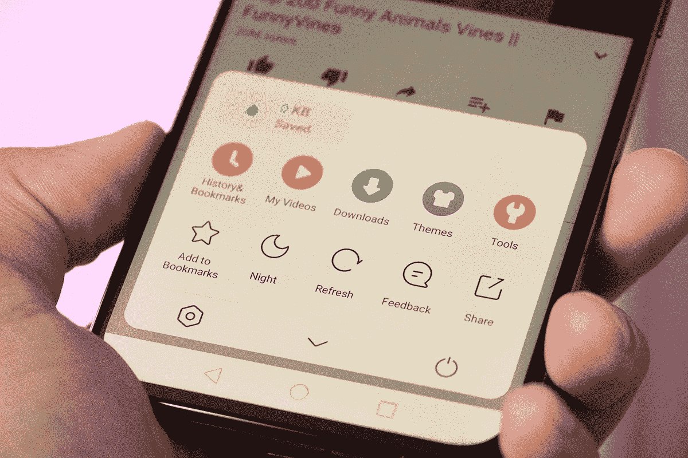

# UC 迷你- Best Tube Mate &快速视频下载器

> 原文：<https://www.xda-developers.com/uc-mini/>

UC Mini 是一款适用于 Android 操作系统的移动网络浏览器。它的突出特点是能够屏蔽视频上的广告，使播放速度更快。该浏览器还支持更快的下载速度，并具有在连接中断时暂停下载的功能。一旦连接恢复，下载将从中断的地方继续。除此之外，这款应用还内置了一系列与视频相关的功能。

*   各种视频—欣赏数以千计的热门视频。选择任何分类视频频道，如喜剧，娱乐，电视，电影，板球，迅速找到你的一杯茶。
*   流畅的视频播放器—硬件加速支持快速视频播放。广告拦截器改善观看体验。一键向下滑动播放下一个视频。
*   多种印度语言- UC mini 支持包括हिन्दी(Hindi)、বাঙালি(Bengali)、मराठी (Marathi)、తెలుగు(Telugu)、தமிழ்(Tamil)、ગુજરાતી(Gujarati)、ಕನ್ನಡ(Kannada)、ଓଡ଼ିଆ(Odia)、മലയാളം(Malayalam)、ਪੰਜਾਬੀ(Punjabi)在内的印度语言
*   快速下载速度—增加并稳定下载。如果发生任何断开或中断，UC Mini 可以从断点继续下载。
*   二重唱视频制作-发现有趣的二重唱视频。直接通过社交应用与朋友分享。你也可以和明星、视频爱好者和朋友一起制作同样的二重唱视频。
*   数据保存 UC Mini 压缩数据，加快导航速度，并帮助您节省大量蜂窝数据流量。
*   匿名模式——浏览时不留下任何历史记录、cookies、缓存等。隐姓埋名模式让你的观看体验完全私人和秘密。

[app box Google play com . UC . browser . en & HL = en _ US]

 <picture></picture> 

UC Mini Browser

无法访问 Google Play 商店？您可以使用以下说明从侧面加载应用程序。

1.  在这里下载最新的 APK 文件[。](https://www.apkmirror.com/apk/ucweb-singapore-pte-ltd/uc-mini/)
2.  打开文件管理器，导航到保存 APK 的文件夹。
3.  点击要安装的 APK 文件。
4.  按照屏幕上的步骤完成安装。