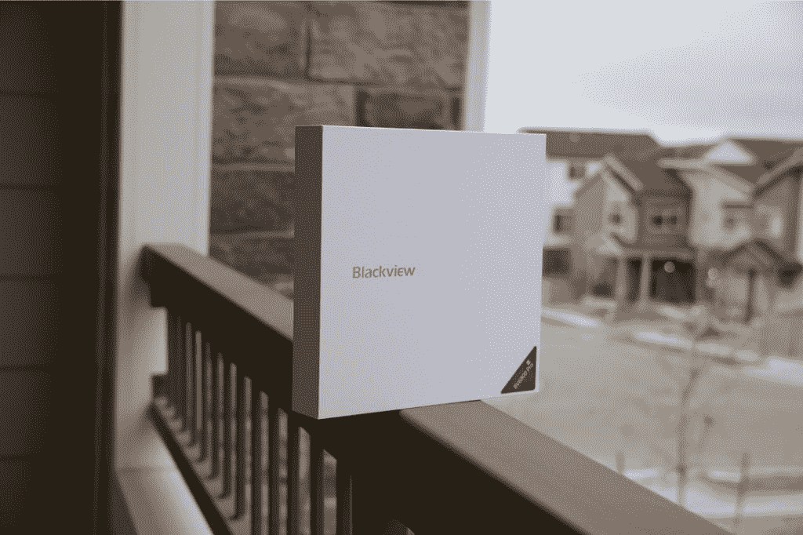
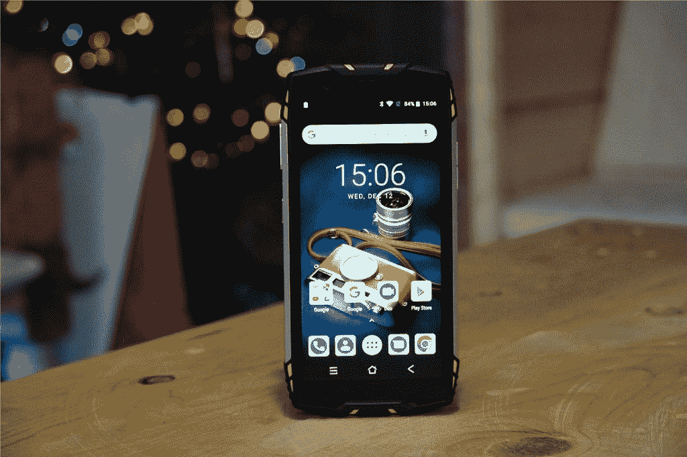
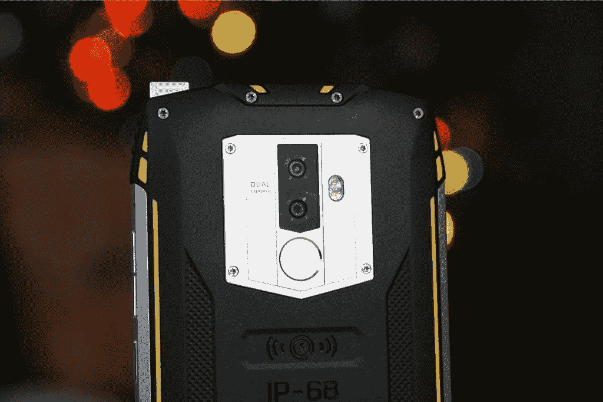

# 使用 BlackView BV6800Pro 开箱和动手操作

> 原文：<https://www.xda-developers.com/unboxing-and-hands-on-with-the-blackview-bv6800pro/>

BlackView BV6800Pro 是一款坚固耐用的手机，比市场上其他耐用手机提供的功能多一点。虽然它们包括无线充电、NFC、IP68 耐用性等级和 gorilla glass 3 显示屏，但它们仍然设法将价格保持在 250 美元以下。BlackView 向我们发送了一个评论单元，我们为您制作了一个实践视频。

 <picture></picture> 

The BlackView BV6800Pro Box

这款手机采用联发科 MT6750T 和 4GB 内存。谈到性能，该软件在导航 Android 8.0 系统时很好，很快。游戏和其他 3D 密集型应用一样，会给你带来一点延迟。但即使这款手机在游戏方面不是最好的，它也是一款利基产品。购买这款手机的人不会买它来玩游戏。这款手机是为在极端条件下工作的人设计的，他们需要一款能够很好地满足基本需求的手机。这就是 BV6800Pro 的意义所在。

| 

BV6800Pro

 | 

规范

 |
| --- | --- |
| 芯片集 | 联发科 MT6750T 八核 1.5GHz |
| 随机存取存储 | 4GB |
| 储存；储备 | 64GB |
| 显示 | 5.7 英寸 FHD+ 18:9 显示屏 |
| 电池 | 6580mAh，带无线充电 |
| 照相机 | 1600 万像素[背面]800 万像素[正面] |
| IP 等级 | IP68 |
| 国家政治保卫局。参见 OGPU | ARM Mali-T860MP2 |

 <picture></picture> 

The BlackView BV6800Pro with IP68 durability rating

说到耐用性，BlackView 制造了市场上一些最坚固的手机。BV6800Pro 在水下一小时的防水深度可达 5 米。它还可以防止意外跌落、灰尘、雨水、冰和各种可能遇到的困难环境。

 <picture></picture> 

BlackView BV6800Pro with dual 16MP cameras

BlackView BV6800Pro 售价 249.99 美元，对于这款超级坚固的手机来说非常划算。使用下面的链接立即获得预售。

[**以 249.99 美元**](https://store.blackview.hk/en/buy/blackview_bv6800pro_rugged_smartphone_outdoor_smartphone_ip68_smartphone_us) 获得 BlackView BV6800Pro

###### 我们感谢 BlackView 赞助这篇文章。我们的赞助商帮助我们支付与运行 XDA 相关的许多费用，包括服务器成本、全职开发人员、新闻撰稿人等等。虽然您可能会在门户内容旁边看到赞助内容(这些内容将始终被标记为赞助内容),但门户团队对这些帖子不承担任何责任。赞助内容、广告和 XDA 仓库完全由一个独立的团队管理。XDA 绝不会通过接受金钱来赞扬一家公司，或以任何方式改变我们的观点或看法，从而损害其新闻诚信。我们的意见不能被收买。