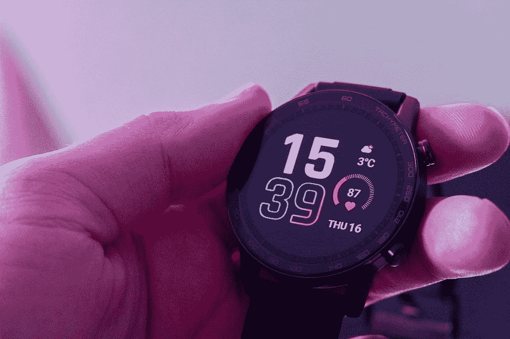

# 使用 HONOR MagicWatch 2 拆箱和动手操作

> 原文：<https://www.xda-developers.com/unboxing-and-hands-on-with-the-honor-magicwatch-2/>

HONOR MagicWatch 2 是一款 46 毫米的智能手表，配有高分辨率 AMOLED 显示屏。在€ 189，这是市场上最好的智能手表之一。HONOR 送了我们一块新手表来看看。虽然我们稍后将进行更深入的审查，但我们希望为您带来一个以 HONOR MagicWatch 2 为特色的实践视频。你可以看看下面的视频。

以下是手表第一次开机时拍摄的一些图像。手表的表盘和表扣由优质金属材料制成。该带是一种柔软舒适的橡胶。这款手表足够轻，以至于你想在锻炼时注意到它戴在手腕上。

 <picture></picture> 

HONOR MagicWatch 2 with 46mm display.

 <picture></picture> 

HONOR MagicWatch 2 paired with the HONOR 20 Pro

这款手表充满了健身功能。跟踪您的锻炼，同时使用许多不同的传感器收集有价值的数据。这是非常容易导航的自定义荣誉软件，用户界面非常快，反应灵敏。AMOLED 显示屏是任何智能手表中最好的显示屏之一。敬请关注荣誉魔法观察 2 的更多报道。

[**获得荣誉魔法手表 2**](https://m.hihonor.com/nl/product/honor-magic-watch2)

###### 我们感谢 HONOR 赞助了这篇文章。我们的赞助商帮助我们支付与运行 XDA 相关的许多费用，包括服务器成本、全职开发人员、新闻撰稿人等等。虽然您可能会在门户内容旁边看到赞助内容(这些内容将始终被标记为赞助内容),但门户团队对这些帖子不承担任何责任。赞助内容、广告和 XDA 仓库完全由一个独立的团队管理。XDA 绝不会通过接受金钱来赞扬一家公司，或以任何方式改变我们的观点或看法，从而损害其新闻诚信。我们的意见不能被收买。