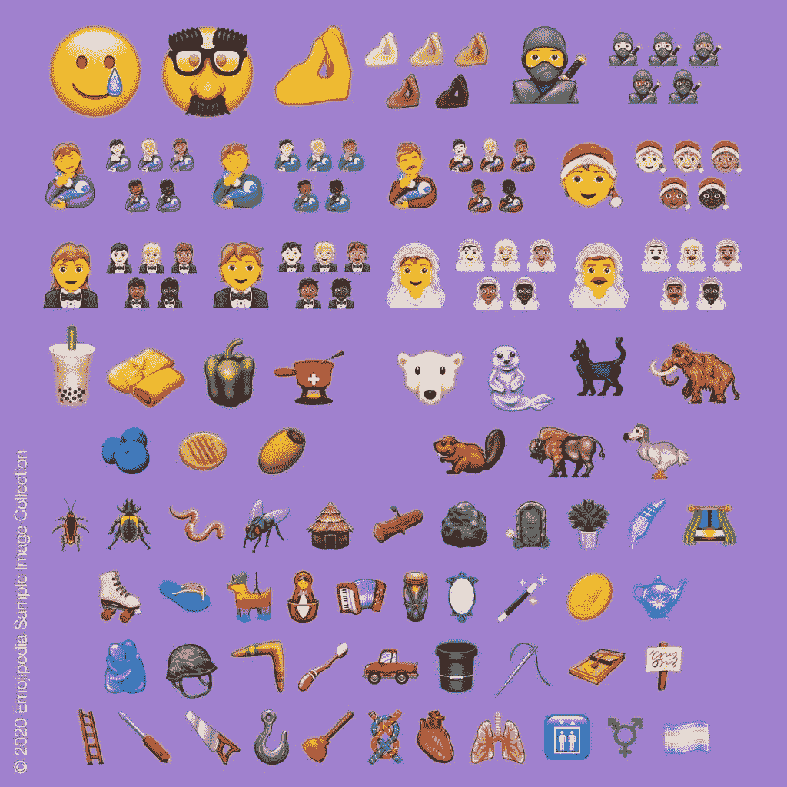

# Unicode 13 宣布 2020 年推出 62 个新表情符号

> 原文：<https://www.xda-developers.com/unicode-13-62-new-emoji-2020/>

表情符号从根本上改变了我们在线交流的方式。它们是我们在 90 年代末和 21 世纪初使用的表情符号的最终演变，自从最初构思以来，它们已经演变成可以准确表达我们的情绪或视觉表达我们想要表达的任何东西的东西。它们每年都会得到扩展，每年的新 Unicode 版本中都会添加一些新的表情符号，每个主要操作系统(Android、iOS、Windows)的新版本都会添加对这些新 Unicode 版本的支持。现在，我们开始了解最新的 Unicode 版本，Unicode 13，今年增加了超过 62 个新的表情符号。

 <picture></picture> 

Approximation of what all the new emoji will look like

Unicode 的最新版本将添加一系列新的表情符号，如带泪的微笑、北极熊、变性国旗和一系列其他内容。Unicode 13 还修改并添加了一系列性别包容性表情符号，这意味着一些通常描述常见性别角色的表情符号，如喂养婴儿以及新娘和新郎，现在将有女性、男性和性别包容性的非二进制变体。

新的表情符号将在今年年底添加到即将到来的 Android、iOS 和 PC 平台的操作系统更新中，如果一切顺利，我们应该会在今年年底或 2021 年初在大多数设备上看到它们。WhatsApp 等即时通讯应用也应该在未来几个月开始准备支持。如上所述，有 62 个全新的表情符号，但包括现有图标的变化，这个数字上升到 117。请点击下面的 Emojipedia 链接查看完整列表。

**来源: [Unicode](http://blog.unicode.org/2020/01/unicode-emoji-130-now-final-for-2020.html) ，[Emojipedia](https://blog.emojipedia.org/117-new-emojis-in-final-list-for-2020/)**