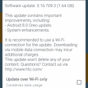

# 解锁的 HTC 10 现在获得了 Android Oreo 更新

> 原文：<https://www.xda-developers.com/unlocked-htc-10-android-oreo-update/>

# [更新:现在推出]解锁的 HTC 10 现在获得 Android Oreo 更新

HTC 10 已经开始接收 Android 8.0 Oreo 的更新。RUU 的文件现在已经可以得到了，而且正在通过无线电传播。

**2018 年 1 月 24 日**更新:OTA 更新现已推出。

谷歌早在 2017 年 8 月就发布了稳定版的 [Android 8.0 Oreo](https://www.xda-developers.com/new-android-oreo-beta-rolling-out-to-the-exynos-galaxy-s8-brings-bug-fixes-and-january-security-patch/) ，并促使多家智能手机原始设备制造商谈论他们的设备升级计划。HTC 表示，他们将在“几个月内”更新 [HTC U11](https://www.xda-developers.com/htc-edge-launcher-update-htc-u11-customization-options/) 、 [U11 Life](https://www.xda-developers.com/unlocked-htc-u11-life-android-oreo/) 、 [U Ultra](https://www.xda-developers.com/the-htc-u-ultra-is-not-worth-the-price/) 和 10，并且它兑现了自己的承诺——至少在 HTC 10 方面。

如果你有未上锁的 HTC 10，可以手动[下载安卓奥利奥 RUU 文件在这里](http://dl3.htc.com/application/RUU_PERFUME_WL_O80_SENSE90GP_MR_NA_Gen_Unlock_3.16.617.2.exe)(Via*[AndroidPolice](http://www.androidpolice.com/2018/01/11/unlocked-htc-10-now-receiving-oreo-update-via-ota-ruu/)*)。请注意，它的大小约为 1.8GB，并且它会在闪烁时擦除您的手机。它会将你的设备软件升级到版本 3.16.617.2，这应该会在不久的将来开始推出。在功能方面，它与 HTC 最近的其他奥利奥更新类似——你可以期待画中画支持、[通知点](https://www.xda-developers.com/notification-dots-coming-to-android-o-allowing-you-to-see-notifications-from-the-home-screen/)、[密码自动填充](https://www.xda-developers.com/android-os-autofill-framework-will-finally-resolve-a-long-standing-lag-issue-with-password-managers/)等等。

智能手机原始设备制造商推出下一个大版本 Android 所需的时间差异很大，旧设备有时需要等待一年或更长时间才能获得新的更新。值得庆幸的是，HTC 正在带头冲锋——当三星 Galaxy S7 和 LG G5 还在等待奥利奥的时候，幸运的 HTC 10 用户现在已经得到了它。

* * *

## 更新:OTA 推出

之前发布的 RUU 被 HTC 撤下，似乎没有人收到更新。然而，现在一个用户报告说 OTA 更新实际上正在推出。

 <picture></picture> 

Credits: XDA Member las_kjam