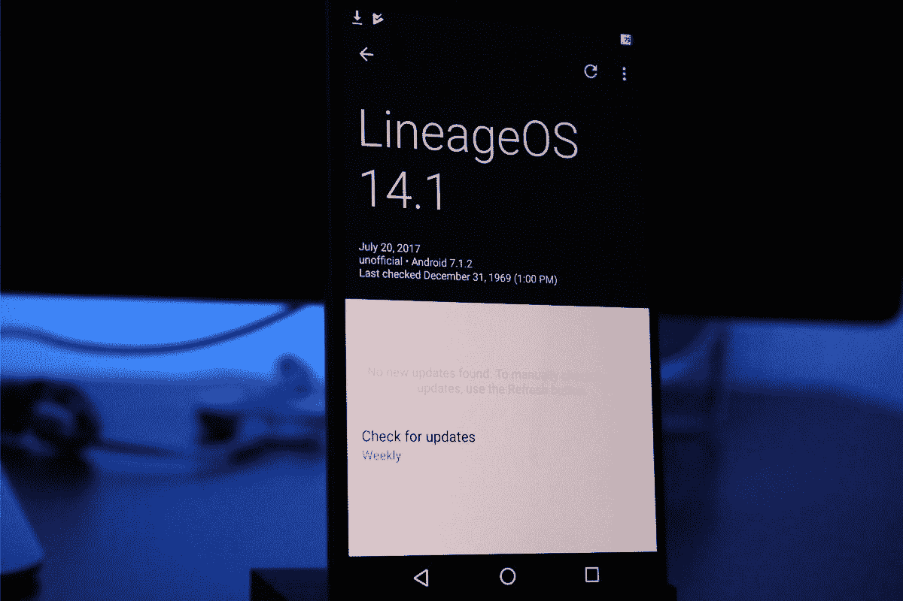

# 荣誉 8 Pro 的非官方 LineageOS

> 原文：<https://www.xda-developers.com/unofficial-lineageos-for-the-honor-8-pro/>

# 荣誉 8 Pro 的非官方 LineageOS

随着 Honor 8 pro 的开发开始加快，rom 正在 XDA 论坛上共享。这是一个非官方的线路图。

开发社区开始为 Honor 8 Pro 推出一些 rom。这个非官方的 OpenKirin LineageOS ROM 是一个替代 EMUI 股票系统的好方法。这个定制的 ROM 是非常简单的，它没有内置很多模块。一切都很稳定，性能也很棒。

不起作用:

*   加密
*   当 FPS 设置为 15 时，后置摄像头仅使用 [OpenCamera](https://play.google.com/store/apps/details?id=net.sourceforge.opencamera) 拍摄视频

虽然大多数人可以在没有加密的情况下生活，但无法拍摄视频意味着这种 ROM 不是日常驱动程序。在 [XDA 论坛](https://forum.xda-developers.com/honor-8-pro)关注这个 ROM 的发展，这样你就可以查看未来的更新。

 <picture></picture> 

OpenKirin LineageOS 14.1 is based on Android Nougat 7.1.2\. Stayed updated with the built-in OTA update manager.

 <picture></picture> 

This custom ROM runs very smooth on the Honor 8 Pro. The Kirin 960 paired with 6GB of RAM makes this an incredibly fast device.

[**得到本罗**](https://forum.xda-developers.com/honor-8-pro/development/rom-t3641454)