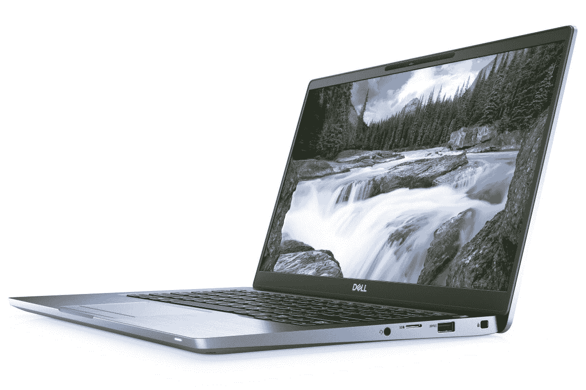
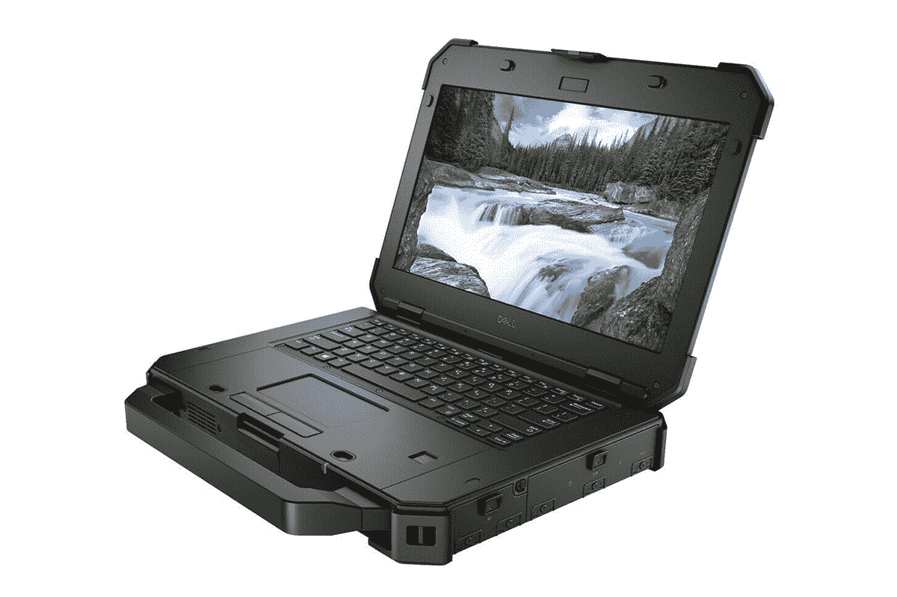
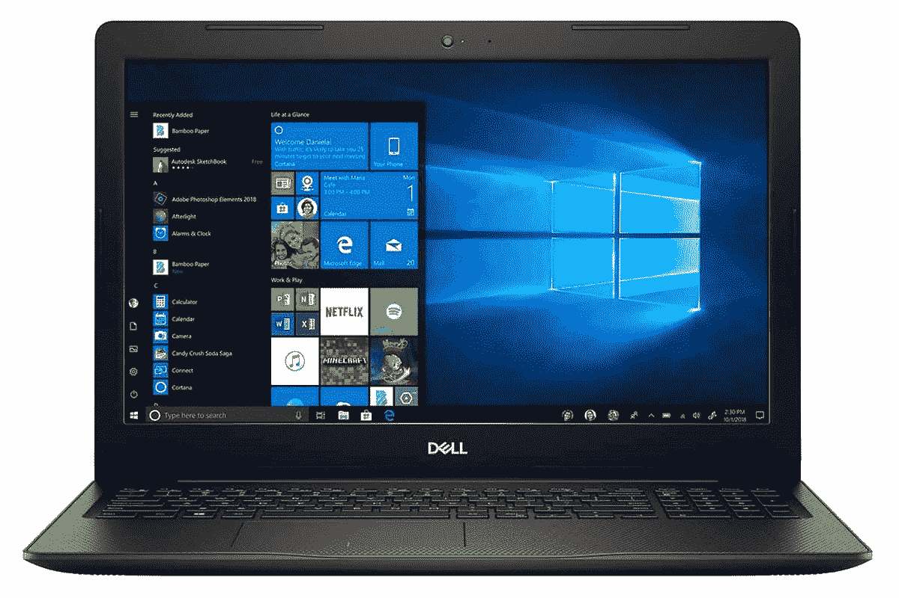
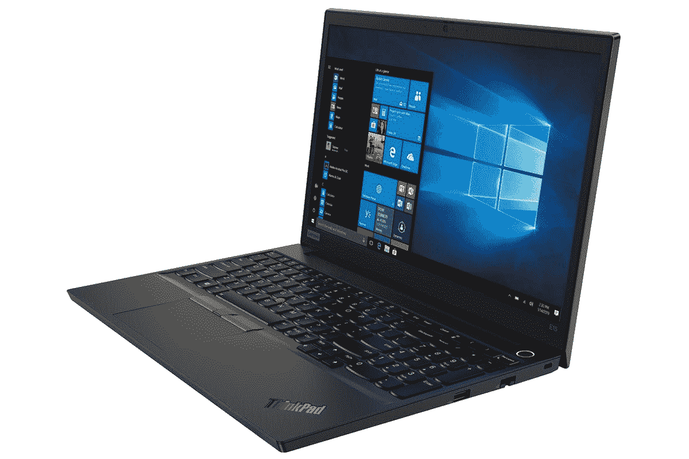
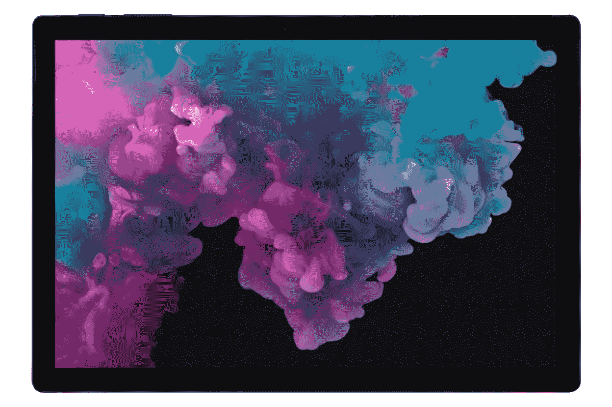
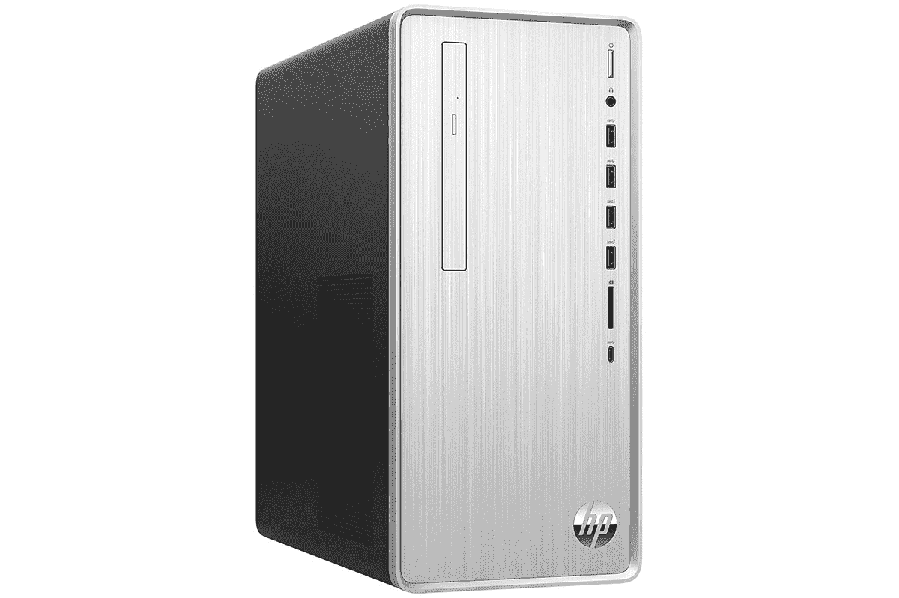

# 以更低的价格升级:本周笔记本电脑最优惠的价格

> 原文：<https://www.xda-developers.com/upgrade-for-less-the-best-deals-on-laptops-this-week/>

无论你是在家工作还是在办公室赶进度，使用旧笔记本电脑真的会让你慢下来。如果你想升级，而不打破银行，认证翻新机提供了巨大的价值。以下是 XDA Developers Depot 本周的一些最佳交易——现在的 MSRP 高达 52%的折扣。

## **Dell Latitude 7400 14 英寸 2 合 1 笔记本电脑 256GB 固态硬盘(经认证翻新)**

****

提供令人难以置信的 26 小时电池续航时间， [这款戴尔二合一设备](https://depot.xda-developers.com/sales/dell-latitude-7400-14-touch-8gb-256gb-ssd-intel-core-i5-8265u-2-in-1-laptop-certified-refurb?utm_source=xda-developers.com&utm_medium=referral&utm_campaign=dell-latitude-7400-14-touch-8gb-256gb-ssd-intel-core-i5-8265u-2-in-1-laptop-certified-refurb&utm_term=scsf-416136&utm_content=a0x1P000004smzPQAQ&scsonar=1) 是移动办公的完美设备。它采用英特尔酷睿 i5 四核处理器，8GB 内存和 256GB 固态存储。与此同时，14 英寸的触摸屏非常适合发挥创造力。原价 1829 美元，认证退款 [现在只要 959.99 美元](https://depot.xda-developers.com/sales/dell-latitude-7400-14-touch-8gb-256gb-ssd-intel-core-i5-8265u-2-in-1-laptop-certified-refurb?utm_source=xda-developers.com&utm_medium=referral&utm_campaign=dell-latitude-7400-14-touch-8gb-256gb-ssd-intel-core-i5-8265u-2-in-1-laptop-certified-refurb&utm_term=scsf-416136&utm_content=a0x1P000004smzPQAQ&scsonar=1) 。

## **Dell Latitude 7424 加固型至尊笔记本电脑 512GB(经认证翻新)**

****

如果你在外工作或经常出差，纬度 7424 的 [可能是更好的选择。这款坚固的 14 英寸笔记本电脑可以承受 6 英尺的跌落，并且外壳防水。它可以在英特尔 i5 处理器上流畅运行 Windows Professional，并具有热量管理功能以防止过热。这款耐用的笔记本电脑被 PCMag 评为“优秀”，原价为 3499 美元，但你现在可以花 1649.99 美元](https://depot.xda-developers.com/sales/dell-latitude-7424-14-32gb-512gb-ssd-intel-core-i5-8350u-win10-rugged-extreme-laptop-certified-refurb?utm_source=xda-developers.com&utm_medium=referral&utm_campaign=dell-latitude-7424-14-32gb-512gb-ssd-intel-core-i5-8350u-win10-rugged-extreme-laptop-certified-refurb&utm_term=scsf-416146&utm_content=a0x1P000004smzPQAQ&scsonar=1) 获得认证退款。

## **戴尔 Inspiron 灵越 3593 15.6 英寸笔记本电脑 8GB 512GB 固态硬盘(经认证翻新)**

****

戴尔 Inspiron 灵越 3593 配备更大的 15.6 英寸屏幕，用于编辑照片和观看电影。凭借灵活的第十代英特尔处理器和 8GB 内存，它对于日常任务来说绰绰有余。同时，内置的 512GB 固态硬盘让您可以存储大量媒体。以前是 899.99 美元，但是 [认证的拒绝者现在是 699.99 美元](https://depot.xda-developers.com/sales/dell-inspiron-3593-15-6-8gb-512gb-ssd-intel-core-i3-1005g1-certified-refurb?utm_source=xda-developers.com&utm_medium=referral&utm_campaign=dell-inspiron-3593-15-6-8gb-512gb-ssd-intel-core-i3-1005g1-certified-refurb&utm_term=scsf-416147&utm_content=a0x1P000004smzPQAQ&scsonar=1) 。

## **联想 ThinkPad E15 笔记本电脑酷睿 i7，8GB 512GB SSD Win10Pro**

****

提供英特尔 UHD 显卡和 IPS 显示技术，[ThinkPad E15](https://depot.xda-developers.com/sales/lenovo-thinkpad-e15-15-6-8gb-512gb-ssd-intel-i7-10510u-x41-8ghz-win10-pro?utm_source=xda-developers.com&utm_medium=referral&utm_campaign=lenovo-thinkpad-e15-15-6-8gb-512gb-ssd-intel-i7-10510u-x41-8ghz-win10-pro&utm_term=scsf-416148&utm_content=a0x1P000004smzPQAQ&scsonar=1)提供令人印象深刻的视觉效果。它还配备了英特尔 i7 处理器，可以在 Windows 10 Pro 中轻松处理多任务处理。凭借 12 小时的电池续航时间，该机器专为移动办公而设计。它价值 1179 美元，但你现在可以用 1079.99 美元 买到它。

## **微软 Surface Pro 6 12.3 英寸平板电脑英特尔 i7 256GB(经认证翻新)**

如果你需要超级便携的东西，试试[Surface Pro 6](https://depot.xda-developers.com/sales/microsoft-surface-pro-6-lsh-00003-12-3-256gb-wifi-x4-1-9ghz-certified-refurb?utm_source=xda-developers.com&utm_medium=referral&utm_campaign=microsoft-surface-pro-6-lsh-00003-12-3-256gb-wifi-x4-1-9ghz-certified-refurb&utm_term=scsf-416149&utm_content=a0x1P000004smzPQAQ&scsonar=1)。这款功能强大的平板电脑采用第八代英特尔 i7 芯片和 12.3 英寸 PixelSense 显示屏，分辨率为 2736 x 1824。购买一个键盘盖，就可以把这个设备当做二合一使用；LaptopMag 居然给了 4.5 星。原价 1319 美元，认证退款 [现在只要 929.99 美元](https://depot.xda-developers.com/sales/microsoft-surface-pro-6-lsh-00003-12-3-256gb-wifi-x4-1-9ghz-certified-refurb?utm_source=xda-developers.com&utm_medium=referral&utm_campaign=microsoft-surface-pro-6-lsh-00003-12-3-256gb-wifi-x4-1-9ghz-certified-refurb&utm_term=scsf-416149&utm_content=a0x1P000004smzPQAQ&scsonar=1) 。

## **惠普 Pavilion 英特尔 i5-9400，12GB 内存 1.1TB 硬盘(经认证翻新)**

****

愿意考虑台式机吗？ [惠普](https://depot.xda-developers.com/sales/hp-pavilion-tp01-0027c-12gb-ram-1-1tb-intel-i5-9400-x62-9ghz-certified-refurbished?utm_source=xda-developers.com&utm_medium=referral&utm_campaign=hp-pavilion-tp01-0027c-12gb-ram-1-1tb-intel-i5-9400-x62-9ghz-certified-refurbished&utm_term=scsf-416150&utm_content=a0x1P000004smzPQAQ&scsonar=1) 的这个庞然大物，引擎盖下有一个快速的英特尔 i5-9400 CPU 和 12GB 的 RAM。电影缓冲区和游戏玩家将会喜欢 1.1TB 硬盘，后者也将受益于 AMD 镭龙显卡。售价 774.99 美元，但是这些 2020 认证的退款者 [现在只要 519.99 美元](https://depot.xda-developers.com/sales/hp-pavilion-tp01-0027c-12gb-ram-1-1tb-intel-i5-9400-x62-9ghz-certified-refurbished?utm_source=xda-developers.com&utm_medium=referral&utm_campaign=hp-pavilion-tp01-0027c-12gb-ram-1-1tb-intel-i5-9400-x62-9ghz-certified-refurbished&utm_term=scsf-416150&utm_content=a0x1P000004smzPQAQ&scsonar=1) 。

*价格随时变化*