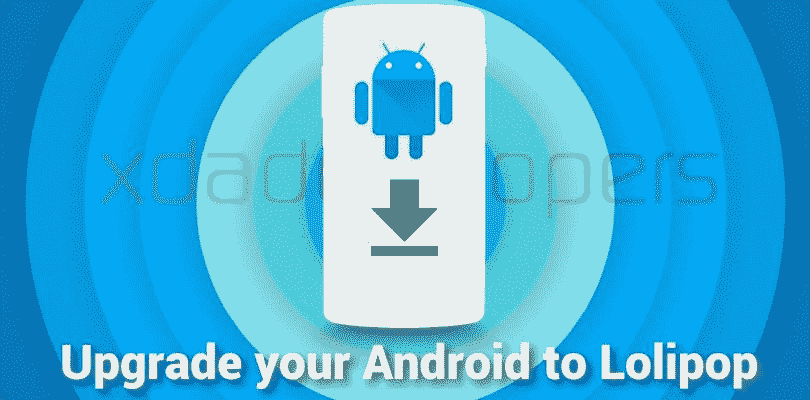

# 如何将你的安卓手机升级到棒棒糖

> 原文：<https://www.xda-developers.com/upgrade-to-lollipop/>

## 

如今，我们大多数人都渴望吃下一款安卓甜点。当对巧克力奇巧的喜爱消退后，人们希望他们的设备上有棒棒糖的甜甜的特性，人们不必在这个过程中失眠，这实际上是一个相对简单的努力！

## 那么棒棒糖到底有什么酷的呢？

现在你可能会问自己为什么要更新。真正突出的一点是谷歌的新材料设计用户界面极大地改善了 Android 的景观，新图标，明亮的美学配色方案，以及无缝融合一切的透明层。为特定设备应用自定义主题也比以往更加容易。

另一个功能是一个新的内置电池节电选项，根据谷歌的说法，它允许长达 90 分钟的时间，当你绝望地被困在看不到充电器的时候，不想因为没有回复短信而与另一半陷入麻烦…

点击音量按钮现在允许静音选项，包括指定的时间或排除某些联系人，以及创建使用配置文件和访客模式的能力是操作系统的一个主要新增功能。这些和其他功能使您值得升级您的设备。

## 好吧，我在船上，现在我如何更新？

很高兴你问了！让我们来看看实现这一点的几种方法。你要做的第一件事就是备份你所有的数据以防万一。现在实际的更新是:

## 飞越顶部攻击(Overflying-Top Attack)

最简单的方法是通过 OTA(空中下载)更新。如果你的手机已经准备好升级，那么你很幸运！最近一两年生产的大多数手机都会有更新。

首先，让我们进入设置>关于手机

查找软件更新或检查更新，看看你的手机是否可以下载 OTA 更新，如果找到了，继续进行更新，但你可能需要 wifi 连接。不同的手机可能会有轻微不同的措辞，但一般程序是相同的。

## 手动更新

### 三星电子

要手动更新某些三星手机(某些旧型号可能需要这种方法)，您需要连接到电脑上的[智能开关](https://shop-links.co/link/?exclusive=1&publisher_slug=xda&article_name=How+to+upgrade+your+Android+phone+to+Lollipop&article_url=https%3A%2F%2Fwww.xda-developers.com%2Fupgrade-to-lollipop%2F&u1=UUxdaUeUpU15429&url=https%3A%2F%2Fwww.samsung.com%2Fus%2Fapps%2Fsmart-switch%2F&ourl=http%3A%2F%2Fwww.samsung.com%2Fus%2Fsmart-switch%2F)软件来进行更新。要做到这一点，只需下载并安装智能开关软件，然后通过 USB 将您的三星手机连接到您的计算机，并启动智能开关，看看您是否可以这样更新。当你插入手机时，可能需要一分钟左右的时间来安装一些驱动程序。

确保你的手机至少有一半电量

有了智能开关，你实际上可以创建你的手机备份，这是推荐的第一步。单击屏幕底部的备份按钮。

备份完成后，您就可以进行更新了。点击屏幕中间的更新按钮，这将会给你一个提示窗口，让你确认你真的想要更新。再次点击更新继续，它会给你一个信息窗口，关于备份数据和有足够的费用等。您可以单击 OK 开始实际过程。

在此过程中的任何时候都不要断开您的设备，这可能需要半个小时。完成后，您的设备可能需要比正常时间更长的时间来启动，这是正常的。

### 常简称为 HTC 或宏达电

手动更新 HTC 设备类似于三星，但你将使用 HTC 同步软件在这里找到[。](http://www.htc.com/us/support/software/htc-sync-manager.aspx)下载软件包后，将其安装到您的机器上。

插入您的 HTC 设备，让它安装任何可能需要的驱动程序。一旦它被你的电脑识别，HTC Sync 会自动告诉你是否有更新，如果有，会弹出一个窗口告诉你它是可用的。此时，您可以单击升级，这可能会提示软件升级助手页面。在这里，您可以从列表中选择您的设备，然后单击升级开始升级过程。

它现在将下载软件，并继续更新您的手机。在更新过程中，手机会重启几次，直到整个过程完成，这时它会再次启动到主屏幕。

### 其他设备

其他一些原始设备制造商拥有专有工具，可以执行类似的更新程序。对于 LG，你实际上必须在支持页面上为你的特定设备获取一个单独的安装程序。[这里的](http://www.lg.com/us/support/product-help/CT10000003-CT10000027-1412198655480)是 LG G3 的。根据您使用的设备，您需要在搜索窗口中进行搜索，找到软件更新链接后，您就可以找到适合您特定设备的工具。最后，如果可以的话，使用 OTA 方法可能是最简单的。

### 定制 ROM

你有没有没有得到官方更新的旧设备？不要害怕，我的好朋友，因为你还有一个解决办法！定制 rom 是升级到最新 Android 版本的一个很好的方式，虽然一开始在你的设备上安装一个需要一点汗水，但过一段时间就成了习惯。

为了在你的设备上安装一个定制的 Lollipop ROM，你首先需要解锁你的引导程序，并加载一个定制的恢复程序。

以下指南将帮助您了解如何在设备上加载自定义 ROM。

### HTC:

**最多一个**:使用这个付费工具来解锁你的引导程序- [链接](http://theroot.ninja/)

这将让你自定义恢复加载，TWRP 是一个非常受欢迎的。- [XDA 线程](http://forum.xda-developers.com/showthread.php?t=2498746)

**One Mini:** 你可以在这里使用 HTC Dev Unlock 解锁设备:[链接](http://www.htcdev.com/bootloader)你只需要从列表中找到你的设备，点击绿色按钮就可以开始了。一旦你这样做了，你就可以从这里开始闪现 TWRP 的恢复: [XDA 线程](http://forum.xda-developers.com/showthread.php?t=2418938)

**One Mini 2:** 你可以在这里使用 HTC Dev Unlock 解锁设备:[链接](http://www.htcdev.com/bootloader)你只需要从列表中找到你的设备，点击绿色按钮就可以开始了。一旦你这样做了，你就可以从这里开始闪现 TWRP 的恢复: [XDA 线程](http://forum.xda-developers.com/one-mini-2/orig-development/recovery-twp-2-7-1-0-one-mini-2-t2801370)

**HTC First:** 你可以用这个向导解锁设备——[XDA 线程](http://forum.xda-developers.com/showthread.php?t=2322272)在这里获得 TWRP 恢复: [XDA 线程](http://forum.xda-developers.com/showthread.php?t=2241782)

**HTC Evo 4G LTE:** 你必须使用 devunlock 来解锁这个设备- [链接](http://www.htcdev.com/bootloader)你只需要从列表中找到你的设备，然后点击绿色按钮就可以开始了。然后你需要使用位于这里的 romrunner 来关闭 [XDA 线程](http://forum.xda-developers.com/showthread.php?t=2498684)。你需要确保遵循所有的方向。然后我们在这里得到一个定制的恢复- [XDA 线程](http://forum.xda-developers.com/showthread.php?t=1675738)，它让你到达我们需要的地方。

**Droid Incredible 4G LTE:** 这个设备有点复杂，但是按照这个线程中关于引导加载器解锁的指令- [XDA 线程](http://forum.xda-developers.com/showthread.php?t=2214653)和这个线程关于关闭的指令- [XDA 线程](http://forum.xda-developers.com/showthread.php?t=2215750)你可以在这里使用 fastboot 得到你的自定义恢复- [链接](https://www.androidfilehost.com/?fid=95916177934546050)。

### 三星电子

**银河 S3；**这款设备上最好的解锁、寻根甚至自定义恢复的方法是 mskip 的工具包，在这里可以找到: [XDA 线程](http://forum.xda-developers.com/galaxy-s3/orig-development/samsung-galaxy-s3-unified-toolkit-v8-0-t1703488)

它适用于几乎所有的变体，并将带您到达我们需要的地方。

**Galaxy Note 2:** 这些你大部分都可以用 CF Autoroot。

**GTN7100，GTN710** 5 - [XDA 螺纹](http://forum.xda-developers.com/showthread.php?t=1933542)

**在& T** - [XDA 线程](http://forum.xda-developers.com/showthread.php?t=1980644)

**冲刺** - [XDA 线程](http://forum.xda-developers.com/showthread.php?t=1956180)

**T-Mobile** - [XDA 线程](http://forum.xda-developers.com/showthread.php?t=1960784)

**威瑞森**:稍微复杂一点的 [XDA 线程](http://forum.xda-developers.com/showthread.php?t=2024207)

### 银河笔记

**GT-N7000** [XDA 螺纹](http://forum.xda-developers.com/showthread.php?t=1329360)

**i717** [XDA 线程](http://forum.xda-developers.com/showthread.php?t=1586223)

现在，这些是最受欢迎的设备，没有任何官方的棒棒糖更新，但有定制的 rom 可用。一旦你有你的设备根和自定义恢复，你可以找到所有的 5。该设备的 Android 开发和原始 Android 开发中的 X ROMs。使用右上角的“查找您的设备”框在此找到正确的开发设备论坛: [XDA 论坛目录](http://forum.xda-developers.com/)

请确保您检查了线程的第一页中列出的错误，以获得最稳定的版本，并快乐闪烁！

好了，我已经更新了我的设备，现在做什么？

现在，您可以随意探索新的功能和用户界面，当您真正开始渴望一种新的甜点风味时，请回头，我们将为您提供一些棉花糖美食！