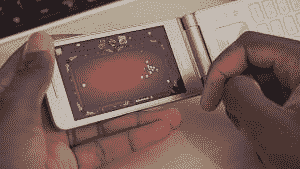

# 2017 年使用翻盖手机-三星 Galaxy Folder 2 回顾

> 原文：<https://www.xda-developers.com/using-flip-phones-2017-samsung-galaxy-folder-2-review/>

# 2017 年使用翻盖手机-三星 Galaxy Folder 2 回顾

三星 Galaxy Folder 2 绝对不是当今世界上采用翻盖手机设计的普通手机。迈尔斯在这段视频中仔细观察。

两周前，我们展示了一款非常普通的手机，嗯，在当今世界很不寻常。三星 Galaxy Folder 2 采用翻盖手机设计，首次发布时吸引了不少眼球。迈尔斯有幸测试了这款手机。观看上面的视频以查看完整的评论，或单击[此处](https://youtu.be/qVvFCGCv47I)查看拆箱和第一印象。

 <picture></picture> 

Flip phones were always better to call with

 <picture></picture> 

Gaming on flip phone though, not so much

# 摘要

这款手机绝对比市场上任何一款手机都要出众。这可能是一件好事，也可能不是，但我们很高兴三星不怕尝试不同的东西。即使这意味着试图重新引入一个许多人认为已经灭绝的设计。这款手机仍然只在中国有售，但我们希望它能很快进入其他国家。