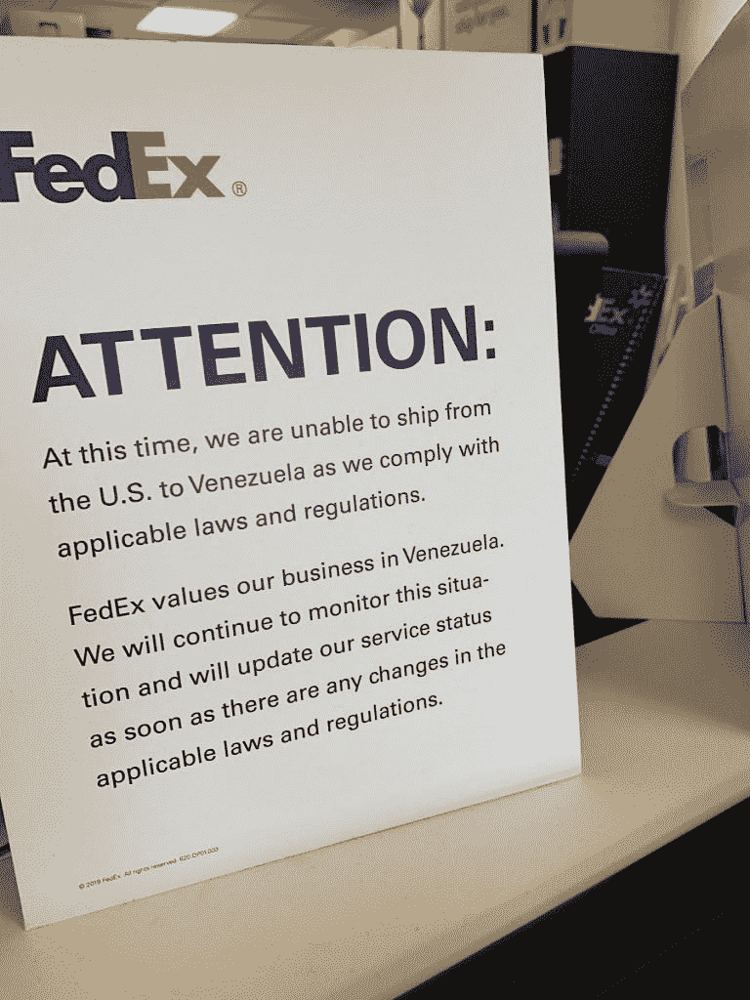
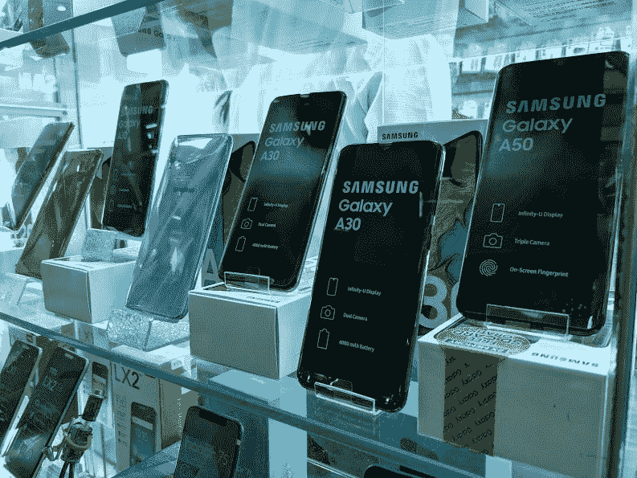

# 破碎的经济:在委内瑞拉购买智能手机是什么感觉

> 原文：<https://www.xda-developers.com/venezuela-android-smartphones/>

通货膨胀，尤其是超级通货膨胀，通常是经济衰退最严重的症状之一，总的来说，是一个国家经济可能发生的最糟糕的事情之一。一些最痛苦的恶性通货膨胀历史事件包括 1923 年的德国(魏玛共和国)、1946 年的匈牙利、1994 年的南斯拉夫和 2008 年的津巴布韦。通俗地说，恶性通货膨胀只是一个非常高且不断加速的通货膨胀事件，它在几周、几天、有时甚至几个小时的时间内快速而持续地提高所有商品的价格，反过来挤压人们的财富，使他们尽量减少自己的本币持有量。当月通货膨胀率超过 50%时，一个国家的经济通常被认为是恶性通货膨胀。

正如你现在可能知道的，一个正在发生的恶性通货膨胀的现代例子是委内瑞拉。这一经济崩溃是由几个因素造成的，已经迅速演变成一场严重的经济和人道主义危机，影响到所有社会阶层的人民。这显然严重影响了普通委内瑞拉人的收入，并以各种可以想象的方式改变了人们的日常生活和消费习惯。智能手机市场显然受到了危机的影响。手机已经成为必不可少的工具，在一个你真的负担不起每两年升级一次手机的国家，你会发现你正在尽可能长时间地挤压你目前使用的任何手机的全部功能。通常，这需要切换到 LineageOS 这样的定制 ROM，以延长设备的寿命，这正是许多委内瑞拉人正在做的事情。

我目前住在委内瑞拉，已经住了好几年了。在这篇文章中，我将讲述作为一名 Android 粉丝在这样一个国家的整体体验，经历购买智能手机、使用智能手机以及长期持续使用智能手机等基本事情。

*免责声明:委内瑞拉目前的局势非常不稳定，难以预测。像通货膨胀/恶性通货膨胀以及其他人道主义/经济方面的因素可以在眨眼之间变得更好或更坏。因为每次有变化就用更新的信息更新这篇文章会很快变得很累，所以这里展示的信息是文章发表日期的最新信息。*

## 你的美元在委内瑞拉能走多远？

马上，有几件事我应该提到的背景。首先，最低工资(也是大多数人的收入)目前约为每月 40，000 主权玻利瓦尔(通常缩写为 Bs.S .或 VES)。按照 1 美元兑换 10，000 越南盾的官方汇率，你一个月可以得到大约 4 美元。这已经够糟了，但我们还得考虑黑市汇率，1 美元兑换 12500 维斯左右，这是大多数人使用的汇率。这份工作每月给我们 3.2 美元。有些工作的工资可能会高一点，但这通常是大多数委内瑞拉工人的平均工资。

我不打算深入探究事情的人道主义方面，因为这篇文章更多的是围绕 Android 展开的。但正如你可能猜到的那样，赚取最低工资甚至不够基本的生计。

所以，假设你想买一部便宜的手机，比如小米 Redmi Go。这款手机在全球通常售价 65 美元，但在委内瑞拉会花掉你 85-90 美元，因为进口成本增加了，因为小米在委内瑞拉没有正式销售手机，而且你必须计入商店的额外利润。如果你是一个普通的工人，你需要存下几个月的支出，以便能够购买它，为了防止通货膨胀，立即将其兑换成更硬的货币(美元、欧元、加密货币)。具体是多久？嗯，如果你挣的是最低工资，你至少需要存 21-30 个月的钱。这还不包括其他基本开支，如食物和其他优先级别更高的服务。加上这些，你几乎不可能存下钱来买一部手机。

如果你需要一部新手机，你怎么筹钱呢？一些工作，尤其是跨国公司的工作，通常以硬通货支付更高的薪水。这些通常是网上的，要么是自由职业者的工作，要么是全职工作，但也有实际的办公室工作以这种方式支付。其他人由于"玻利瓦尔散居国外"，在国外有家庭，能够每月或每周给他们寄钱，这足以让他们维持生计。

## 你实际上是怎么买手机的？

所以让我们假设你有钱，你准备买一部新手机。最合理的方法是去商店买一个。在加拉加斯，大多数人购买科技产品的首选地点是位于加拉加斯东部 Sabana Grande 大道的 City Market mall。这是一个几乎完全致力于技术产品的整个商场，包括智能手机、视频游戏、电脑等。这家购物中心有几家商店，里面堆满了三星 Galaxy S10+、iPhone XS Max、华为 P30 系列和其他最新设备。

委内瑞拉商店的货架上展示着华为 P30 Pro、小米 Mi 9、iPhone XS Max 和三星 Galaxy A70 等设备——所有这些设备都超出了委内瑞拉人的平均预算，但仍然可以购买。

除了少数例外，比如一加设备(据我询问的一位店主说，这些设备本身非常罕见，因为它们很难进口)，还有很多种类，从旗舰手机一直到入门级设备。你甚至可能会碰到一些...奇数的...景点。

但是在这里购买一台设备并不是一个简单的过程。这实际上是一件非常令人费解和复杂的事情。尤其是当你考虑到这些商店实际上很少处理当地货币的时候。

为了这篇文章，我在那里购买了两台设备:一台小米红米 Note 7 和一台小米红米 Go。正如我们之前所说，一些商店不接受当地货币，因为它有恶性通货膨胀的趋势，至少在购买手机和更昂贵的设备时，如游戏机。因此，这些商店不得不通过接受其他几种非正式支付方式来分散风险，包括美元/欧元现金、向外国银行账户(通常是美国银行、花旗银行、大通银行或巴拿马银行)、国际信用卡、比特币/莱特币/其他加密货币、PayPal、Zelle、adopt 和其他平台。这听起来很混乱。

在这两种情况下，我都用 PayPal 在不同的商店购买手机。通常情况下，这些商店的 PayPal 账户由国外的人管理，以确保所有交易顺利进行，要求收银员联系此人以确保付款正确收到。在红米 Note 7 的情况下，这个确认过程需要大约 20 分钟。随后，这款手机立即在密封的盒子里交给了我，里面有完整的发票(价格以玻利瓦尔计)和 3 个月的保修期。

在 Redmi Go 的情况下，负责管理商店 PayPal 账户的人没有按时回复，要求我第二天回来拿设备。最终由一名店员当着我的面派送测试，店家甚至还好心为我安装了免费的钢化玻璃屏幕保护器。我拿了设备和发票，就出发了。

其他商店也是同样的流程，但您的里程可能会因您的付款方式和商店接受的付款方式而异。一些商店也完全停止了一些支付方式，因为一些人已经找到了欺骗店主和偷窃设备的方法，这使事情变得更加复杂。因此，即使你找到了你想要的手机，而且你有钱去买，如果不经过奇怪的程序和变通办法，你可能也买不到。这与大多数用户已经习惯的简单体验相去甚远，即使他们在第一次访问中有一部可用的手机，也经常需要第二次访问当地商店来拿起你选择的手机。

## 导入是如何工作的？

那么，如果我不想经历这一切，不能经历这一切，或者我想要的手机还没有在这里购买呢？你的第二个选择是自己导入，这是我在 2017 年 OnePlus 5T 发布时对我目前的日常驱动程序所做的。但是，这并不像你想象的那么简单。仅仅是在网上购买一部手机并直接送货上门是一场危险的赌博:像 UPS 和 USPS 这样的运输公司经常将发往委内瑞拉的包裹转交给国有邮政服务公司 Ipostel。

 <picture></picture> 

FedEx locations across the US have put up warnings stating that they won't ship cargo from the US to Venezuela in accordance with new sanctions.

由于几乎没有安全措施以及委内瑞拉看似很高的犯罪统计数据，这意味着像手机这样昂贵的东西几乎肯定会在送到你手中的途中“神秘消失”。其他公司，如 DHL 和 FedEx，确实自己处理和交付包裹，因为他们在委内瑞拉有几个办事处，有自己的卡车和员工，但最近，出现了另一个问题:美国政府实施了某种旅行禁令，禁止飞往美国的客机和货机往返委内瑞拉，实际上使这些公司无法从美国向委内瑞拉交付包裹。

那你怎么进口东西呢？答案很简单:美国的这一禁令仅适用于从美国到委内瑞拉的直飞和直飞航班，反之亦然，但转机航班和其他类型的交通工具不受影响。一些货运代理和快递公司已经设法成功进口货物，并通过转机或海运来规避这一禁令。那你会怎么做？你最安全的做法是把你的钱寄给美国的某个人，他可以为你购买设备，并确保它安全到达你的手中。收到电话后，此人会将其发送给货运代理，然后货运代理会处理包裹并将其安全运送到委内瑞拉。这是我在家里的大多数设备上使用的过程，虽然，很明显，以前它更容易，更便宜。

## Android 在委内瑞拉

正如你现在可能已经猜到的，获得一部新手机是一个非常复杂的过程，大多数人都无法经历，因为他们根本负担不起这样的事情。那些设法购买新手机的人通常会购买比旗舰手机更实惠的低端手机，如三星新推出的智能手机 [Galaxy A 系列](https://www.xda-developers.com/samsung-galaxy-a80-rotating-camera/)(最常见的是 Galaxy A10、A20 和 A30)，或小米设备，如 Redmi Note 7、Redmi 7、Mi 8 Lite 和 Pocophone F1。

 <picture></picture> 

Budget devices like Samsung's renewed Galaxy A line have become a popular choice in Venezuela for those who can manage to buy new smartphones.

然而，其他人只是简单地停留在他们所拥有的。很容易看到三星、LG 和 BLU 的老款手机运行 Android Lollipop 甚至冰激凌三明治，这些设备在其他市场早就被认为过时了。

这些手机在规格方面也非常弱。该国使用最多的手机之一是 Orinoquia Auyantepui Y221 和 Orinoquia Bucare Y330，这两款手机都非常旧，更名为华为 Ascend Y210/Ascend Y330 设备。这些设备是政府租赁的，这就是为什么它们在野外如此常见的原因。但是，由于联发科 MT6572 双核 SoC 为这两款设备提供了不起眼的 512MB 内存和基于 EMUI 的 Android 4.2/4.4，它们不太可能在你彻底沮丧之前找到你的位置。

这些设备，以及上面的软件，几年前就开始显示它们的年龄，而且只会变得更糟。此外，开发人员已经开始在他们的应用程序中放弃对旧版本 Android 的支持，如果你的手机运行的是 Android 7.1 牛轧糖或 Android 6.0 棉花糖，这可能不是一个大问题，但如果你的手机运行的是 Android 4.2 果冻豆，这是一个过时的 Android 版本，委内瑞拉的许多手机在 2019 年仍然运行良好。是啊，真糟糕。

## 拯救世界的定制 rom

因此，如果你被困在 2012/2013 时代的智能手机中，无法升级到更新的手机，你有什么选择？一些用户害怕搞乱他们的手机，最终选择了库存软件，如果你的应用程序仍然可以与你目前使用的任何软件兼容，这没什么大不了的。但是许多委内瑞拉人已经开始涌向 XDA 开发者论坛，以便在他们的设备上安装一个定制的 ROM，其中一些人在这个过程中成为了安卓超级用户。根据 LineageOS 的统计页面，仅委内瑞拉就有超过 5700 个活跃安装。该国最活跃的设备包括:

*   三星 Galaxy S III (i9300，2012 年推出)
*   摩托罗拉摩托 G(猎鹰，2013 年推出)
*   摩托罗拉摩托 G 2014(泰坦，2014 年推出)
*   三星 Galaxy S III mini(金色，2012 年推出)
*   三星 Galaxy S4 迷你二重奏(serranodsdd，2013 年推出)
*   三星 Galaxy S4 迷你 LTE (serranoltexx，2013 年推出)
*   三星 Galaxy S5 (klte，2014 年推出)
*   摩托罗拉摩托 G 2015(鱼鹰，2015 年下水)
*   三星 Galaxy S4 mini (serrano3gxx，2013 年推出)
*   三星 Galaxy S4 (ja3gxx，2013 年推出)

这个列表中有很多要点。所有这些设备都已经使用了 4 年多，除了 Moto G 2015(推出了 Android 5.1 Lollipop)，所有这些设备都推出了 Android 4.x，三星 Galaxy S III 大约在 7 年前推出了 Android 4.0 冰淇淋三明治——截至目前，这一操作系统已经完全过时。第 12 个最活跃的设备是 Galaxy S II，8 年前推出了 Android 2.3 姜饼。这些都是人们这些年来一直保留的设备，因为他们别无选择。

现在，我们应该提到，LineageOS 的全球统计数据也不完全是由旗舰、顶级设备组成的，但差异很明显。首先，像小米 3/4 (cancro)、Redmi 5A (riva)和 OnePlus One (bacon)这样的设备，是全球最活跃的 3 款 LineageOS 设备，在委内瑞拉的生态系统中几乎不存在。

请记住，我们只是在谈论线性地理。还有很多其他的 rom，像复活混音，Pixel Experience，和 crDroid，没有被计算在内，但仍然在这个市场上被广泛使用。我们还需要考虑到旧的 rom，如 LineageOS 13.0(你更有可能找到的是 CyanogenMod 13.0)，也存在，并且使用起来和新的一样，如果不是更多的话。

虽然在其他国家，Android 修改通常是出于热情，但在委内瑞拉，这是出于必要。出于这篇文章的目的，我与 Twitter 用户 [@KalebPrime](https://twitter.com/KalebPrime) (因两年前的一条[病毒式推文](https://twitter.com/KalebPrime/status/885997066140475395?ref_src=twsrc%5Etfw%7Ctwcamp%5Etweetembed%7Ctwterm%5E885997066140475395&ref_url=https%3A%2F%2Fwww.theblaze.com%2Fnews%2F2017%2F07%2F31%2Fworld-of-warcraft-video-game-currency-now-worth-more-than-venezuelan-money)而闻名，他在推文中指出委内瑞拉的货币价值低于魔兽世界的黄金)进行了简短的交流，他目前居住在委内瑞拉。他一直在使用 iPhone 5，直到今年 1 月电池没电，因此鉴于该国的现状，他买不起新手机，他决定从抽屉里拿出一部旧的三星 Galaxy S III，买一个新电池，一个 microSD 卡，并在上面安装 LineageOS，以便让它复活并运行起来。他的手机目前运行的是 LineageOS 14.1。基于 Android 7.1.2 牛轧糖，它与当前基于 Android 9 Pie 的 LineageOS 16.0 版本相去甚远(LineageOS 16.0 非正式地用于 Galaxy S III，但它可能比最新的正式版本更慢/更不可靠)，但它对于大多数日常任务来说已经足够好了。此外，根据 Kaleb 的说法，它实际上比手机的默认软件更好，除了这里和那里的一些小问题(这是 2012 年的设备，所以它是可以预期的)，它可以用作日常驱动程序。

卡莱布的故事是全国许多委内瑞拉人共有的:智能手机已经成为我们社会的重要支柱，即使在危机重重的情况下也是如此。考虑到该国迅速变化的政治和经济形势，使用 WhatsApp 等即时通讯应用程序进行交流以及使用脸书或 Twitter 等社交网络获取信息是绝对必要的。因此，如果你的经济状况和你目前的设备不允许你跟上快速发展的智能手机行业(智能手机行业已经向我们介绍了像可折叠显示屏和内置指纹扫描仪这样的概念，这在 10 年前似乎是不可思议和不现实的)，你必须利用你可以利用的任何手段来保持联系。

其中一种方法是定制 rom，这绝对是一些委内瑞拉人已经开始利用的东西。随着情况的恶化，我完全预计这些收养人数会继续上升。

## 底线

作为像委内瑞拉这样的第三世界国家的 Android 粉丝，肯定是一种非常奇怪的体验，但尽管该国目前正在经历迅速恶化的危机，Android 生态系统仍然保持着惊人的健康，这一切都要归功于定制的 rom。最近，我看到越来越多的人使用他们的设备，虽然硬件较旧，但软件却很先进。虽然这还没有成为一种更广泛流行的趋势——毕竟，年龄更大、对技术更无知的人首先不会对他们设备中的软件感兴趣——但越来越多的用户正在转向定制 rom，作为购买新手机的替代选择。LineageOS 和其他 rom 确实为旧智能手机注入了新的活力，这对智能手机的耐用性和寿命来说是一个好消息。

Android 和智能手机也证明是委内瑞拉用户不可或缺的工具，因为它们允许基本的通信(WhatsApp、Telegram)和银行业务( *pago móvil* 银行间即时转账服务)。在全国范围的停电和其他紧急情况下，我的智能手机是我了解外界的唯一窗口。所以保持事物的更新和良好运行是有意义的。

生活在委内瑞拉这样的国家，除非你真的有钱买一部旗舰智能手机，否则最接近新科技的方式就是通过商店货架或 YouTube 视频。但这并不意味着你必须错过最新的软件开发。来自我们的论坛和定制 rom 场景的开发人员不仅将最新的 Android 版本带到旧手机上，以服务于利基爱好者市场，而且他们还有可能让遭受危机打击的国家在逆境和赤贫的情况下保持可靠的连接，并仍然让他们了解最新和最棒的 Android。