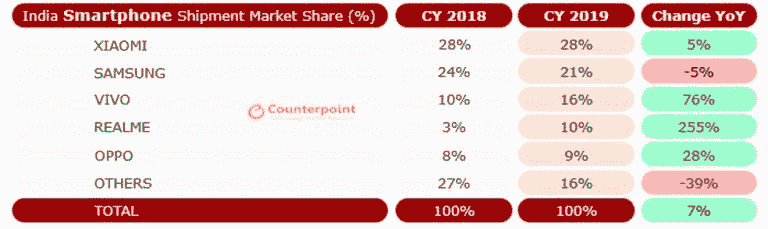
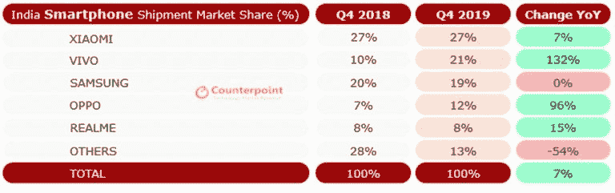

# Vivo 在 2019 年第四季度超越三星成为印度第二大出货量智能手机品牌

> 原文：<https://www.xda-developers.com/vivo-overtakes-samsung-india/>

市场情报公司 IDC 最近分享了 2019 年第四季度印度智能手机市场的一些数据。根据数据，小米和三星在本季度的市场份额都有显著增长，而 Realme 的份额有所下降。此外，数据还显示，中国原始设备制造商 Vivo 也在 11 月恢复了整体市场份额，从 2019 年 9 月的 14.31%上升至 16.92%。现在，Counterpoint Research 的一份独立报告称，就市场份额而言，Vivo 在 2019 年第四季度超过三星成为第二大 OEM 厂商。

根据 Counterpoint 的 2019 年第四季度市场监测报告，Vivo 在 2019 年同比增长 76%，仅在 2019 年第四季度同比增长 132%。该公司的增长是其预算设备系列的成功、Vivo S 系列的积极定位及其在线业务增长的直接结果。由于这些因素，Vivo 有史以来第一次在印度智能手机市场上占据了第二把交椅。

 <picture></picture> 

India Smartphone Market Share in 2019

随着 Vivo 的巨大增长，得益于中国品牌的扩张及其积极的定价策略，印度市场整体同比增长 7%。这一增长导致印度智能手机市场首次超过美国，成为全球第二大智能手机市场，2019 年出货量为 1.58 亿部。

 <picture></picture> 

India Smartphone Market Share in Q4 2019

小米在 2019 年第四季度同比增长 7%，2019 年同比增长 5%，其增长主要是由积极的线下扩张战略推动的。相反，韩国巨头三星的出货量在 2019 年第四季度几乎持平，而该公司在 2019 年整体下降了 5%。Vivo 的姐妹公司 OPPO 也取得了显著增长，2019 年第四季度的出货量同比增长了近一倍。虽然 Vivo 的增长肯定令人印象深刻，但 OPPO 的前子品牌 Realme 轻松盖过了该公司 2019 年 255%的增长。

* * *

**来源:[对位研究](https://www.counterpointresearch.com/india-surpassed-usa-become-second-largest-smartphone-market-world-reaching-158-million-shipments-2019/)**