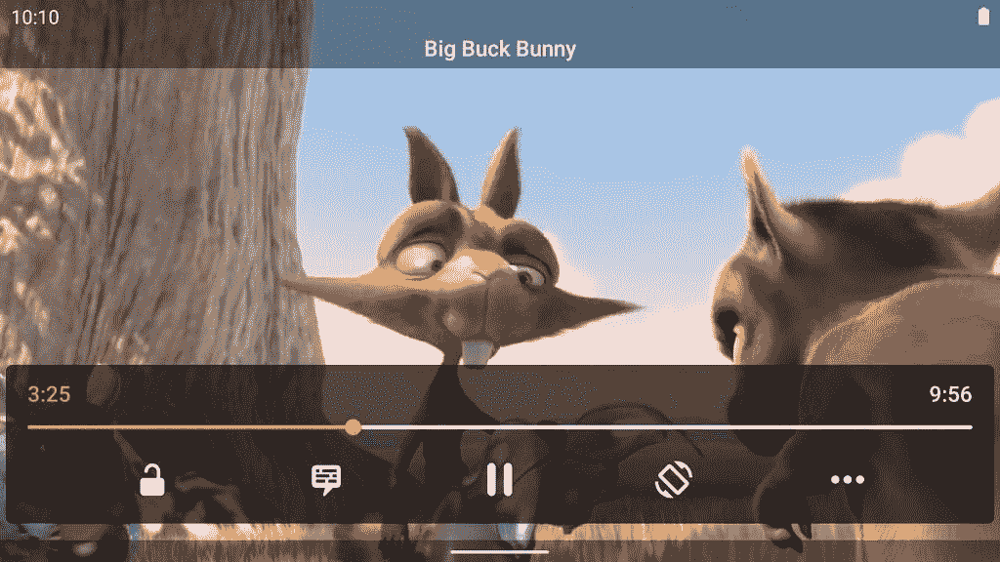

# 安卓版 VLC 3.3.0 测试版增加了一个底部导航栏的新用户界面

> 原文：<https://www.xda-developers.com/vlc-3-3-beta-android-bottom-navigation-bar/>

VLC 媒体播放器是来自 VideoLAN 的免费开源媒体播放器。这款流行的媒体播放器可以在许多平台上使用，包括 Android、Android TV 和 Chrome OS。现在已经为 Android 设备发布了 3.3.0 测试版，它带来了重新设计的 UI，带有底部导航。

让·巴普蒂斯特·肯普夫是 VideoLAN 的总裁，也是 VLC 的主要开发者之一，[在 Reddit](https://www.reddit.com/r/Android/comments/gbg5jn/vlc_330_beta_uiux_feedback/) 上宣布了新版本，并寻求对新用户界面的反馈。他解释说，新的更新使 VLC 的 UI 更接近谷歌的材料主题指南，使媒体播放器与 Android 中的手势导航更加兼容，并引入了大量的 UI 技巧和动画，使应用程序感觉更加原生。

他还分享了以下截图，展示了 Android 在 VLC 的新用户界面:

*安卓版 VLC 3.3.0 测试版截图。来源:VideoLAN*

 <picture></picture> 

VLC 3.3.0 beta media player UI on Android. Source: VideoLAN

在 Twitter 上，VideoLAN 工程师 Nicolas Pomepuy [分享了关于 VLC 3 . 3 . 0 测试版中引入的变化的更多细节](https://twitter.com/PomepuyN/status/1255930491389255680)。首先，他说转换到底部导航栏是为了减少从一个屏幕到另一个屏幕的点击次数。接下来，移除全彩色工具栏是为了获得更现代的设计，但 VideoLAN 在整个用户界面上保留了 VLC 标志性的橙色，以保留品牌的身份。虽然该团队更喜欢在卡片中显示内容，但他们让用户决定是否要切换到标准的列表视图。此外，用户现在可以创建自定义组，以防自动排序的视频集不够用。浏览屏幕被重新设计，将本地和网络浏览放在同一个地方，深色主题被重新设计为比以前更暗，最后，UI 中的更多角落被圆角化。

你可以在 Google Play [这里](https://play.google.com/apps/testing/org.videolan.vlc)注册 VLC 测试程序，然后从 Play Store 下载最新的测试版。如果你还没有看到更新，你可以通过从 [APKMirror](https://www.apkmirror.com/apk/videolabs/vlc/vlc-3-3-0-beta-1-release/) 下载 3.3.0 beta 1 版本来跳过等待。VLC 的安卓、安卓电视和 Chrome 操作系统的源代码可以在[这里](https://code.videolan.org/videolan/vlc-android/)找到。

如前所述，VideoLAN 正在积极寻求 VLC 最新版本的反馈。你可以在这里提交错误报告[或者在团队的 Reddit 帖子](https://code.videolan.org/videolan/vlc-android/-/issues)[这里](https://www.reddit.com/r/Android/comments/gbg5jn/vlc_330_beta_uiux_feedback/)发表评论。