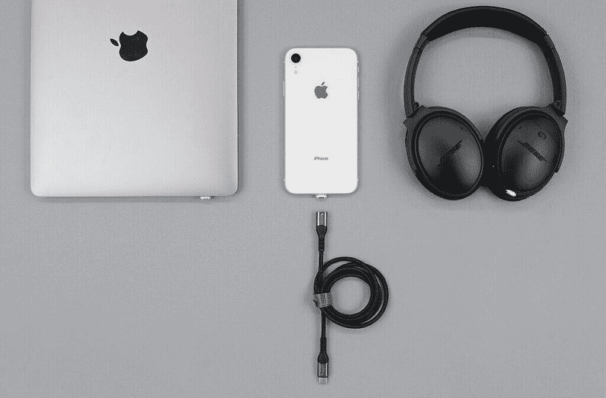
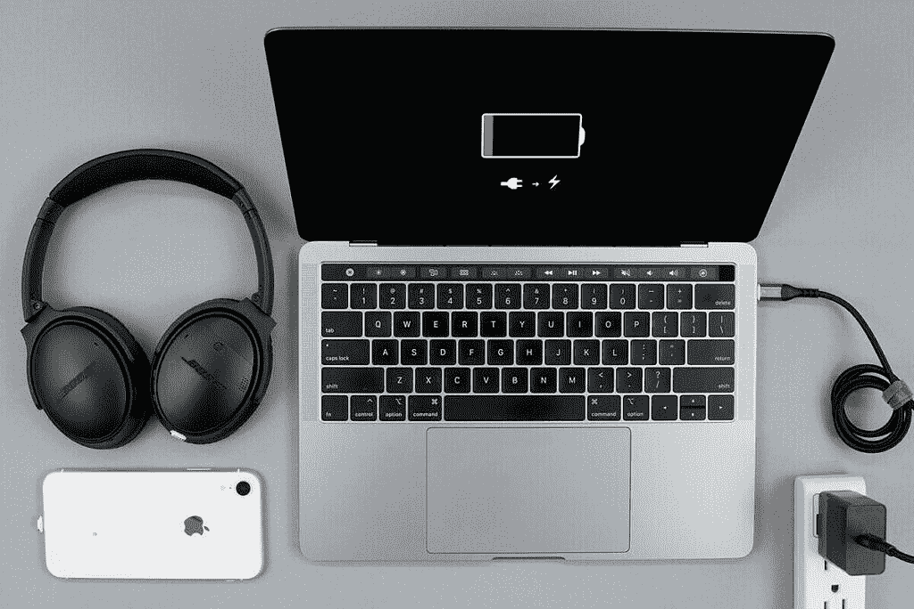

# VOLTA Spark 再现了 MagSafe 充电器的便利性

> 原文：<https://www.xda-developers.com/volta-spark/>

每天，给电子设备充电的方式变得越来越普遍。随着制造商放弃专有充电，转而使用 USB-C 充电，一些老的聪明的充电方法就消失了。一直以来，人们最喜欢的充电方式之一就是为早期 MacBooks 设计的苹果 MagSafe 充电器。

VOLTA 一直在重新创造这种充电方法，使用 UBS-C 等现代充电电缆。VOLTA 对这一领域并不陌生。多年来，他们制造了一些市场上质量最高的磁性充电器。他们的设计很聪明，有一个小的磁性适配器，几乎与你的手机边缘齐平。他们制作了一系列不同的适配器，旨在让充电成为一种更普遍的体验，一根电缆适用于所有设备。在这篇文章中，我们将看看他们的最新产品，沃尔特火花。

VOLTA Spark 是一种磁性充电电缆，配有 USB-C、Micro-USB 和 Lightning 适配器。使用最大 **100W USB-C PD** 充电和 **480mbps** 数据传输为您的设备充电。

**[回到 Indiegogo 竞选伏打星火](https://www.indiegogo.com/projects/volta-spark-charge-all-your-devices-and-laptops#/)这里**

 <picture></picture> 

Use the VOLTA Spark to charge all of your devices

 <picture></picture> 

VOLTA Spark's snag-safe design prevent accidents that can send your laptop flying across the room

*   安全的磁性设计
*   适用于多种适配器
*   为任何 USB-C、微型 USB 或 Lightning 设备充电
*   防磨损保护装置
*   智能 LED 充电指示灯
*   强 N52 钕磁铁
*   快速充电
*   终身保修
*   OTG 充电

VOLTA Spark 比传统充电器方便得多，而且在质量或规格上也没有遗漏。该电缆可以在 USB-C 连接上推动高达 100W 的功率，在照明上推动 18W，在微型 USB 上推动 10W。UBS 2.0 数据传输允许 480mbps 的传输速度。

两端 360°定向的两个完美对齐的 N52 级钕可逆磁体可在瞬间提供即时、强大的连接。没有更多的刺死你的设备试图连接收费。只要将电缆末端靠近连接器，它就会卡入到位。

耐用性是这种电缆的主要关注点。虽然随着时间的推移，许多充电电缆都会损坏，但 VOLTA Spark 的设计是经久耐用的。防磨损保护装置可防止电缆末端裂开和磨损。弯曲支撑允许充电器末端附近的灵活性。所有这些功能汇集在一起，以确保您不会购买另一个只能使用一个月的廉价充电器。

如果你想整合你的充电器系列，并且厌倦了低质量的廉价解决方案，VOLTA Spark 就是为你设计的。这是一个更安全、更方便的充电器，它的保修使它成为你需要的最后一个充电器。点击查看活动页面[上的更多信息。](https://www.indiegogo.com/projects/volta-spark-charge-all-your-devices-and-laptops#/)

###### 我们感谢 Volta 赞助了这篇文章。我们的赞助商帮助我们支付与运行 XDA 相关的许多费用，包括服务器成本、全职开发人员、新闻撰稿人等等。虽然您可能会在门户内容旁边看到赞助内容(这些内容将始终被标记为赞助内容),但门户团队对这些帖子不承担任何责任。赞助内容、广告和 XDA 仓库完全由一个独立的团队管理。XDA 绝不会通过接受金钱来赞扬一家公司，或以任何方式改变我们的观点或看法，从而损害其新闻诚信。我们的意见不能被收买。