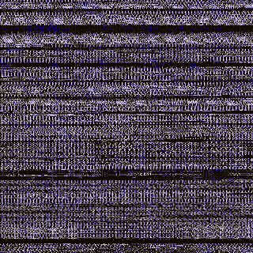

# 非官方磁贴 API 带来定制磁贴佩戴 OS 智能手表

> 原文：<https://www.xda-developers.com/wear-os-unofficial-tiles-api/>

# 非官方磁贴 API 带来定制磁贴佩戴 OS 智能手表

谷歌最近开始为 Wear OS 智能手表推出新的磁贴功能，开发人员已经知道如何定制磁贴。

虽然 Wear OS 在 Google I/O 2019 上只是一个[脚注](https://www.wareable.com/android-wear/wear-os-missing-in-action-google-io-7231)，但在活动前一周，Wear OS 团队宣布了新的磁贴功能。[磁贴](https://www.xda-developers.com/google-wear-os-tiles-feature/)是小型的、信息丰富的应用程序小部件卡片，带有常用的操作，只需在屏幕上轻轻一扫就可以显示出来。该功能正在慢慢推广到世界各地的智能手表，但在发布时只有 5 个磁贴可用:目标、下一个事件、预测、心率、标题和计时器。在这段视频中，您可以看到大约 50 秒的功能演示。

缓慢的部署和选项的缺乏抑制了人们对该功能的兴奋，但一位有进取心的应用程序开发人员最近找到了如何制作定制瓷砖的方法。虽然谷歌还没有发布磁贴的 API，但开发者 StringMon 从 Wear OS 应用中提取了相关代码，从而推断出一个 API。因此，这个“非官方应用程序接口”使用与 Wear OS 应用程序相同的内部 API 来创建智能手表上的磁贴，但由于该 API 不是官方的，这意味着谷歌可能会在发布前改变一些方法。如果您仍然对使用这个 API 感兴趣，您可以在这里找到的[实现细节。](https://bitbucket.org/StringMon/unofficialtileapi/src/master/)

 <picture></picture> 

Custom Tiles in NavExplorer for starting an FTP server. Credits: /u/[joelphilippage](https://www.reddit.com/r/WearOS/comments/bwquni/made_my_first_custom_tile_for_navexplorer/).

许多开发者已经更新了他们的应用程序来利用这个非官方的 API。 [JellyLauncher](https://play.google.com/store/apps/details?id=vg.maarten.jellylauncher) 、 [Nav Fit](https://play.google.com/store/apps/details?id=com.turndapage.navfit) 、 [Nav Explorer](https://play.google.com/store/apps/details?id=com.turndapage.navexplorer) 、[泡泡云(beta)](https://play.google.com/store/apps/details?id=dyna.logix.bookmarkbubbles) 、 [TerraTime (beta)](https://play.google.com/store/apps/details?id=com.daylightclock.android) 、 [Lunescope (beta)](https://play.google.com/store/apps/details?id=com.daylightmap.moon.pro.android) Wear OS 应用都实现了磁贴。/r/ [WearOSDev](https://www.reddit.com/r/WearOSDev) 社区上的开发人员正在分享如何使用新功能的技巧，所以如果你有兴趣在自己的应用程序中尝试一下，我建议你访问这个子网站。

* * *

*特写图片致谢:谷歌*