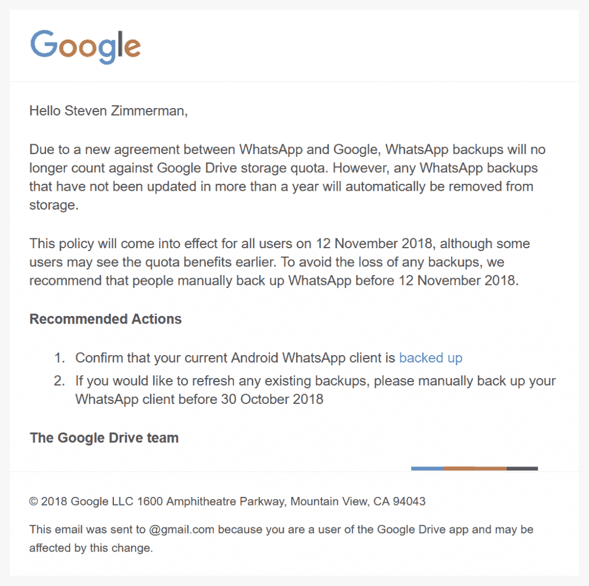

# WhatsApp 备份将不再计入 Google Drive 存储

> 原文：<https://www.xda-developers.com/whatsapp-backup-google-drive-storage-quota/>

WhatsApp Inc .与谷歌达成协议，从 2018 年 11 月 12 日开始，不再将备份计入谷歌硬盘存储配额。但是，用户必须每年至少备份一次他们的邮件、照片和/或视频，否则备份将自动从驱动器存储中删除。宣布这一协议的电子邮件已于今天早些时候发送给用户，我们自己的史蒂文·齐默曼证实了这一点。

 *今天发送给 Drive 用户确认与谷歌*达成协议的电子邮件

对于那些经常使用 Drive 并备份大量 WhatsApp 数据的人来说，你肯定会喜欢你很快就可以使用的额外存储空间。虽然有些用户只备份数千字节的文本数据，但其他用户可能会备份数百兆字节甚至数千兆字节的照片和视频。我们的一位作家阿罗尔·赖特(Arol Wright)将 2gb 的 WhatsApp 数据备份到 Google Drive。

这一声明是在谷歌为全球更多用户开放 [Google One 云存储订阅](https://www.xda-developers.com/google-one-cloud-subscription-available/)服务之际发布的。Google One 是所有 Google 订阅服务的[整合，包括 Google Drive、Google Photos 和 Gmail，并提供以下订阅层级:](https://www.xda-developers.com/google-one-new-paid-cloud-storage-service/)

*   15GB——所有谷歌账户免费
*   100 GB–每月 1.99 美元
*   200 GB–每月 2.99 美元
*   2TB–每月 9.99 美元

对于那些为 Google One 付费的人来说，一旦 WhatsApp 数据不再计入 Drive 的存储配额，额外的可用空间就不会那么可观了。但对于免费层的大多数用户来说，节省几百兆或几千兆字节会有很大的不同。正如电子邮件和本文开头所述，该协议在 2018 年 11 月 12 日之前不会生效，因此请确保在我们到达该日期之前手动备份您的数据，这样您就不会丢失任何数据。你可以从下面的谷歌 Play 商店链接下载最新版本的应用程序。