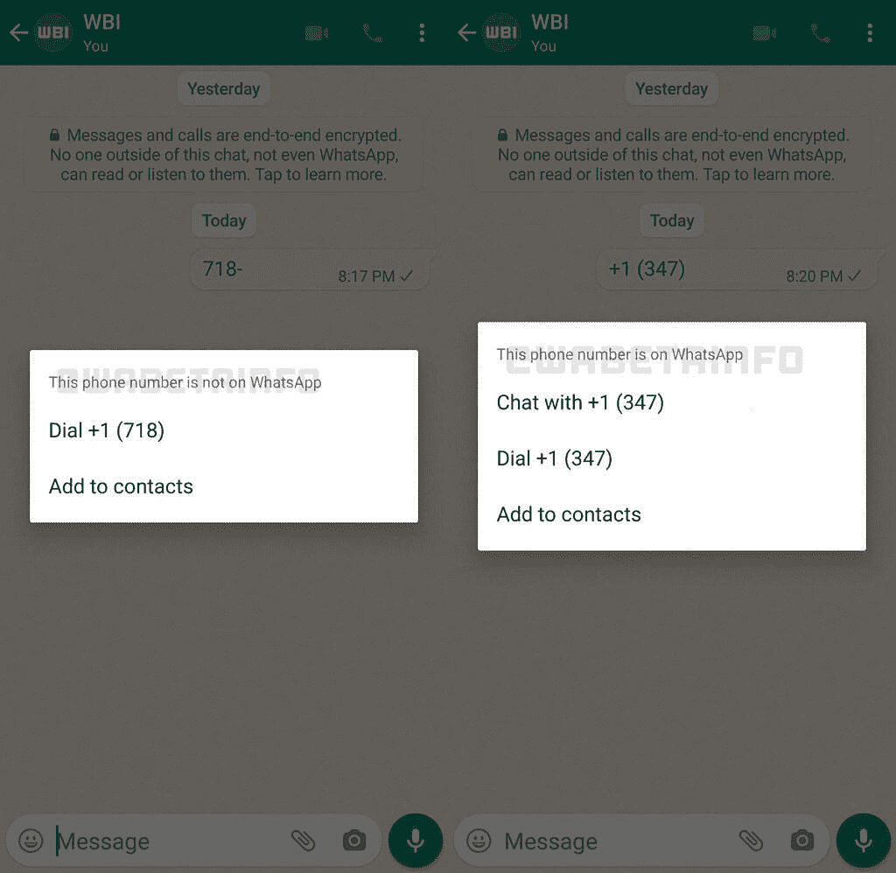

# WhatsApp 测试版带来了新功能，可以帮助您快速向未保存的联系人发送短信

> 原文：<https://www.xda-developers.com/whatsapp-beta-chat-unsaved-contacts/>

# WhatsApp beta for Android 引入了新功能，帮助您快速开始与未保存的联系人聊天

WhatsApp 正在测试频道推出一项新功能，让你可以轻松地在应用程序内给未保存的联系人发短信。请继续阅读，了解更多信息。

目前，在 WhatsApp 聊天中点击未保存的联系人会打开默认的拨号器应用程序。该应用程序没有给你在应用程序内给联系人发短信的选项，你必须使用[变通方法给 WhatsApp 上未保存的号码发消息](https://www.xda-developers.com/how-to-message-unsaved-whatsapp-numbers-android/)。然而，根据 WABetaInfo 最近的一份报告，这种情况很快就会改变。

最新的 WhatsApp Android 测试版更新(v2.22.8.11)包括一个新功能，可以在聊天中与未保存的号码进行交互时提供多个选项。正如你在附上的截图中看到的，点击一个未保存的号码会打开一个新的弹出菜单。该菜单为您提供了三个选项，让您可以立即与未保存的号码开始 WhatsApp 聊天，给它打电话，或将它添加到通讯录。

 <picture></picture> 

Credit: WABetaInfo

如果未保存的联系人没有 WhatsApp 帐户，弹出窗口只会让您选择拨打该号码或将其添加到联系人。WABetaInfo 指出，这项新功能将通过最新的更新向 Android 上的 WhatsApp 测试版用户推出，但也可能向以前测试版的一些用户提供。

目前，我们没有任何关于该功能何时会在稳定频道推出的信息。但由于它已经开始出现在测试版用户面前，不久之后这个功能就会得到更广泛的推广。如果您尚未收到该功能，并且希望向未保存的联系人发送短信，您可以打开一个新的浏览器窗口，输入*http://wa.me/*，然后输入国家代码和电话号码(例如 http://wa.me/911234567890)。只要你点击 go，网页就会将你重定向到一个新的 WhatsApp 聊天窗口，其中有未保存的联系人。

你收到 WhatsApp 最新测试版的新功能了吗？它像预期的那样工作吗？请在下面的评论区告诉我们。

* * *

**来源:** [WABetaInfo](https://wabetainfo.com/whatsapp-beta-for-android-2-22-8-11-whats-new/)