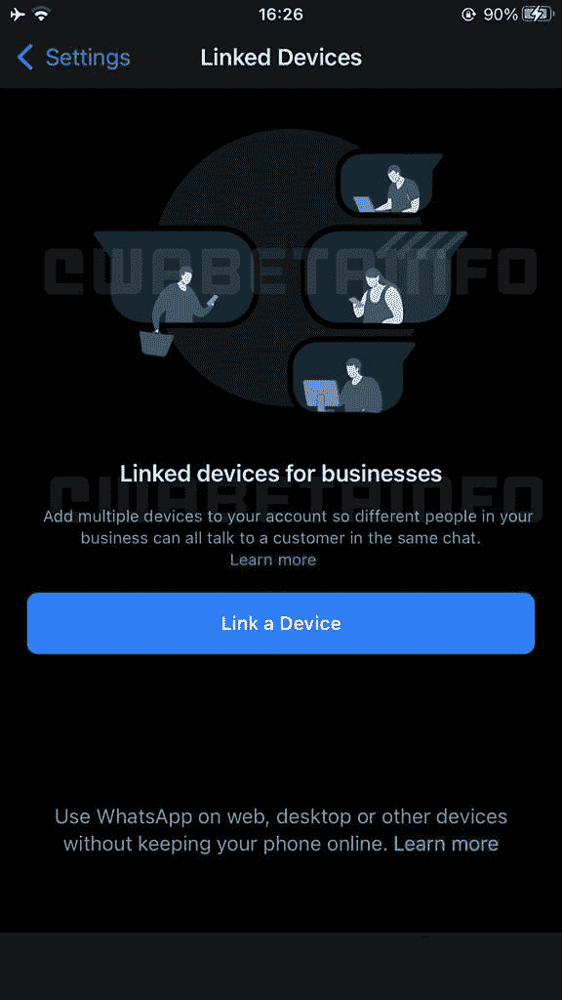

# WhatsApp 业务可以向连接超过四个设备的用户收费

> 原文：<https://www.xda-developers.com/whatsapp-business-could-charge-users/>

# WhatsApp 业务可以向连接超过四个设备的用户收费

在未来的更新中，WhatsApp 业务可能会开始向希望将四个以上设备与同一个账户关联的用户收费。

WhatsApp 是全球最受欢迎的即时通讯应用程序之一。不同地区的数十亿用户依靠这项服务来联系他们的亲人。此外，人们用它来与大小企业交流。因此，无论你是寻求支持、订购某种产品，还是仅仅是询问——有几家公司提供 WhatsApp 作为正式的沟通方式。Meta 已经有了一个专用的商业版本，它包含了更多与商业相关的特性和工具。尽管如此，该公司仍然不向用户收取这些服务的费用。但是，这可能会在未来的更新中有所改变。根据一份新的报告，WhatsApp Business 可能正在为那些希望将四个以上设备连接到一个账户的人准备订阅服务。这项功能仍在开发中，所以它是否会出现现在还不清楚。Meta 可能会因为任何原因改变计划。

 <picture></picture> 

Credit: *WABetaInfo*

根据 WABetaInfo 的一份报告，WhatsApp 可能准备向将四个以上设备连接到一个账户的商业用户收费。据报道，付费订阅将把这一限制增加到 10 台设备，而不是 4 台。该公司已经在研究重新设计的*联动设备*屏幕。然而，关于此事的其他细节暂时还不清楚。

WABetaInfo 的披露只是暗示了潜在的订阅服务。它不共享有关其价格、可用性或其他可能包含的专有功能的信息。然而，这位泄密者提到，WhatsApp 不太可能将现有功能锁定在潜在的付费墙之后。考虑到其他即时通讯应用程序往往允许用户免费连接更多设备，看看企业是否订阅这一即将到来的计划将是一件有趣的事情——如果该公司发布它的话。

*你会每月付费在 WhatsApp Business 上连接四个以上的设备吗？为什么或为什么不？请在下面的评论区告诉我们。*

* * *

**来源:** [*WABetaInfo*](https://wabetainfo.com/whatsapp-is-working-on-a-subscription-plan-for-businesses/)