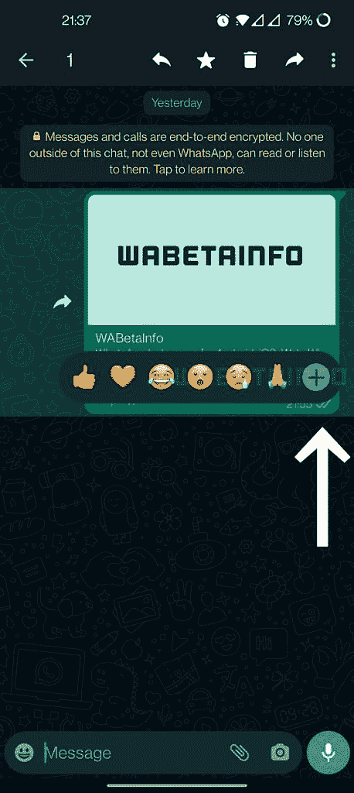

# WhatsApp 上的消息反应可能很快会获得更多表情符号的支持

> 原文：<https://www.xda-developers.com/whatsapp-message-reactions-more-emoji-reactions/>

# WhatsApp 的消息反应功能可能很快会支持更多表情符号反应

WhatsApp 正在更新其消息反应功能，该功能可能允许用户在反应面板中添加更多表情反应。

WhatsApp 一直在努力增加对表情符号消息反应的支持。我们在去年 8 月首次了解到该功能，此后在 iOS 和 Android 的 WhatsApp 测试版中发现了该功能的不同完成阶段。上个月，WhatsApp [终于开始向一些测试版用户](https://www.xda-developers.com/whatsapp-message-reactions-beta/)发布消息反馈。但该公司似乎还没有完成对该功能的调整。来自 *WABetaInfo* 的一份新报告显示，WhatsApp 正在努力增加一个新选项，允许用户在消息反应面板中添加自定义表情反应。

当 WhatsApp 最近向测试版用户推出消息反应时，该功能仅支持六种表情符号反应——竖起大拇指、红心、喜极而泣的脸、张开嘴的脸、哭泣的脸和双手合十。与 Instagram 和 Messenger 上的消息反应不同，该功能没有给用户提供在 WhatsApp 上添加更多表情符号反应的选项。然而，最新的 WhatsApp Android 测试版在表情反应面板上添加了一个加号图标，这表明 WhatsApp 可能很快就会让用户在面板上添加更多的表情反应。

 <picture></picture> 

Credit: WABetaInfo

正如你在所附的截图中看到的，Android v2.22.9.4 的 WhatsApp 测试版中的表情符号反应面板包括一个新的加号图标。点击这个新图标可能会让用户在面板上添加更多的表情符号反应。但该按钮似乎在当前的测试版中不起作用，所以我们无法确认 WhatsApp 在发布时可能会添加哪些新的表情反应。

这个新版本的消息反应面板可能会在未来的 WhatsApp 测试版中推出。但 WhatsApp 尚未公布官方发布日期。我们将确保在即将到来的测试版/稳定版中推出该功能时尽快通知您。

* * *

**来源:** [WABetaInfo](https://wabetainfo.com/whatsapp-is-working-on-a-new-version-of-message-reactions/)