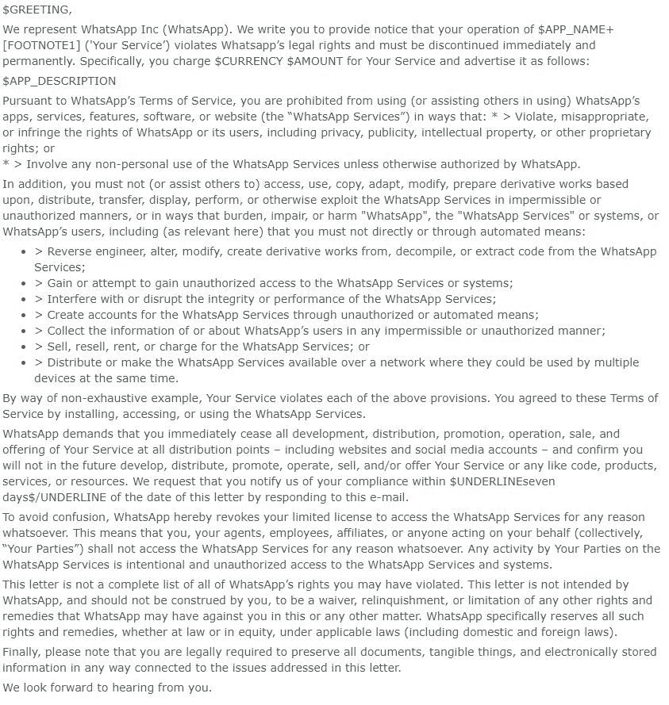

# WhatsApp 向使用原生 Android APIs 的应用程序发送停止和终止请求

> 原文：<https://www.xda-developers.com/whatsapp-sends-cease-desist-apps-native-android-api/>

WhatsApp 是迄今为止智能手机上最受欢迎的应用之一，每天有超过 10 亿的活跃用户。早在 2014 年被脸书以 190 亿美元收购时，怀疑者就担心此后该应用程序将如何管理。对用户来说幸运的是，尽管有一些关于幕后发展的，但似乎没有什么变化。对开发者来说不幸的是，有一个地方我们希望公司有所改变:他们对第三方开发者的态度。该公司正在向独立的 Android 应用程序开发者发出新一轮的停止和终止信，但这一次他们的声明没有多少价值。

## WhatsApp 怎么了？

WhatsApp 是这个星球上最大的服务之一，所以看到他们通过防止滥用他们的平台来积极保护自己的品牌并不奇怪。这很好，这也是为什么我们可以理解为什么之前的公司[追求第三方客户](https://www.xda-developers.com/cease-and-desist-whatsapp-sucks-and-you-cant-help-it/)，即使我们不同意这个决定。使用服务的 API 的应用程序正在走钢丝，因为每当他们想要杀死第三方客户端时，服务都可以更改他们的 API 的服务条款(只要他们通知用户任何更改)。第三方 Twitter 客户端的开发者[对此太了解了](https://www.xda-developers.com/twitter-new-api-third-party-clients/)。

但这次不是这样。一家代表 WhatsApp 的法律公司已经向至少两家独立的 Android 应用程序开发者发送了停止函，要求他们删除应用程序的功能，否则将面临诉讼。这两个应用程序都不使用任何来自 WhatsApp 服务的代码，也不与 WhatsApp 服务接口。相反，这些应用程序利用标准的 Android APIs、通知监听器和直接回复来运行。因此，要求从这些应用中去除任何与 WhatsApp 相关的功能，往好里说是可疑的，往坏里说是恶意的。

你可以在下面查看开发者从代表 WhatsApp 的法律公司收到的停止和终止信的编辑版本。*XDA-开发商*可以证实原始信件的真实性。我们联系了 WhatsApp 的母公司脸书，请其置评。

 <picture></picture> 

Source: [Reddit](https://www.reddit.com/r/Android/comments/8vkqtk/follow_up_whatsapp_cease_and_desist_full_letter/)

## 分解停止和终止信

这封信中提出了许多说法，但并没有准确反映每个应用程序在 WhatsApp 集成方面的功能。让我们来分解一下这些说法:

*   您通过安装、访问或使用 WhatsApp 服务同意这些服务条款
    *   这两个应用程序都不使用服务中的任何 API。此外，开发人员从一开始就没有同意服务条款，因为他们没有使用他们的任何 API。
*   对 WhatsApp 服务进行反向工程、更改、修改、创建衍生作品、反编译或提取代码
    *   这两款应用都不是 WhatsApp 特有的，都使用原生 Android APIs，而不是 WhatsApp 本身的任何代码。
*   "获得或试图获得对 WhatsApp 服务或系统的未授权访问."
    *   按照这种逻辑，Android 本身违反了 ToS，因为它处理每个通知并保留通知日志。
*   “以任何不允许或未经授权的方式收集 WhatsApp 用户的信息或关于 WhatsApp 用户的信息”
    *   用户明确地自己下载并安装这个应用程序。
*   WhatsApp 服务的销售、转售、租赁或收费
    *   这些应用程序不出租或出售对服务的访问权限。除非安装最初的 WhatsApp 应用程序，否则这两个应用程序都无法运行。

几乎信中的每一项声明都是错误的，或者过于模糊，无法说明这些应用程序是如何违反这些条款的。不管怎样，这些应用背后的开发者没有一个同意任何 ToS，使得这些协议没有实际意义。不过，该信确实指出，指称的违反行为并非详尽无遗。除非这些应用违反了这里没有涉及的术语，否则我们看不出这些应用如何违反了 ToS。甚至在 Play Store 对每个应用程序的描述中使用 WhatsApp 品牌名称可能会侵犯他们的商标，而不是 ToS。

开发商有七天的时间来遵守，否则他们可能会面临诉讼。在开发者评估他们的选项时，不能说话已经从 Play Store 中删除，而 DirectChat 应用程序仍然可用，但可能会被修改以删除对 WhatsApp 集成的访问。移除整合将对每个应用造成重大打击，因为他们的大多数用户可能会使用这些应用进行特定的整合——毕竟 WhatsApp 每天有超过 10 亿的活跃用户。

## 收到停止函的申请

### 不能说话

[不会说话](https://forum.xda-developers.com/android/apps-games/app-talk-office-everything-t3634507)的前提是[简单](https://www.xda-developers.com/cant-talk-auto-reply-whatsapp-slack/)。它所做的就是当你不在的时候，利用 Android 自带的快速回复(RemoteInput) API，自动回复别人。如果你正在开车，看电影，或者只是不想在这个时候说话，那么应用程序可以用预设的消息为你回复。它还可以给试图给你打电话的人发短信。如果你想支持的不仅仅是短信和通话，比如 WhatsApp、Slack 等等，这是一个付费应用。基本上，任何允许你通过可以使用的通知发送快速回复的消息服务都无法与之交谈。

### DirectChat

DirectChat 是另一个有用的应用。它就像 Facebook Messenger 的聊天气泡一样工作，但它也支持许多不同的应用程序。它会将你的聊天内容传送到另一个窗口，你也可以在那里回复。它最流行的用法可能是 WhatsApp。

## 接下来会发生什么？

为使用原生 Android APIs 而关闭这些应用程序，为大公司未来的关闭树立了一个危险的先例。如果这种情况继续下去，是什么阻止了 WhatsApp 要求移除任何通知管理器应用程序，不管它对 WhatsApp 的具体用途是什么。独立的应用程序开发者没有资源来对抗这些主张，所以大多数人只能让步。我们将密切关注这一情况，如果我们从脸书/WhatsApp、受影响的开发者或涉及这一情况的另一方那里得到反馈，我们将更新您的信息。