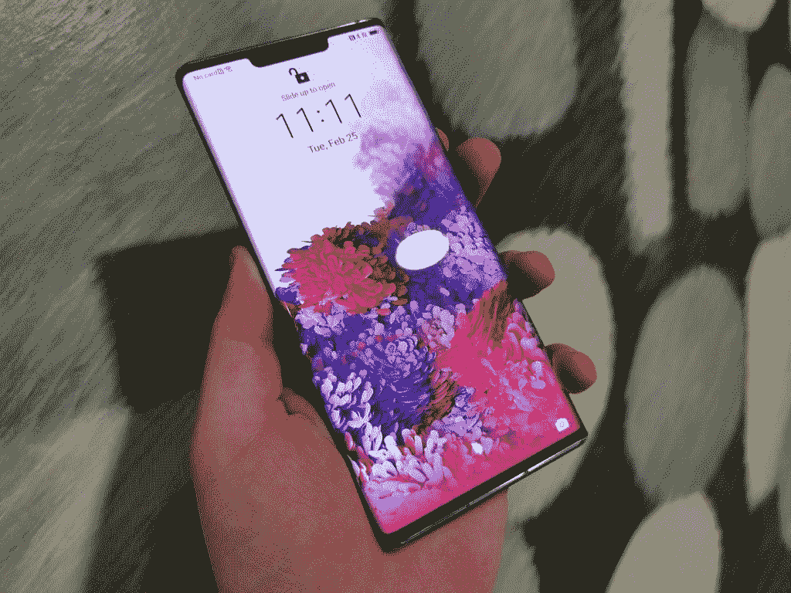
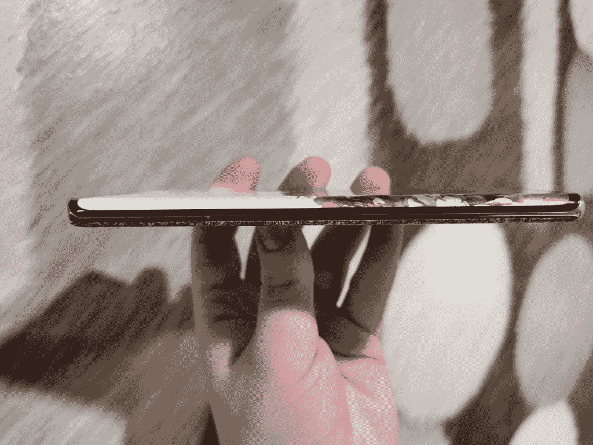

# 赢取一台华为 Mate 30 Pro【面向所有国家开放】

> 原文：<https://www.xda-developers.com/win-a-huawei-mate-30-givaway/>

华为 Mate 30 Pro 是一款功能强大的旗舰设备，配有 6.71 英寸的大显示屏。大屏幕分辨率为 1440x3120p，是一款非常适合视频和游戏的手机。自拍相机是双传感器设置，有两个 32MP 相机。后置摄像头装有四个不同的传感器，组成四摄像头。有一个 40MP 宽相机，8MP 长焦相机，40MP 超宽相机和一个 TOF 3D 深度相机。海思麒麟 990 是华为最新的内部芯片组，配有 8GB 内存和 128GB 和 256GB 存储选项。这些都是由 4500 毫安的大电池供电的。

现在你有机会赢得这款来自华为的惊艳手机。这一赠品对所有国家开放。你所要做的就是填写下面的表格，这样你就有机会获胜。祝你好运！

[赢一台 Mate 30 Pro！【对所有国家开放】](https://gleam.io/DybDj/win-a-mate-30-pro-open-to-all-countries)

 <picture></picture> 

Mate 30 Pro

 <picture></picture> 

Mate 30 Pro Waterfall Display

 <picture></picture> 

Join the Official Huawei Community

在你进入这个激动人心的大赛后，考虑加入华为官方社区，与其他华为用户互动。华为有一个庞大的社区，包含各种不同的主题，包括为 XDA 更懂技术的用户提供的主题。今天就加入我们，成为华为最新产品的频繁赠品、重要讨论和突发新闻的一部分。

[**加入华为官方社区**](http://xda.tv/HC)

###### 我们感谢华为赞助这篇文章。我们的赞助商帮助我们支付与运行 XDA 相关的许多费用，包括服务器成本、全职开发人员、新闻撰稿人等等。虽然您可能会在门户内容旁边看到赞助内容(这些内容将始终被标记为赞助内容),但门户团队对这些帖子不承担任何责任。赞助内容、广告和 XDA 仓库完全由一个独立的团队管理。XDA 绝不会通过接受金钱来赞扬一家公司，或以任何方式改变我们的观点或看法，从而损害其新闻诚信。我们的意见不能被收买。