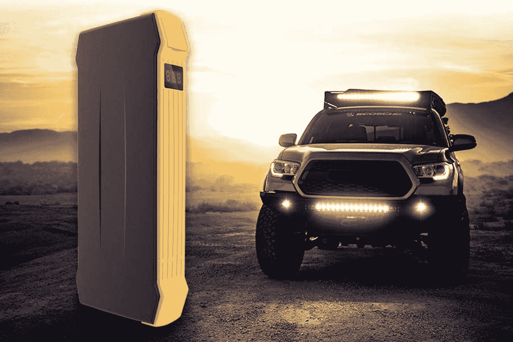
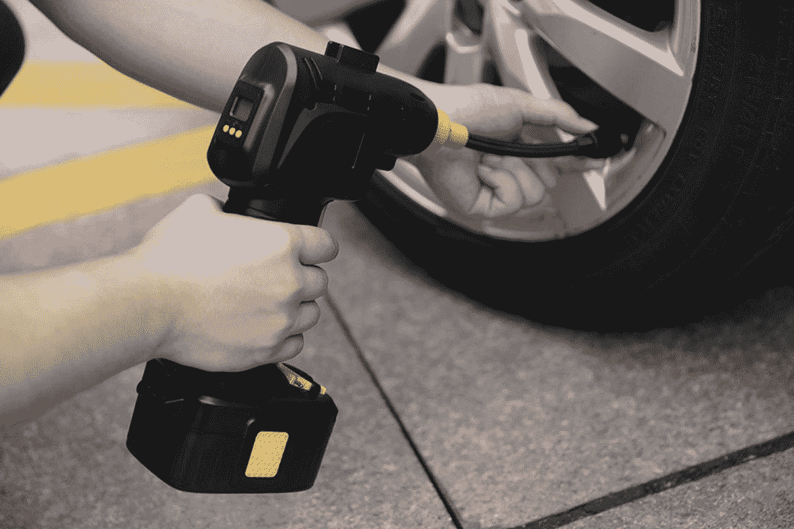
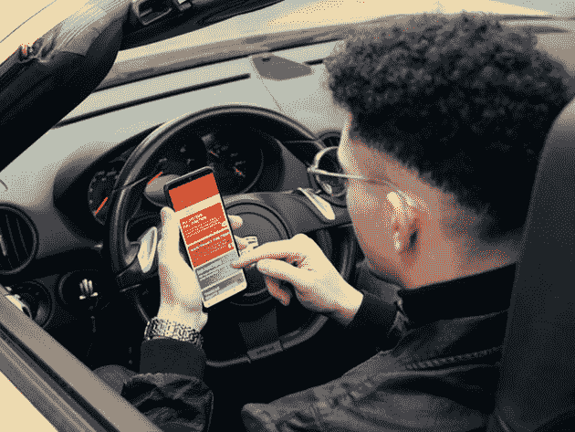
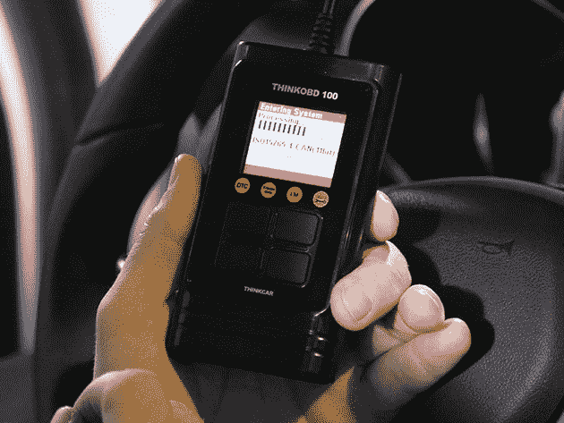
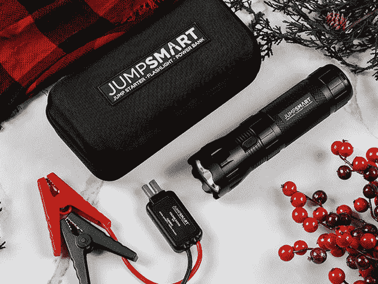
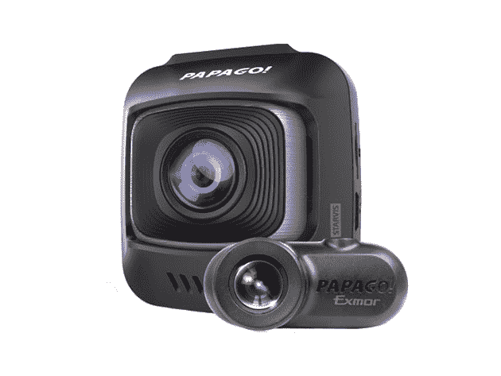
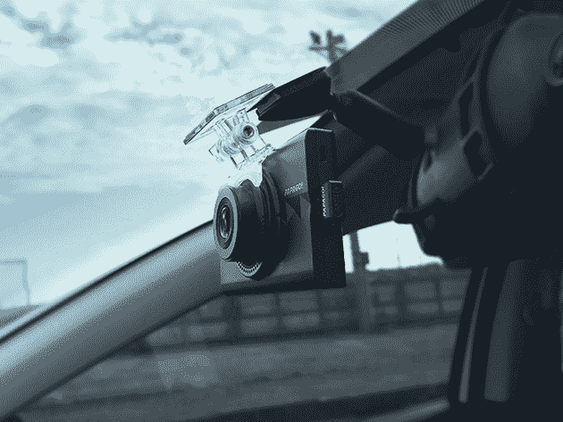
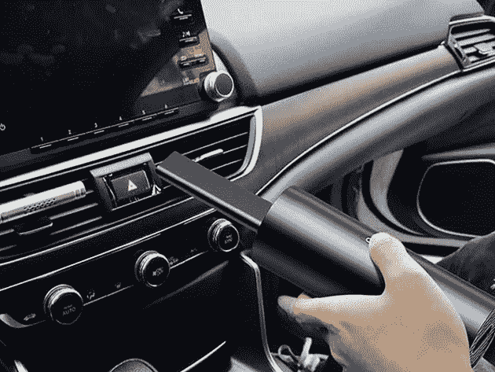
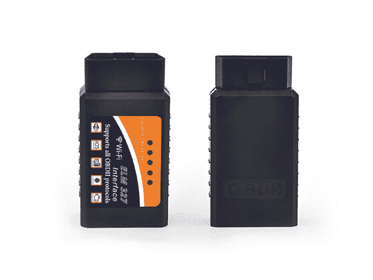

# 赢得一辆特斯拉，购买这些汽车配件可节省高达 70%的费用

> 原文：<https://www.xda-developers.com/win-a-tesla-and-save-up-to-70-on-these-auto-accessories/>

根据交通部的数据，普通美国人每年花在路上的时间超过 350 小时。为了让乘坐更舒适，我们给你机会 [赢取全新 2020 特斯拉 Model 3](https://depot.xda-developers.com/giveaways/tesla-giveaway?utm_source=xda-developers.com&utm_medium=referral&utm_campaign=tesla-giveaway&utm_term=scsf-434972&utm_content=a0x1P000004YFILQA4&scsonar=1) 。

这台漂亮的机器时速可达 140 英里，0-60 英里仅需 5.3 秒，行驶里程可达 250 英里。 [现在就进入](https://depot.xda-developers.com/giveaways/tesla-giveaway?utm_source=xda-developers.com&utm_medium=referral&utm_campaign=tesla-giveaway&utm_term=scsf-434972&utm_content=a0x1P000004YFILQA4&scsonar=1) 让您有机会驾驶汽车——与此同时，这里有一些汽车配件的超值优惠。

## **Autowit 12V 便携式无电瓶汽车跳启动器**

****

[auto wit](https://depot.xda-developers.com/sales/autowit-12v-portable-batteryless-car-jump-starter?utm_source=xda-developers.com&utm_medium=referral&utm_campaign=autowit-12v-portable-batteryless-car-jump-starter&utm_term=scsf-434973&utm_content=a0x1P000004YFILQA4&scsonar=1)的功率密度是普通电池的 60 倍，足以启动任何 5.0 升汽油或 3.0 升柴油汽车。它可以在-40 华氏度到 158 华氏度的任何温度下工作，电池的设计寿命为 20 年。通常售价 159 美元，[jump starter 现在只要 121.99 美元](https://depot.xda-developers.com/sales/autowit-12v-portable-batteryless-car-jump-starter?utm_source=xda-developers.com&utm_medium=referral&utm_campaign=autowit-12v-portable-batteryless-car-jump-starter&utm_term=scsf-434973&utm_content=a0x1P000004YFILQA4&scsonar=1) 。

## **Autowit 无绳轮胎充气机**

****

[auto wit 轮胎充气机](https://depot.xda-developers.com/sales/autowit-cordless-tire-inflator?utm_source=xda-developers.com&utm_medium=referral&utm_campaign=autowit-cordless-tire-inflator&utm_term=scsf-434974&utm_content=a0x1P000004YFILQA4&scsonar=1) 具有定制预设和自动切断功能，帮助您在几秒钟内达到完美的压力。该充气机由可充电电池组供电，易于使用且非常轻便。它的零售价为 69 美元，但你现在只需 59.99 美元就可以买到。

在亚马逊上被评为 4.4 星， [这个 Kickstarter 的成功故事](https://depot.xda-developers.com/sales/thinkdiag-professional-automotive-diagnostic-device-1-year-subscription-service?utm_source=xda-developers.com&utm_medium=referral&utm_campaign=thinkdiag-professional-automotive-diagnostic-device-1-year-subscription-service&utm_term=scsf-434975&utm_content=a0x1P000004YFILQA4&scsonar=1) 将实时诊断从你的汽车传递到你的手机。它适用于市场上 95%的汽车，你可以获得大量有用的数据。它通常是 119 美元，但你可以 [现在花 99.99 美元](https://depot.xda-developers.com/sales/thinkdiag-professional-automotive-diagnostic-device-1-year-subscription-service?utm_source=xda-developers.com&utm_medium=referral&utm_campaign=thinkdiag-professional-automotive-diagnostic-device-1-year-subscription-service&utm_term=scsf-434975&utm_content=a0x1P000004YFILQA4&scsonar=1) 购买 THINKDIAG，其中包括一年的订阅。

****

另一个很棒的诊断工具是[THINKOBD 100](https://depot.xda-developers.com/sales/thinkobd-100?utm_source=xda-developers.com&utm_medium=referral&utm_campaign=thinkobd-100&utm_term=scsf-434976&utm_content=a0x1P000004YFILQA4&scsonar=1)。这款插件设备专为汽车静止时使用而设计，可检查发动机故障，读取实时数据，并显示 VIN 号码。它的正常售价为 34 美元，但你现在可以用 29.99 美元 买到它。

## **Jump smart 37000 mwh 便携式车辆跨接启动套件**

被《今日创新与科技》评为 CES 2019 和 2018 最佳， [这款跳跃式启动器](https://depot.xda-developers.com/sales/portable-vehicle-jump-starter-flashlight-power-bank-with-37000-mwh-black?utm_source=xda-developers.com&utm_medium=referral&utm_campaign=portable-vehicle-jump-starter-flashlight-power-bank-with-37000-mwh-black&utm_term=scsf-434977&utm_content=a0x1P000004YFILQA4&scsonar=1) 可以让大多数汽车起死回生。它还可以作为 330 流明的 LED 手电筒用于紧急情况，你可以通过内部电源为手机充电。正常情况下是 119.99 美元， [现在是 89.99 美元](https://depot.xda-developers.com/sales/portable-vehicle-jump-starter-flashlight-power-bank-with-37000-mwh-black?utm_source=xda-developers.com&utm_medium=referral&utm_campaign=portable-vehicle-jump-starter-flashlight-power-bank-with-37000-mwh-black&utm_term=scsf-434977&utm_content=a0x1P000004YFILQA4&scsonar=1) 当您使用促销代码 **无限制 25** 享受七五折优惠时。

## **重力 X 车载支架**

****

如在 Kickstarter 和 Indiegogo 上看到的那样， [重力 X 坐骑](https://depot.xda-developers.com/sales/gravity-x-car-mount?utm_source=xda-developers.com&utm_medium=referral&utm_campaign=gravity-x-car-mount&utm_term=scsf-434978&utm_content=a0x1P000004YFILQA4&scsonar=1) 锁定仪表板上的任何缝隙。这为您的手机提供了一个安全的休息场所，是查看方向和选择您最喜爱的播放列表的理想选择。目前，该产品的零售价为 19.99 美元[低 33%。](https://depot.xda-developers.com/sales/gravity-x-car-mount?utm_source=xda-developers.com&utm_medium=referral&utm_campaign=gravity-x-car-mount&utm_term=scsf-434978&utm_content=a0x1P000004YFILQA4&scsonar=1)

## **带索尼图像传感器的 GoSafe S780 仪表盘摄像头**

****

[GoSafe S780](https://depot.xda-developers.com/sales/gosafe-s780-2-channel-dash-cam-with-sony-image-sensor-ultra-wide-angle-free-16gb?utm_source=xda-developers.com&utm_medium=referral&utm_campaign=gosafe-s780-2-channel-dash-cam-with-sony-image-sensor-ultra-wide-angle-free-16gb&utm_term=scsf-434979&utm_content=a0x1P000004YFILQA4&scsonar=1)使用两个独立的镜头覆盖汽车的前部和内部，提供 330 度的覆盖范围。该相机还具有一个 G 传感器，可以检测碰撞，加上驾驶员辅助功能。通常是 299 美元，但你今天只需 199.99 美元 就可以 [买到。](https://depot.xda-developers.com/sales/gosafe-s780-2-channel-dash-cam-with-sony-image-sensor-ultra-wide-angle-free-16gb?utm_source=xda-developers.com&utm_medium=referral&utm_campaign=gosafe-s780-2-channel-dash-cam-with-sony-image-sensor-ultra-wide-angle-free-16gb&utm_term=scsf-434979&utm_content=a0x1P000004YFILQA4&scsonar=1)

## **Papago GoSafe 366 仪表盘凸轮**

****

除了前置和后置摄像头，这款[go safe dash cam](https://depot.xda-developers.com/sales/papago-gosafe-366-wifi-2-channel-1080p-touch-screen-dash-cam?utm_source=xda-developers.com&utm_medium=referral&utm_campaign=papago-gosafe-366-wifi-2-channel-1080p-touch-screen-dash-cam&utm_term=scsf-434980&utm_content=a0x1P000004YFILQA4&scsonar=1)还增加了 Wi-Fi 连接和 3.5 英寸触摸屏。它也有夜视功能，所以你可以一直记录到深夜。正常情况下 299 美元，现在已经 [降到了 249.99 美元](https://depot.xda-developers.com/sales/papago-gosafe-366-wifi-2-channel-1080p-touch-screen-dash-cam?utm_source=xda-developers.com&utm_medium=referral&utm_campaign=papago-gosafe-366-wifi-2-channel-1080p-touch-screen-dash-cam&utm_term=scsf-434980&utm_content=a0x1P000004YFILQA4&scsonar=1) 。

## **迷你无绳汽车吸尘器**

[Kittylulu 迷你真空吸尘器](https://depot.xda-developers.com/sales/mini-cordless-car-vacuum-cleaner?utm_source=xda-developers.com&utm_medium=referral&utm_campaign=mini-cordless-car-vacuum-cleaner&utm_term=scsf-434981&utm_content=a0x1P000004YFILQA4&scsonar=1) 是拾取灰尘和碎屑的理想选择，配有一个 HEPA 过滤器和三个清洁附件。在充满电的情况下，你可以获得 30 分钟的强大吸力，然而该设备比大多数水瓶都小。价值 49 美元的 Kittylulu[目前仅售 39.95 美元](https://depot.xda-developers.com/sales/mini-cordless-car-vacuum-cleaner?utm_source=xda-developers.com&utm_medium=referral&utm_campaign=mini-cordless-car-vacuum-cleaner&utm_term=scsf-434981&utm_content=a0x1P000004YFILQA4&scsonar=1) 。

## **KOBRA 无线车载扫描仪**

****

在亚马逊上从 700 条评论中被评为 4 星， [Kobra 扫描仪](https://depot.xda-developers.com/sales/kobra-wireless-car-scanner-2?utm_source=xda-developers.com&utm_medium=referral&utm_campaign=kobra-wireless-car-scanner-2&utm_term=scsf-434982&utm_content=a0x1P000004YFILQA4&scsonar=1) 为 1996 年以来制造的所有汽车提供实时诊断。它可以解释超过 3，000 个引擎代码，您可以将它与众多诊断应用程序配合使用。它的零售价为 49 美元，但你现在可以以 14.99 美元 的价格在 [买到它。](https://depot.xda-developers.com/sales/kobra-wireless-car-scanner-2?utm_source=xda-developers.com&utm_medium=referral&utm_campaign=kobra-wireless-car-scanner-2&utm_term=scsf-434982&utm_content=a0x1P000004YFILQA4&scsonar=1)

*价格随时变化*