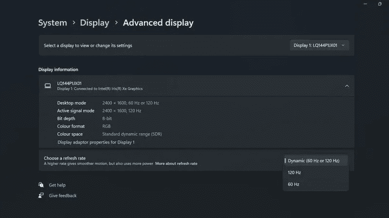

# Windows 内部人员现在可以在 Surface Laptop Studio 上尝试动态刷新率

> 原文：<https://www.xda-developers.com/windows-insiders-surface-laptop-studio-dynamic-refresh-rate/>

大约在笔记本电脑推出六个月后，微软终于开始在 Surface Laptop Studio 上测试动态刷新率功能。这使得笔记本电脑上的显示器能够根据需要在 60Hz 或 120Hz 刷新率之间自动切换，这是微软自首次推出笔记本电脑以来一直承诺的。不过，该功能目前只对 Windows 内部人员开放。

据 *Windows Central* 报道，动态刷新率模式正在向注册 Windows Insider 计划的 Surface Laptop Studio 用户推出，特别是开发和测试频道。如果您属于这一组，您应该会通过 Windows Update 收到一对更新，一个是固件更新(版本 10.0.156)，另一个是新的英特尔图形驱动程序(版本 30.0.101.1340)。

一旦您安装了更新，您应该能够通过进入设置应用程序并前往**显示** - > **高级显示**找到新的动态刷新率模式。在这里，你通常可以在 60Hz 和 120Hz 之间选择，现在你会看到一个**动态(60Hz 或 120Hz)** 选项。

 <picture></picture> 

Image credit: Windows Central

看起来只有这两种刷新率可用，所以当屏幕空闲时，你不会得到 90Hz 或低至 10Hz，但有这个选项还是不错的。根据 *Windows Central* 的说法，笔记本电脑在屏幕空闲时确实会坚持 60Hz，在滚动文档时会变为 120Hz。然而，一些动画并没有触发更高的刷新率，所以体验并没有想象中那么流畅。希望这种情况在这一功能推广到所有人的时候会有所改变。就这一点而言，Surface Pro 8 似乎不具备这一功能，因为 Surface Pro 8 也有 120Hz 的显示屏。据推测，它最终也会得到它。

如果你更熟悉智能手机市场，这种功能可能实际上有点不起眼。智能手机多年来一直在宣传动态刷新率，其中一些智能手机对刷新率可以达到多低以节省电池的控制更加精细。我们只能希望像 Surface Laptop Studio 这样的笔记本电脑能够开创一种新趋势，而个人电脑将使这种功能变得更加普遍。如果你对微软的最新笔记本电脑感兴趣，请查看我们的 [Surface Laptop Studio 评测](https://www.xda-developers.com/surface-laptop-studio-review/)以了解更多信息。

* * *

来源: [Windows Central](https://www.windowscentral.com/surface-laptop-studio-dynamic-refresh-rate-preview-rollout)