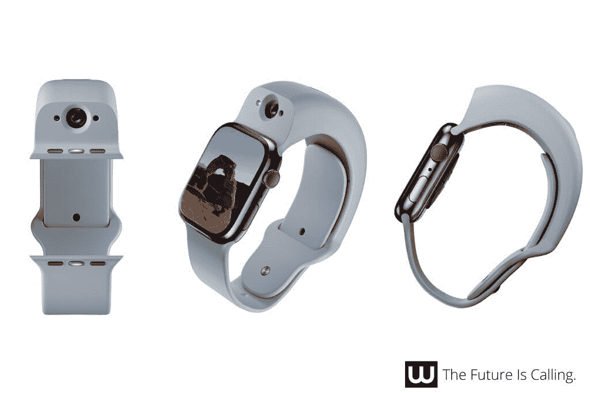

# Wristcam 让视频通话在你的 Apple Watch 上成为现实

> 原文：<https://www.xda-developers.com/wristcam-makes-video-calls-a-reality-on-your-apple-watch/>

# Wristcam 让视频通话在你的 Apple Watch 上成为现实

现在，你可以在你的 Apple Watch 上拨打和接听视频电话，这要归功于手腕摄像头的新软件更新。

如果您有一个腕式相机，您会很高兴地知道，您现在可以用您的进行视频通话了

[Apple Watch](https://www.xda-developers.com/best-apple-watch/)

。遗憾的是，这项操作不是使用 FaceTime 执行的。相反，你必须依赖 Wristcam 应用程序，这意味着双方都需要安装该应用程序才能进行视频通话。为了访问新功能，用户必须首先访问 WristCam 网站，以请求“提前访问”。您需要填写您的姓名和电子邮件地址。虽然它不是最无缝的，但该公司在其关于页面上表示，它目前正在与不同的开发商合作，以增加更好的支持和兼容性。

For those unfamiliar with the accessory, the Wristcam is an [Apple Watch band](https://www.xda-developers.com/best-apple-watch-bands/) that was launched last year. It gave Apple Watch users the ability to take photos and videos. The product was developed by an ex-Apple engineer. The company's mission statement is "focused on making camera-powered software experiences faster and more accessible than ever before". The Wristcam has an 8MP primary camera for taking photos and 1080p videos of the environment around you and makes use of a 2MP for selfies.

您可以通过应用程序或按下设备的物理按钮来激活相机。单次按下将拍摄照片，长时间按下将开始拍摄视频。有 8GB 的板载存储空间，可以存储长达一个多小时的视频或数千张照片。腕式相机确实需要电源，可以使用随附的磁性充电电缆进行充电。充满电可以持续一整天。该产品有三种颜色，六种尺寸，从 38 毫米到 45 毫米不等。它可以通过该公司的网站购买，起价 299 美元。