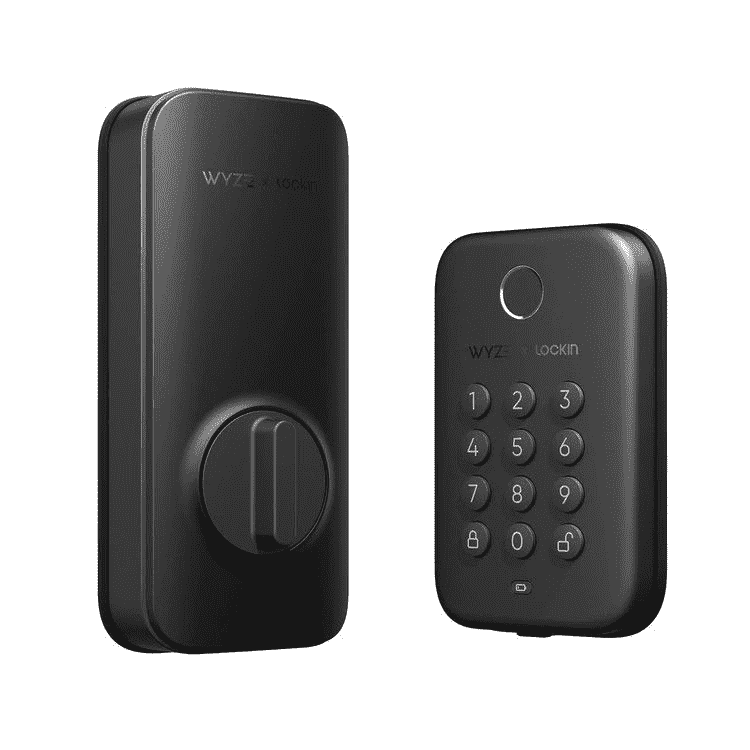

# 新的 Wyze 锁栓确保您的前门没有云

> 原文：<https://www.xda-developers.com/wyze-lock-bolt-launched/>

广受欢迎的智能家居品牌 Wyze 推出了最新产品，它在多个方面都非常有趣。众所周知，该公司最近受到了一些严厉但理所应当的批评。毕竟，[没有披露一个严重的安全漏洞](https://www.xda-developers.com/wyze-security-vulnerability-2022/)——当你的产品是为了家庭安全而部署的时候——这可不好。但是在 Wyze 锁栓的例子中，没有云连接。

对于那些怀疑将他们的家连接到一些远程服务器的人来说，这立刻会更好。Wyze 锁栓摒弃了这一点，支持基于蓝牙的本地连接。这使得它可以在 Wyze 应用程序中使用，但不依赖于 Wi-Fi 连接。然后，该应用程序可以用于与关键功能进行交互，如记录指纹，创建门代码，以及检查锁定和解锁历史。

Wyze 锁栓既有键盘又有指纹作为开门的机制。Wyze 说，指纹传感器将在半秒钟内识别你的指纹，并在另半秒钟内打开门。由于它不受天气影响，一点点湿气也不是障碍。

具体来说，Wyze 锁栓的防护等级为 IPX5，因此即使在最下雨的气候下，也应该将其刷掉。因为上面没有钥匙，所以也不能被撬开。指纹是开门的理想方式，但键盘也很漂亮。它有“窥视保护”，允许你在实际代码的两边添加随机数字，它仍然会打开。锁定也很简单，只需按下一个按钮，但如果你忘记了，内置的计时器会自动锁定。面对现实吧，我们都做过。

Wyze 锁栓由四节 AA 电池供电，但在电池耗尽的情况下，底部有一个 USB-C 端口。这样你就可以快速充电，充电量足够解锁并进入车内。

Wyze 锁栓的价格仅为 70 美元，这对于进入智能锁的世界来说极具吸引力。不幸的是，它显示已经卖完了，所以你必须留意何时有更多的货。

 <picture></picture> 

Wyze Lock Bolt

##### Wyze 锁栓

抛弃云连接，实现简单的蓝牙，这是最实惠、最容易使用的智能锁之一。