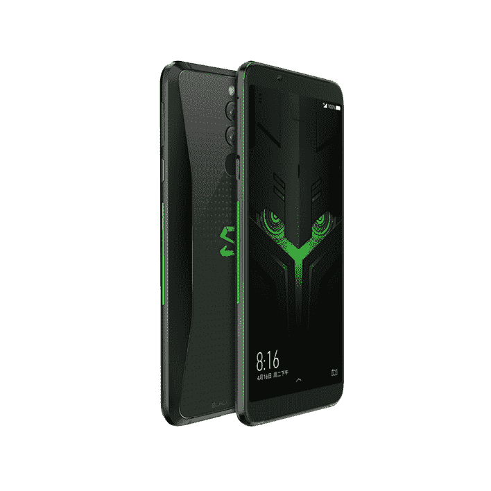

# 小米黑鲨 Helo 公布:你需要知道的

> 原文：<https://www.xda-developers.com/xiaomi-black-shark-helo-announced/>

无论你认为它们是一时的潮流，还是认为它们会一直存在，有一点是非常清楚的:游戏手机是一种东西，Android OEMs 厂商正在认真对待它们。它们绝对不是一个新概念:Xperia Play 于 2011 年推出，是第一款面向游戏的主流智能手机。但那是不同的时代。现代智能手机的功能比以前强了很多，能够运行更重、要求更高的游戏。移动 GPU 越来越好，甚至可能很快开始与桌面级 GPU 相抗衡。因此，游戏智能手机的存在是有意义的:规格齐全、功能丰富的智能手机迎合了游戏玩家的需求。

这种游戏智能手机的趋势是由去年最初的 Razer 手机启动的。华硕随后推出了 [ROG 手机](https://www.xda-developers.com/asus-rog-phone-google-arcore-support/)，最终，小米也想分一杯羹，他们试图通过[小米黑鲨](https://www.xda-developers.com/xiaomis-black-shark-razer-phone-competitor/)分一杯羹。现在，小米黑鲨 Helo 已经宣布，在原始黑鲨的基础上进行实质性的改进，以提供更好的游戏体验。

## 小米黑鲨 Helo 规格

| 

种类

 | 

小米黑鲨 Helo

 |
| --- | --- |
| 尺寸和重量 | 160 x 75.25 x 8.7mm 毫米，190 克 |
| 中央处理器 | 高通骁龙 845 @ 2.8GHz |
| 国家政治保卫局。参见 OGPU | 肾上腺素 630 |
| 随机存取存储 | 6GB/8GB/10GB |
| 后置摄像头 | 12MP (1.25 m 像素大小，f/1.75 光圈)+ 20MP (1.0 m 像素大小，f/1.75 光圈)，带双色 LED 闪光灯 |
| 前置摄像头 | 20MP，f/2.2 光圈 |
| 储存；储备 | 128GB/256GB |
| 显示 | 6.01 英寸 1080x2160 18:9 AMOLED HDR 显示屏，402 PPI |
| 声音的 | 无 3.5 毫米耳机插孔、立体声扬声器、调频收音机 |
| 电池 | 4000 毫安时电池，带快速充电功能 |
| 港口 | USB Type-C (USB 2.0) |
| 指纹扫描仪 | 是(后置) |
| 软件 | 安卓 8.1 奥利奥(JOY UI) |
| 连通性 | 双 SIMWi-Fi 802.11 ac (2.4 GHz/5GHz)蓝牙 5.0LTE，带 VoLTEGPS / GLONASS |
| 颜色；色彩；色调 | 黑色 |
| 定价 | 起价 3199 元人民币(约合 416 美元) |
| 有效性 | 10 月 30 日上市 |

 <picture></picture> 

The Xiaomi Black Shark Helo.

小米黑鲨 Helo，与其说是一个成熟的继任者，不如说是一个中期更新，进行了关键的改进，以解决最初黑鲨的一些弱点。这里选择的 SoC 再次是高通骁龙 845 -骁龙 8150/855 尚未公布，如果之前的高通版本告诉我们什么，它要到 2019 年初才会在设备上发货，所以我们不能指望在这方面有很大的改进。外部设计略有变化:双摄像头现在垂直安装并居中，指纹传感器现在安装在背面。

屏幕仍然是 FHD+ 18:9 面板，没有屏幕缺口。小米已经选择在他们的几款设备上使用凹槽，但他们似乎在这里跳过了这一点。它还内置了液冷设置，比前代产品有所改进，配备了 2 根液冷管，据小米称，这将能够将 CPU 的温度降低 12 度。黑鲨直升机确实引入了一些新功能和改进，其中最有新闻价值的是专用的两级鲨鱼钥匙。它在时尚上类似于一加设备中的提醒滑块，只是它有另一个用途:启用手机的高性能游戏模式。这款手机再次配备了一个专用的左侧游戏手柄，这次将单独出售一个右侧插件。双前置扬声器也出现在这里。

小米黑鲨 Helo 还提供了高达 10 GB 的内存配置和 256 GB 的存储空间，再加上高端的骁龙 845 处理器，应该能够在可预见的未来让你的手机保持漂亮和敏捷。事实上，即将发布的小米 Mix 3 [也被证实](https://www.xda-developers.com/xiaomi-mi-mix-3-10gb-ram-5g-support/)将采用 10 GB RAM 版本。如果你认为这有点过分，这款手机还提供 8 GB RAM/128 GB 存储和 6 GB RAM/128 GB 存储选项。

## 小米黑鲨 Helo 定价和供货情况

小米黑鲨 Helo 现已接受预购，10 月 30 日上市。基本款 6/128 售价 3199 元，约合 416 美元。中间层的 8/128 型号价格为 3499 元(504 美元)，而更高端的 10/256 型号将花费 4199 元(605 美元)。目前还没有关于在其他国家上市的信息，因为到目前为止这款手机只被确认将进入中国，但如果这款手机将在全球上市，我们将在未来几天/几周内知道。

如何看待小米黑鲨 Helo？请在评论中告诉我们。